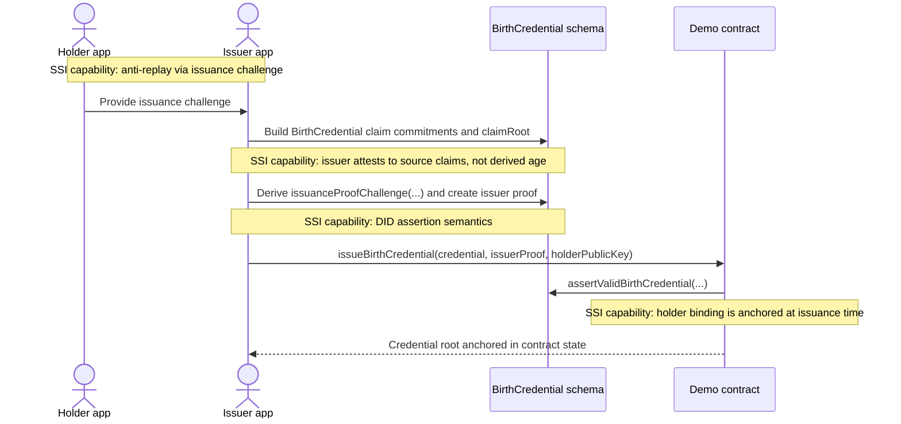
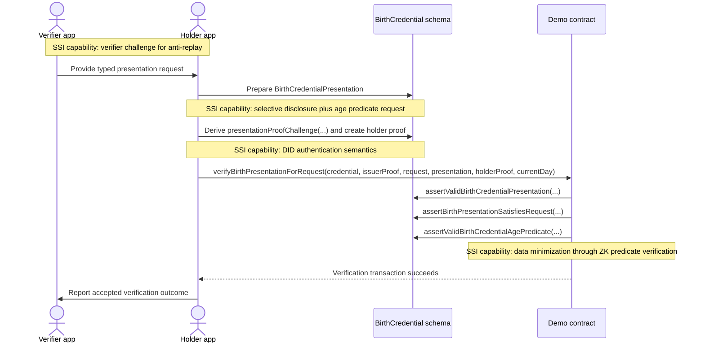

# Midnight Credentials

Version: `0.1-draft`

Status: Draft specification with partial Compact prototype coverage

Repository scope: `midnight-did`

Companion guide:

- `research/midnight-credentials-for-dummies.md`
- docs site entry: `/spec/midnight-credentials`
- docs site companion: `/spec/midnight-credentials-for-dummies`

## Change Log
### `0.1-draft`

- establishes the Compact-first canonical model for Midnight credentials
- defines generic VC and VP envelopes plus schema-specific specializations
- defines explicit and secret holder-binding profiles
- adds verifier-driven presentation requests
- adds verifier-domain pseudonym derivation and blinded holder-binding anchors as privacy-oriented prototypes
- records current standards alignment, transport fit, and AnonCreds comparison

## Abstract
This draft specification defines a Compact-first model for Midnight-native Verifiable Credentials and Verifiable Presentations.

The current draft covers:

- typed credential and presentation envelopes
- issuer and holder binding
- selective disclosure over committed claims
- zero-knowledge predicates over hidden claim values
- verifier-defined presentation requests
- privacy-oriented holder binding through hidden secrets, verifier-domain pseudonyms, and blinded binding anchors

Transport protocols and web serialization formats are explicitly out of scope as canonical representations. They may be added later as adapters around the Compact-native model.

## Scope
This document defines the current specification draft for Midnight-native Verifiable Credentials (VCs) and Verifiable Presentations (VPs) in the `midnight-did` repository.

It is not a final standard and should be treated as an evolving specification for the current prototype and follow-on implementation work.

## Objectives
Define a credential model that:

- is directly consumable by Midnight Compact contracts
- supports selective disclosure
- supports zero-knowledge predicates such as `age >= threshold`
- uses Midnight DID verification methods cleanly
- stays reasonably aligned with general SSI recommendations from DID Core, VCDM 2.0, and VC Data Integrity

## Non-Goals
This draft does not attempt to provide:

- full wire-format interoperability with JSON-LD, JWT, or SD-JWT VC ecosystems
- a production-ready blind-issuance protocol
- privacy-preserving revocation proofs
- a generic dynamic claim map or unbounded disclosure model
- a final transport standard for issuance or presentation exchange
- a commitment to a single cross-ecosystem proof suite beyond the current Midnight Jubjub profile

## Terminology

| Term | Meaning in this specification |
| --- | --- |
| `VC` | A typed Midnight credential envelope plus schema-defined claims and an issuer proof |
| `VP` | A typed Midnight presentation envelope plus bounded disclosures and a holder-side presentation proof |
| `SchemaRef` | A Compact-native schema identifier containing package, schema, and version information |
| `VerificationMethodRef` | A Compact-native DID verification method reference: `didContractAddress + methodId` |
| `Holder binding` | The mechanism that binds a credential to a specific holder or holder secret |
| `Explicit holder binding` | Holder binding through a public DID verification method reference |
| `Secret holder binding` | Holder binding through a hidden holder secret rather than a public DID method |
| `Verifier-domain pseudonym` | A pairwise pseudonym derived from the hidden holder secret and a verifier-supplied domain hash |
| `Blind issuance` | An issuance pattern where holder-bound material is signed without exposing the holder’s final secret in the clear to the issuer |

## Architecture Overview
### Canonical Representation
Use a Midnight-native Compact representation as the canonical VC/VP model.

W3C JSON-LD, JWT, SD-JWT, or other exchange representations can exist later as adapters, but they are not the source of truth for contract execution.

Reasoning:

- Compact is strongly typed and bounded
- the contract-facing model cannot depend on dynamic JSON
- schema-specific fixed layouts are easier to verify in circuits
- selective disclosure on Midnight is a circuit problem, not just a transport-format problem

### Credential Family Rationale
#### Why `BirthCredential` replaced `AgeCredential`
The first draft was centered on an age-style credential. That was the wrong semantic layer.

A reusable SSI credential should carry an issuer-attested source fact, not a moving derived property.

`BirthCredential` is the better base credential because it can attest to claims such as:

- subject identifier commitment
- legal name commitment
- birth-date commitment
- birth-country commitment

From that source credential, the holder can later prove predicates such as:

- age is over 18
- age is over 21
- age is over any supported threshold

This is both more reusable and more privacy-preserving than issuing a separate credential for each age threshold.

#### Why Passport is the second credential family

The passport credential extends the birth credential pattern with two new capabilities:
- an expiry predicate (`currentDay <= expiryDate`)
- nationality and gender disclosures using ISO numeric codes from the shared registry

This makes passport the simplest expansion that validates the generic layer's reusability while adding meaningful new predicate and disclosure types.

### Shared ISO Registry

The `credentials-iso-registry` package provides Compact-native types for ISO-standard numeric codes:
- `CountryCode` (ISO 3166-1 numeric, `Uint<16>`)
- `CurrencyCode` (ISO 4217 numeric, `Uint<16>`)
- `LanguageCode` (custom numeric mapping, `Uint<16>`)
- `RegionCode` (ISO 3166-2, country + subdivision pair)
- `GenderCode` (ISO 5218, `Uint<8>`)

All credential families import these types rather than defining their own country or gender representations. Numeric values are preferred because they are bounded, circuit-friendly, and comparable with standard Compact operators. The presentation layer renders numeric codes to human-readable text.

### Compact-First Constraints
The current design follows the Compact model rather than a web-first model.

The practical constraints are:

- bounded structs and fixed-size fields
- deterministic claim ordering
- no runtime-defined claim maps
- no unbounded disclosure sets
- algorithm-specific proof types
- explicit disclosure boundaries

This pushes the architecture toward:

- schema-specific credential bodies
- schema-specific presentation bodies
- fixed disclosure layouts
- typed DID method references
- proof validation circuits that are explicit about what is signed

### Serialization and Deserialization

Midnight Credentials have three separate representations. They must not be treated as interchangeable.

| Layer | Representation | Purpose | Current implementation status |
| --- | --- | --- | --- |
| Canonical contract model | Compact structs and circuits | The source of truth for VC/VP semantics, body roots, holder binding, and predicate verification | implemented in `credentials`, credential-family Compact packages, and generated `pureCircuits` |
| TypeScript execution model | TypeScript types generated by the Compact compiler | Build fixtures, run unit tests, run simulators, and call generated circuits from TypeScript | implemented through each package's `src/managed/.../contract/index.js` exports |
| Transport / wallet model | Binary Compact payloads inside JSON/OID4VCI/OID4VP-inspired envelopes | Move credentials, presentations, requests, and responses between wallets, issuers, verifiers, and demos | generic `compact-value-v1.base64url` framing implemented in `credentials-openid`; typed convenience codecs implemented for the passport-secret and compliance prototype families |

#### Canonical serialization boundary

The canonical VC/VP representation is the Compact value, not JSON.

For signing and verification, the body root is computed in Compact:

- `credentialBodyRoot(credential)`
- `presentationBodyRoot(presentation)`
- schema-specific claim-root circuits such as `birthCredentialClaimRoot(...)`, `secretPassportCredentialClaimRoot(...)`, or `sanctionScreeningCredentialClaimRoot(...)`

These circuits use Compact hashing primitives such as `persistentHash`, `transientHash`, `persistentCommit`, and related conversion helpers. That gives the credential a deterministic circuit-native digest without requiring JSON canonicalization, RDF dataset normalization, JWT signing input rules, or SD-JWT disclosure canonicalization.

Important rule:

> `JSON.stringify(...)` is never a canonical signing or verification input for Midnight VC/VP.

JSON can carry a credential or presentation over a protocol, but the credential or presentation body itself should be serialized with the generated Compact type descriptor when possible. The receiver must reconstruct the typed Compact value and recompute the Compact body root before accepting any proof.

#### Use of Midnight TypeScript and Ledger packages

The current prototype uses Midnight-generated TypeScript artifacts for Compact contracts:

- generated TypeScript struct types
- generated `pureCircuits`
- generated Compact type descriptors inside compiled contract artifacts
- generated simulator/contract helpers where needed

Those generated artifacts are the bridge between TypeScript tests/app code and the Compact canonical model.

The preferred serialization direction is to use the Midnight Compact runtime representation rather than hand-written field-by-field JSON conversion:

1. Compact circuits define canonical roots and proof challenges.
2. Generated TypeScript types represent those Compact values in tests and app orchestration.
3. Generated `CompactType` descriptors convert those TypeScript values to the runtime field-aligned `Value` representation through `toValue(...)`.
4. Generated `CompactType` descriptors reconstruct TypeScript values from the runtime `Value` representation through `fromValue(...)`.
5. Built-in runtime helpers such as address/token encode/decode functions should be used for supported built-in Midnight values.

In the current ledger8/runtime stack, the relevant packages are exposed through `@midnight-ntwrk/compact-runtime` and `@midnight-ntwrk/onchain-runtime-v3`, with `@midnight-ntwrk/ledger-v8` used by the broader Midnight execution stack. The generated descriptors in `src/managed/.../contract/index.js` demonstrate the mechanism, although many descriptors are generated as private implementation constants. The `credentials-openid` package now provides a generic `compact-value-v1.base64url` framing helper for descriptor-based payloads. Credential-family packages expose explicit package-level typed codec helpers so application code does not depend on generated private descriptor names.

The safe rule is:

> Use generated Compact descriptors/runtime codecs for VC/VP payload bytes; use JSON only as an explicit envelope, metadata, or UX adapter.

This avoids corrupting `bigint`, `Uint8Array`, opaque curve points, contract addresses, and fixed-size vectors through plain JSON serialization.

#### Draft wire encoding profile

Transport JSON must be explicit about every Compact payload it carries.

Recommended credential envelope:

```json
{
  "format": "midnight_compact_vc",
  "credentialFamily": "passport-secret",
  "schemaId": "passport-secret:v1",
  "schemaVersion": "1.0",
  "credential": {
    "encoding": "compact-value-v1.base64url",
    "payload": "<base64url-encoded framed Compact credential Value>"
  },
  "credentialProof": {
    "encoding": "compact-value-v1.base64url",
    "payload": "<base64url-encoded framed Compact issuance Proof Value>"
  }
}
```

Recommended presentation envelope:

```json
{
  "format": "midnight_compact_vp",
  "presentationFamily": "passport-secret",
  "schemaId": "passport-presentation:v1",
  "schemaVersion": "1.0",
  "presentation": {
    "encoding": "compact-value-v1.base64url",
    "payload": "<base64url-encoded framed Compact presentation Value>"
  },
  "credentialProof": {
    "encoding": "compact-value-v1.base64url",
    "payload": "<base64url-encoded framed Compact issuance Proof Value>"
  },
  "presentationProof": {
    "encoding": "compact-value-v1.base64url",
    "payload": "<optional holder-authenticated Compact presentation Proof Value>"
  }
}
```

The payloads should be decoded by the credential-family package, not by generic application code. The package knows the exact Compact type and version. For the current hidden holder-secret profiles, holder authentication is often represented by the holder-binding challenge response inside the presentation. A separate `presentationProof` is therefore optional and mainly applies to explicit DID-bound holder profiles.

The runtime `CompactType.toValue(...)` representation is a field-aligned `Value` (`Uint8Array[]` chunks in the current runtime), not a self-describing JSON object. A transport codec therefore needs a small stable framing around those chunks before converting to a single `Uint8Array` or base64url string. Receivers must reject malformed framing, wrong chunk counts, wrong fixed byte lengths, and schema/version mismatches before calling `fromValue(...)`.

Field-by-field JSON can still be useful for debugging, demos, or human-readable exports, but it is not the preferred canonical wire profile.

If field-level JSON is used temporarily, it must be explicit about every Compact primitive that is not naturally JSON-safe.

Temporary field-level profile:

| Compact / TS value | JSON wire encoding | Notes |
| --- | --- | --- |
| `Uint<N>` | decimal string | avoids JavaScript number precision loss; small values may be rendered as numbers in UI only |
| `Boolean` | JSON boolean | direct mapping |
| `Bytes<N>` | unpadded base64url string | compact and OpenID-friendly; fixtures may still use `0x...` while the profile is stabilizing |
| `Field` | decimal string | avoids accidental modulo/precision issues |
| `JubjubPoint` | object with encoded coordinates, or a named profile string if provided by a stable Midnight codec | must not be an ad hoc string without a declared profile |
| `ContractAddress` | string using the Midnight address format | validate as a Midnight address before reconstructing the Compact value |
| enum | symbolic string at transport boundary; numeric enum inside Compact | improves wallet UX while preserving bounded Compact checks |
| vector / fixed array | JSON array with exact expected length | deserializer must reject wrong lengths |
| optional-like fields | explicit booleans plus value fields where Compact uses that pattern | follows existing `hasExpiration` / `expiresAt` style |

The `credentials-openid` package currently accepts both `0x...` and base64url-like byte strings for some Midnight extension fields to keep prototyping flexible. Before publishing a production profile, the wire format should pick one canonical byte encoding. Base64url is the recommended default for OID4VCI/OID4VP compatibility.

#### Why plain JSON can corrupt Compact values

Plain JSON serialization is unsafe for Compact values for several reasons:

- `bigint` cannot be serialized by `JSON.stringify(...)` without a custom replacer
- `Uint8Array` serializes as an object with numeric properties, not as fixed-length bytes
- opaque values such as `JubjubPoint` may lose their runtime shape or validation context
- fixed-size vectors become unbounded arrays unless the decoder checks lengths
- enum names and enum numeric values can drift if not explicitly versioned
- contract addresses and other Midnight built-ins may have runtime-specific encoded forms

This does not mean JSON cannot be used. It means JSON must be treated as an envelope or adapter format, not the canonical VC/VP serialization.

Preferred production direction:

1. serialize the Compact VC/VP body with the generated descriptor and a stable `Value` framing
2. encode the framed bytes as base64url for HTTP/OpenID transport
3. keep JSON fields for schema ID, version, media type, issuer endpoint, nonce, challenge, descriptor maps, and other protocol metadata
4. decode bytes through the credential-family codec
5. recompute roots and verify proofs after decoding

#### Serialization procedure

For issuance:

1. Issuer and holder exchange a transport request, for example an OID4VCI-style credential request.
2. Application code validates the transport message with the relevant TypeScript schema.
3. Application code constructs the generated TypeScript representation of the Compact credential body.
4. The issuer computes the credential body root through the generated `pureCircuits`.
5. The issuer signs the Compact-derived issuance challenge.
6. The issued payload is transported as a JSON DTO containing:
   - schema identifier
   - base64url-encoded Compact body bytes
   - base64url-encoded Compact `credentialProof` bytes
   - holder-binding profile fields
   - optional transport metadata

For verification:

1. Verifier sends a transport request, for example an OID4VP-style presentation definition plus Midnight extension fields.
2. Holder builds the generated TypeScript representation of the Compact presentation body.
3. Holder computes or obtains the presentation proof over the Compact-derived presentation challenge when the holder-binding profile requires a DID-authenticated holder proof. Hidden holder-secret profiles can instead use the Compact holder-binding challenge response in the presentation body.
4. Holder serializes the presentation into the transport DTO.
5. Verifier validates the transport DTO shape.
6. Verifier deserializes the Compact bytes into generated TypeScript Compact values through the credential-family codec.
7. Verifier calls generated `pureCircuits` or contract circuits to recompute roots, verify proofs, and enforce predicates.

#### Deserialization requirements

Deserialization must be strict:

- reject unknown schema IDs unless the application explicitly supports extension handling
- reject wrong fixed byte lengths
- reject unsafe JavaScript numbers for `Uint<N>` and `Field` values
- reject vectors with unexpected length
- reject enum values outside the declared schema
- reject presentations where the transport descriptor map does not match the verifier request
- recompute all claim roots and body roots after decoding
- never trust a root, challenge, or proof payload root supplied only by the sender

#### Storage

Wallet storage may persist the transport DTO, the generated TypeScript-friendly object, or both.

The recommended approach is:

1. store the transport DTO for audit/export/debugging
2. store a parsed internal object for wallet UX and fast selection
3. recompute Compact roots before every proof or contract submission

Persisted wallet data should include the credential schema ID and schema version because deserialization is schema-specific. If a schema package changes its Compact layout, the wallet must treat old stored credentials as requiring migration or re-issuance unless a versioned decoder exists.

### Prototype Package Layout
The current implementation lives in:

- [`../credentials/src/credentials.compact`](../credentials/src/credentials.compact) (standalone package root)
- [`../credentials/src/credentials/composable.compact`](../credentials/src/credentials/composable.compact) (shared Layer 3 root)
- [`../credentials/src/credentials/vc-support.compact`](../credentials/src/credentials/vc-support.compact) (VC envelope and proof-validation support)
- [`../credentials/src/credentials/protocol-support.compact`](../credentials/src/credentials/protocol-support.compact) (issuance and presentation protocol support)
- [`../credentials/src/credentials/bindings.compact`](../credentials/src/credentials/bindings.compact) (holder-binding structs and witness-validation helpers)
- [`../credentials-birth/src/birth-credential.compact`](../credentials-birth/src/birth-credential.compact) (entry point that includes `birth-credential/model`, `birth-credential/protocol-model`, `birth-credential/helpers`, `birth-credential/validation`; also contains [`birth-credential/claims.compact`](../credentials-birth/src/birth-credential/claims.compact) with shared claim commitment circuits imported by both `credentials-birth` and `credentials-birth-secret`)
- [`../credentials-birth-secret/src/secret-birth-credential.compact`](../credentials-birth-secret/src/secret-birth-credential.compact)
- [`../credentials-same-holder/src/same-holder.compact`](../credentials-same-holder/src/same-holder.compact)
- [`../credentials-same-holder/src/same-holder/composable.compact`](../credentials-same-holder/src/same-holder/composable.compact)
- [`../credentials-iso-registry/src/iso-registry.compact`](../credentials-iso-registry/src/iso-registry.compact) (shared ISO code types: CountryCode, CurrencyCode, LanguageCode, RegionCode, GenderCode)
- [`../midnight-passport-prototype/packages/credentials-passport/src/passport-credential.compact`](../midnight-passport-prototype/packages/credentials-passport/src/passport-credential.compact) (explicit DID-bound passport credential with age predicate and expiry check, imports ISO registry for CountryCode and GenderCode)
- [`../midnight-passport-prototype/packages/credentials-passport-secret/src/secret-passport-credential.compact`](../midnight-passport-prototype/packages/credentials-passport-secret/src/secret-passport-credential.compact) (hidden holder-secret passport credential with pseudonym support, same-holder composition, and expiry check)
- [`../midnight-passport-prototype/packages/credentials-compliance/src/sanction-screening-credential.compact`](../midnight-passport-prototype/packages/credentials-compliance/src/sanction-screening-credential.compact) (sanctions/PEP screening credential family with blinded holder binding and freshness/expiry predicates)
- [`../credentials-demo-contract/src/demo.compact`](../credentials-demo-contract/src/demo.compact)
- [`../credentials-protocol/`](../credentials-protocol/) (TypeScript protocol simulation layer)
- [`../credentials-openid/`](../credentials-openid/) (OID4VCI/OID4VP-inspired TypeScript transport schemas with Midnight extension fields)
- [`../midnight-passport-prototype/`](../midnight-passport-prototype/) (standalone TypeScript/UI prototype that composes wallet, issuers, verifier, OpenID-shaped envelopes, and Compact credential-family helpers)
- [`../standalone-environment/`](../standalone-environment/) (TypeScript shared integration test infrastructure)


Dependency-composition research is tracked separately in [Midnight Credentials Dependency Composition Model](./midnight-credentials-dependency-composition.md). That document defines the recommended split between Compact source entry points, generated TS/JS runtime artifacts, and Layer 3 business-contract imports.

The package split is now intentional:

- `credentials` owns the generic VC/VP envelope, proof core, holder-binding profiles, and protocol message abstractions
- `credentials-birth` owns the explicit DID-bound birth-credential specialization including protocol-level issuance and verification message types
- `credentials-birth-secret` owns the hidden holder-secret birth-credential specialization
- `credentials-same-holder` owns the optional same-holder composition capability for cross-credential holder correlation
- `credentials-iso-registry` owns the shared Compact-native ISO code types (CountryCode, CurrencyCode, LanguageCode, RegionCode, GenderCode) used by all credential families
- `midnight-passport-prototype/packages/credentials-passport` owns the explicit DID-bound passport credential specialization with age predicate and expiry check, importing CountryCode and GenderCode from the ISO registry
- `midnight-passport-prototype/packages/credentials-passport-secret` owns the hidden holder-secret passport credential specialization with pseudonym support, same-holder composition, and expiry check
- `midnight-passport-prototype/packages/credentials-compliance` owns the sanctions/PEP screening credential specialization used by the Midnight Passport prototype
- `credentials-demo-contract` owns the executable issuer, holder, verifier flow with contract-native gated access
- `credentials-protocol` owns the TypeScript protocol simulation layer with party agents and in-process message transport
- `credentials-openid` owns transport DTO schemas inspired by OID4VCI and OID4VP; it validates exchange messages but does not define canonical credential semantics
- `midnight-passport-prototype` owns the current standalone actor/UI prototype
- `standalone-environment` owns the shared Midnight Docker environment for integration tests, including the `StandaloneEnvironment` lifecycle class, DID profile provisioning, and wallet setup utilities

### Verifier-as-Contract Composition Model
The most important Midnight-specific observation is that the verifier is often not a generic wallet or backend service. The verifier is frequently a Compact smart contract that enforces business rules directly.

Examples:

- a voting contract that admits only eligible voters
- an auction contract that admits only participants satisfying jurisdictional or membership constraints
- a gated membership or access contract that returns a capability for later use

This matters because a generic multi-credential bundle abstraction is not automatically the right primary model for Midnight.

In Compact, a bundle-oriented generic core introduces immediate complexity:

- fixed-size bundle shapes must be chosen in advance
- schema unions must be modeled explicitly
- each credential family still needs its own witness and predicate logic
- business-specific ordering and dependency rules still live outside the bundle type

The result is that a generic `PresentationBundle` can easily become more abstract than useful.

The current design direction is therefore:

1. keep the `credentials` package focused on reusable single-credential verification primitives and holder-binding profiles
2. let business contracts compose concrete credential-family circuits directly
3. only introduce a generic bundle abstraction later if repeated business contracts converge on the same structure

This is more idiomatic for Midnight than copying a transport-oriented VC bundle model from another ecosystem.

### Architectural Layers

The current Midnight Credentials solution should be understood as five layers.

#### Layer 1: generic capabilities layer

This is the reusable core of the Midnight Credentials library.

It should contain:

- generic VC and VP envelopes
- generic proof structures and challenge derivation
- generic holder-binding profiles
- verifier-domain pseudonym helpers
- blinded holder-binding helpers
- reusable request and validation primitives that are not tied to one credential family
- transport and protocol abstractions only when they are truly cross-family and Compact-friendly

This layer should not contain:

- business-specific claim semantics
- verifier-specific policy
- workflow rules tied to one product or contract

#### Layer 2: concrete credential-family layer

This layer defines concrete VC, VP, request, and predicate logic for one credential family.

Examples:

- birth credential
- membership credential
- residency credential
- professional eligibility credential

This layer usually belongs to the issuer or verifier ecosystem that defines the actual claims and capabilities that matter in business logic.

It should contain:

- concrete claim structures
- concrete disclosure structures
- concrete request structures
- concrete predicates and witness checks
- concrete issuer restrictions and schema checks

It should not contain:

- application-specific contract state
- business process orchestration
- application-specific payment or participation logic

#### Layer 3: business logic layer

This is the main smart-contract layer where layers 1 and 2 are composed into product behavior.

Examples:

- voting contracts
- auction contracts
- gated access contracts
- issuance workflows that return a business receipt or capability

This layer should own:

- the business requirements model
- the decision whether verification is atomic or staged
- contract state mutation
- participation or issuance payment rules
- anti-reuse logic such as nullifiers or consumed rights
- any application-specific receipts, tickets, or tokens

This is the layer where Midnight becomes simpler than generic VC ecosystems, because the verifier is the contract and the contract can directly express what successful verification means.

#### Layer 4: application orchestration layer

This layer lives outside Compact, usually in TypeScript.

It becomes important because smart-contract composability is not currently the primary mechanism for assembling complex application flows. When a scenario needs more than one contract or a mix of on-chain and off-chain steps, the orchestration is often cleaner at the application layer.

This layer should own:

- sequencing across multiple contract calls
- coordination across issuance, verification, and business-process contracts
- local preparation and routing of witnesses
- aggregation of typed requirements from multiple contracts
- retries, timeouts, and session continuity
- off-chain resource handoff after on-chain verification
- API, backend, and wallet coordination

Typical examples:

- call one contract to fetch typed requirements
- prepare local VC and VP witnesses
- call another contract to verify eligibility
- call a third contract to consume the resulting capability, receipt, or token
- use the returned artifact to unlock an HTTP or application-level resource

This layer should not redefine the credential semantics already owned by layers 1 and 2. Its job is orchestration, not duplication of verification logic.

##### Protocol simulation layer (`credentials-protocol`)

The `credentials-protocol` package provides the concrete prototype implementation of Layer 4. It models the issuance and presentation flows as typed agent interactions over an in-process message bus.

Party agents:

- `IssuerAgent` and `SecretIssuerAgent` for explicit-DID and secret-holder issuance flows
- `HolderAgent` and `SecretHolderAgent` for explicit-DID and secret-holder holder-side flows
- `VerifierAgent` for presentation request and verification orchestration
- `ContractVerifier` for contract-native gated access verification through the demo contract simulator

Transport abstraction:

- `MessageBus` provides an in-process transport with typed `ProtocolMessage` envelopes carrying `ProtocolMessageType` tags (`issuance:offer`, `issuance:request`, `issuance:result`, `presentation:request`, `presentation:submission`, `presentation:result`)
- this is the seam where OID4VCI or DIDComm v2 transport would plug in later, replacing the in-process bus with a real network transport while preserving the agent and message type structure

#### Layer 5: governance and trust-policy layer

This layer is acknowledged now, but remains abstract in the current prototype.

It is the place where an ecosystem would eventually answer questions such as:

- which issuers are trusted for which credential families
- which verifiers are allowed to request which disclosures or predicates
- which schema identifiers and versions are approved
- which policies apply on which Midnight networks
- how trust anchors, accreditation, suspension, or policy evolution are represented

Typical future examples:

- a trust registry of issuers
- a trust registry of verifiers
- schema support and version policy
- ecosystem-level issuance and verification policy

This layer should not change the cryptographic meaning of the credential or presentation itself.
Its role is to govern trust and policy around those artifacts, not to redefine Layer 1 through Layer 4 semantics.

For that reason, the current work treats this layer as future scope rather than something to fold into the generic VC/VP core prematurely.

#### Layering recommendation

The intended separation is:

1. layer 1 defines reusable generic credential capabilities
2. layer 2 defines concrete credential families and predicates
3. layer 3 defines contract-native business policy
4. layer 4 coordinates multi-contract or mixed on-chain/off-chain workflows when one contract is not enough
5. layer 5 governs trust and policy for issuers, verifiers, and schema support

Layer 4 is especially useful until richer contract composability is available.
Layer 5 is intentionally left abstract until the VC core and protocol boundaries settle.

#### Prototype capability profiles

The current prototype is intentionally exercised through a small set of capability
profiles rather than one monolithic "full SSI" flow.

That is the right shape for Midnight, because concrete business contracts can
compose only the capabilities they actually need.

| Profile | Layer 2 composition | Layer 3 business outcome | Current prototype coverage |
| --- | --- | --- | --- |
| Minimal issuer-attested credential | explicit holder binding, issuer proof, no extra disclosure requirements | accept a simple issuer-attested credential as a typed source record | `credentials-birth` tests, `credentials-protocol` explicit-holder issuance tests |
| Operational disclosure flow | explicit holder binding, typed presentation request, selective disclosure | verify a presentation against a verifier-defined request | `credentials-birth` tests, `credentials-protocol` explicit-holder presentation tests |
| Predicate-based access flow | explicit holder binding, age predicate, typed verifier challenge | verify eligibility without disclosing the birth date itself | `credentials-birth` and `credentials-demo-contract` tests, `credentials-protocol` contract-verifier age-gate tests |
| Hidden-holder flow | secret holder binding, issuer proof, holder witness verification | avoid a stable public holder DID in the verifier-facing flow | `credentials-birth-secret` tests, `credentials-protocol` secret-holder issuance and presentation tests |
| Advanced privacy flow | secret holder binding, blinded holder anchor, verifier-domain pseudonym, selective disclosure, age predicate | support stronger privacy controls while still proving business eligibility | `credentials-birth-secret` tests, `credentials-protocol` secret-holder pseudonym tests |
| Contract-native gated access flow | typed presentation request plus reusable capability issuance | issue a contract-level capability and consume it later with soft business denial states | `credentials-demo-contract` tests, `credentials-protocol` contract-verifier capability-lifecycle tests |
| Same-holder credential composition | two or three secret-holder credentials, one shared verifier challenge, one shared hidden holder secret witness | prove that multiple credentials belong to the same holder without revealing a stable public DID | `credentials-same-holder` and `credentials-birth-secret` tests, `credentials-protocol` secret-holder same-holder tests |
| Full explicit-holder lifecycle | explicit holder binding, protocol-level issuance offer/request/result, presentation request/submission/result | exercise the complete issuance-to-verification lifecycle through typed protocol messages | `credentials-protocol` explicit-holder full-lifecycle tests |
| Passport issuer-attested credential | explicit holder binding, issuer proof, nationality and gender disclosures | accept an issuer-attested passport credential as a typed source record | `credentials-passport` tests |
| Passport operational disclosure flow | explicit holder binding, nationality disclosure, age predicate | verify a passport presentation with nationality disclosure and age check | `credentials-passport` tests |
| Passport full verification flow | explicit holder binding, nationality and gender disclosure, age predicate, expiry check | verify a passport presentation against all supported disclosures and predicates | `credentials-passport` tests |
| Passport hidden-holder flow | secret holder binding, blinded anchor, age predicate, expiry check | avoid a stable public holder DID while proving age and document validity | `credentials-passport-secret` tests |
| Passport advanced privacy flow | secret holder binding, pseudonym, nationality and gender disclosure, age predicate, expiry check | support stronger privacy controls while proving passport-based eligibility | `credentials-passport-secret` tests |
| Passport same-holder composition | two or three secret passport credentials from different issuers, shared verifier challenge, shared hidden holder secret | prove that multiple passport credentials belong to the same holder without revealing a stable public DID | `credentials-passport-secret` tests |

This profile matrix is deliberate.

It lets Midnight credential families evolve incrementally:

1. start with the smallest credential family that proves the domain model
2. add privacy capabilities only when a verifier contract actually needs them
3. keep the business contract readable by composing typed helpers instead of duplicating credential logic

## Data Model
### Generic Credential Envelope
The generic `VC<TClaims, TDisclosures, THolderBinding>.Credential` envelope contains:

| Field | Meaning |
| --- | --- |
| `version` | schema version for the credential body |
| `schema` | package and schema identity |
| `issuerVerificationMethodRef` | issuer DID method reference in Compact-native form |
| `holderBinding` | specialization-defined holder binding, such as an explicit DID method or a hidden holder-secret commitment |
| `issuedAt` / `expiresAt` | validity window |
| `claims` | schema-specific claim payload |
| `claimRoot` | root commitment over the schema-defined claim commitments |

For the birth specialization, `claims` is a struct of four claim commitments.

### Claim Commitments
The current claim set is:

| Claim | Public representation |
| --- | --- |
| Subject identifier | `subjectIdCommitment` |
| Legal name | `legalNameCommitment` |
| Birth date | `birthDateCommitment` |
| Birth country | `birthCountryCodeCommitment` |

The credential body carries commitments, not raw claim values.

### Generic Presentation Envelope
The generic `VC<TClaims, TDisclosures, THolderBinding>.Presentation` envelope contains:

| Field | Meaning |
| --- | --- |
| `version` | schema version for the presentation body |
| `schema` | schema identity matching the credential |
| `credentialClaimRoot` | anchor back to the issued credential claim set |
| `issuerVerificationMethodRef` | issuer DID method reference copied for verification context |
| `holderBinding` | specialization-defined holder binding carried forward into the presentation |
| `disclosed` | schema-specific bounded disclosure and predicate-request layout |

For the birth specialization, the current `disclosed` layout supports:

- optional disclosure of the subject identifier commitment
- optional disclosure of the birth-country value together with its opening
- an age-over-threshold predicate request

### Presentation Request Model

The current birth specialization now includes a typed verifier-defined presentation request:

- `BirthCredentialPresentationRequest`

It contains:

| Field | Meaning |
| --- | --- |
| `version` | request schema version |
| `schema` | required schema identity |
| `issuerVerificationMethodRef` | issuer restriction for the credential to be presented |
| `requireSubjectIdCommitmentDisclosure` | whether the subject commitment must be disclosed |
| `requireBirthCountryDisclosure` | whether the birth-country claim must be disclosed |
| `requireVerifierScopedPseudonym` | whether the verifier requires a stable pairwise pseudonym for its own domain |
| `verifierDomainHash` | verifier-defined domain identifier used when deriving a pairwise pseudonym from the hidden holder secret |
| `requireAgeOverThreshold` | whether an age predicate proof is required |
| `requestedAgeThresholdYears` | exact requested threshold for the current profile |
| `verifierChallengeHash` | verifier-provided anti-replay challenge |

The secret-holder birth specialization defines a separate `SecretBirthCredentialPresentationRequest` type with two additional fields:

| Field | Meaning |
| --- | --- |
| `requireVerifierScopedPseudonym` | whether the verifier requires a stable pairwise pseudonym for its own domain |
| `verifierDomainHash` | verifier-defined domain identifier used when deriving a pairwise pseudonym from the hidden holder secret |

All other fields match `BirthCredentialPresentationRequest`. The type separation ensures explicit-holder and secret-holder requests are not accidentally interchangeable.

Current design intent:

- verifier policy is explicit and typed
- the presentation proof must bind to the request challenge
- the verifier can optionally request a verifier-domain pseudonym without learning a global holder identifier
- the presentation must satisfy the requested disclosure and predicate policy

This is the first adopted AnonCreds-inspired capability in the PoC.

## Security Considerations
### Witness and Arithmetic Discipline

The current model depends on private witness values for hidden claims and holder-binding proofs.

That means two rules are mandatory:

1. witness outputs are untrusted input until the circuit rebinds them to commitments, roots, or request values with explicit `assert(...)` checks
2. date arithmetic should stay day-based, not second-based, for bounded and readable age predicates

Practical implication for the birth-credential family:

- `birthDateDays` and `currentDay` should remain day counts
- age checks should compare day deltas against a threshold expressed in years-times-365 for the current PoC
- if leap-year-accurate policy becomes a product requirement, it should be modeled explicitly as a later schema or predicate upgrade rather than hidden inside the current arithmetic

## Proof Model
### Proof Object
The PoC uses a single canonical proof type: `Proof`.

For the current Midnight VC/VP profile, that canonical proof suite is Jubjub.

It contains:

| Field | Meaning |
| --- | --- |
| `signerVerificationMethodRef` | DID method reference for the signer |
| `createdAt` | proof timestamp |
| `challengeHash` | anti-replay interaction binding |
| `publicKey` | public key needed by the Compact verifier |
| `signature` | signature components for the canonical Jubjub proof suite |

Important design point:

- proof is outside the VC or VP body
- the VC or VP body is the semantic payload
- the proof is the cryptographic statement over that payload

The proof does not carry a stored `purpose` field.

That was removed because it duplicated context the verifier already has. The verifier already knows whether it is validating:

- an issuance proof over a credential body
- a presentation proof over a presentation body

So the current decision is:

- remove the stored enum from the proof object
- keep explicit domain separation in challenge derivation
- expose that separation through named helpers such as `issuanceProofChallenge(...)` and `presentationProofChallenge(...)`

### Canonical Proof Suite

The current profile fixes Jubjub as the signature suite for Midnight VC/VP.

That is why the API now uses generic names such as:

- `Proof`
- `Signature`
- `verifySignature(...)`

instead of repeating the curve name in every type and circuit.

This is a readability choice, not an abstraction over multiple active proof suites.

If the project later adds another canonical proof suite, it should do so by introducing a new profile or a new specialization rather than overloading the current generic names silently.

### In-Circuit Proof Challenge Derivation
The verifier does not trust a precomputed challenge field inside the proof.

Instead, the verifier derives the signing challenge in-circuit from:

1. the VC or VP body root
2. the verification context tag (issuance or presentation)
3. proof metadata (signer method id, `createdAt`, `challengeHash`)
4. the signer public key
5. the signature nonce point `r`

This makes the proof-to-body binding explicit and removes redundant proof state.

## Circuit Reference

This section documents the generic circuits in [`../credentials/src/credentials.compact`](../credentials/src/credentials.compact) as the current canonical reusable VC/VP core. The entry point includes the following source files: `credentials/types.compact` (types and structs), `credentials/proofs.compact` (proof verification), `credentials/vc.compact` (credential and presentation envelope logic), `credentials/holder-bindings.compact` (holder-binding profiles), and `credentials/protocols.compact` (protocol message abstractions).

The goal is to make each circuit understandable in terms of:

- what it proves or enforces
- why it exists as a separate circuit
- how it compares to typical W3C VC/VP verification behavior

### Envelope and Rooting Circuits

| Circuit | Purpose | Logic | Pros vs W3C VC/VP | Cons / trade-offs |
| --- | --- | --- | --- | --- |
| `credentialBodyRoot(credential)` | Produce the canonical digest for a credential body | hashes the entire typed credential envelope with `persistentHash` | deterministic and circuit-native; no JSON canonicalization or RDF normalization step | only works for Compact-native typed payloads; not interoperable with JSON-LD or JWT proof inputs |
| `presentationBodyRoot(presentation)` | Produce the canonical digest for a presentation body | hashes the typed presentation envelope with `persistentHash` | same determinism and boundedness benefits as the credential root | same serialization lock-in as above |
| `assertValidCredentialEnvelope(credential, expectedClaimRoot)` | Validate generic credential invariants before schema-specific business rules | checks version, checks that `claimRoot` matches the schema-provided expected root, checks expiration ordering | pushes core consistency checks into the reusable layer; easier to audit than ad hoc verifier logic | versioning is intentionally rigid; evolution requires explicit schema/version updates instead of looser web-style extension |
| `assertValidPresentationEnvelope(credential, presentation)` | Validate that a presentation is anchored to a credential envelope | checks presentation version, references the credential `claimRoot`, matches issuer method | stronger contract-time anchoring than many web verifiers perform by default; removes ambiguity about which credential the VP is about | holder binding is no longer hardcoded here, so each profile must add its own binding checks explicitly |

### Proof Verification Circuits

| Circuit | Purpose | Logic | Pros vs W3C VC/VP | Cons / trade-offs |
| --- | --- | --- | --- | --- |
| `verifySignature(pk, signature, challenge)` | Verify the canonical Midnight VC/VP signature primitive | checks the Jubjub signature equation in-circuit | native to Midnight proving model; no external verifier dependency | intentionally not proof-suite agnostic; unlike W3C ecosystems, suite negotiation is outside the generic core |
| `assertValidCredentialProof(credential, proof)` | Enforce issuer-side proof binding for a credential | checks signer DID method equals `issuerVerificationMethodRef`, then validates an issuance-context proof over `credentialBodyRoot` | makes issuer authorization explicit and mandatory in reusable logic | assumes the issuer method reference is already the right DID verification relationship; DID-document-level policy enforcement sits outside this package |
| `assertValidIssuanceContextProof(bodyRoot, proof)` | Verify a proof under issuance semantics | derives issuance-specific challenge domain and verifies signature | keeps issuance/presentation separation without redundant proof state | the distinction is Compact-native, not a serializable `proofPurpose` field |
| `assertValidPresentationContextProof(bodyRoot, proof)` | Verify a proof under presentation semantics | derives presentation-specific challenge domain and verifies signature | same explicit domain separation benefit | same trade-off as above |

### Holder-Binding Helper Circuits

The generic core now exposes two reusable holder-binding helper sets instead of hardcoding one profile into the envelope validators.

| Circuit | Purpose | Logic | Pros vs W3C VC/VP | Cons / trade-offs |
| --- | --- | --- | --- | --- |
| `assertValidExplicitHolderBinding(binding)` | Validate the explicit DID-bound holder profile | checks the holder method reference is set | very simple and auditable for DID-bound operational flows | explicit holder DID references are more correlatable across verifiers |
| `assertMatchingExplicitHolderBindings(credentialBinding, presentationBinding)` | Ensure the presentation reuses the issued explicit holder binding | compares DID contract address and method id | straightforward DID-authenticated holder model | intentionally not privacy-preserving |
| `assertProofMatchesExplicitHolderBinding(binding, presentationProof)` | Bind a presentation proof to the explicit holder DID method | checks the proof signer matches the explicit holder method reference | maps cleanly to DID-authenticated holder control | requires a stable holder DID verification method in the presentation |
| `noSecretHolderChallengeResponse()` | Provide the sentinel value for an unset holder challenge response at issuance time | returns a fixed padded string tag `"midnight:vc:no-holder-response"` | makes the distinction between issuance binding (no challenge yet) and presentation binding (challenge required) explicit and type-safe | sentinel-based convention rather than a richer issuance protocol |
| `secretHolderBindingCommitment(holderSecret, opening)` | Commit to a hidden holder secret at issuance time | creates a commitment over the holder secret and opening | closer to AnonCreds-style hidden holder binding | still a simple commitment, not full blind issuance |
| `secretHolderBindingChallengeResponse(holderSecret, verifierChallengeHash)` | Produce a verifier-challenge-bound response from the hidden holder secret | hashes the hidden holder secret with the verifier challenge under a dedicated domain separator | demonstrates holder knowledge without revealing an explicit DID method | current prototype is single-credential and does not yet provide pairwise pseudonyms |
| `verifierScopedPseudonym(holderSecret, verifierDomainHash)` | Derive a stable pseudonym for one verifier domain from the hidden holder secret | hashes the hidden holder secret with a verifier-domain hash under a dedicated domain separator | provides pairwise verifier correlation without exposing a global holder identifier | stability is scoped to the chosen verifier domain and depends on domain-governance discipline |
| `assertVerifierScopedPseudonym(pseudonym, holderSecret, verifierDomainHash)` | Check that a disclosed pairwise pseudonym really comes from the holder witness and verifier domain | recomputes the pseudonym from the hidden witness and request domain | lets a verifier request a stable local pseudonym without seeing the holder DID | only works when the verifier supplies a consistent domain hash in the presentation request |
| `assertValidSecretHolderCredentialBinding(binding)` | Validate the issuance-time secret holder binding shape | requires the credential copy to carry a sentinel instead of a request response | keeps issuance and presentation semantics distinct | relies on convention rather than a richer issuance protocol |
| `assertValidSecretHolderPresentationBinding(binding)` | Validate the presentation-time secret holder binding shape | requires a real request-bound response value | makes the verifier challenge mandatory in the presentation flow | still assumes the verifier challenge is supplied out-of-band or by request object |
| `assertMatchingSecretHolderBindings(credentialBinding, presentationBinding)` | Ensure the presentation stays anchored to the issued hidden holder binding | compares holder-secret commitments | enables hidden holder binding without leaking a DID method | same commitment reused across verifiers can still be correlatable if exposed directly |
| `assertSecretHolderBindingWitness(binding, verifierChallengeHash, holderSecret, opening)` | Verify the holder’s private witness against the stored commitment and request challenge | recomputes commitment and challenge response from private witness data | moves holder authentication into a ZK-friendly witness model | does not yet include blind issuance or same-holder multi-credential composition |
| `blindedSecretHolderCommitment(holderSecretCommitment, issuerNonce, blindingFactor)` | Build a blinded holder-binding anchor for issuance-time privacy research | hashes the hidden holder commitment with an issuer nonce and holder blinding factor under a dedicated domain separator | gives the generic layer a place to prototype blind-issuance-style holder binding without exposing the raw commitment | this is a building block, not a full blind-signature issuance protocol |
| `assertValidBlindedSecretHolderCredentialBinding(binding)` | Validate the issuance-time blinded secret holder binding shape | requires the credential copy to carry a sentinel instead of a request response | keeps issuance and presentation semantics distinct for the blinded profile | parallel to `assertValidSecretHolderCredentialBinding` but for `BlindedSecretHolderBinding` |
| `assertValidBlindedSecretHolderPresentationBinding(binding)` | Validate the presentation-time blinded secret holder binding shape | requires a real request-bound response value | makes the verifier challenge mandatory for the blinded presentation flow | parallel to `assertValidSecretHolderPresentationBinding` but for `BlindedSecretHolderBinding` |
| `assertMatchingBlindedSecretHolderBindings(credentialBinding, presentationBinding)` | Ensure the blinded presentation stays anchored to the issued blinded holder binding | compares blinded holder-secret commitments and issuer nonces | enables hidden holder binding with blinded issuance anchors without leaking the raw commitment | reuses the same blinded commitment across verifiers |
| `assertBlindedSecretHolderBindingWitness(binding, verifierChallengeHash, holderSecret, opening, blindingFactor)` | Verify a hidden holder witness against a blinded issuance anchor | recomputes the raw holder commitment privately, then checks the blinded commitment and request challenge response | keeps the public credential/presentation shape free of the raw holder commitment | still requires a higher-level issuance choreography before it becomes real blind issuance |
| `assertSameSecretHolderBindingWitnesses(firstBinding, secondBinding, verifierChallengeHash, holderSecret, firstOpening, secondOpening)` | Prove that two secret-holder bindings are satisfied by the same hidden holder secret | validates both bindings against one shared holder secret witness and one verifier challenge | smallest reusable same-holder primitive without introducing a generic bundle abstraction | works only when the verifier intentionally coordinates a shared challenge across the composed proof |
| `assertSameBlindedSecretHolderBindingWitnesses(firstBinding, secondBinding, verifierChallengeHash, holderSecret, firstOpening, firstBlindingFactor, secondOpening, secondBlindingFactor)` | Prove that two blinded secret-holder bindings belong to the same holder | validates both blinded bindings against one shared holder secret witness | gives the generic layer an AnonCreds-style same-holder building block while preserving hidden holder binding | still pairwise and verifier-session scoped; not a full multi-credential presentation object |
| `assertSameSecretHolderBindingWitnesses3(firstBinding, secondBinding, thirdBinding, verifierChallengeHash, holderSecret, firstOpening, secondOpening, thirdOpening)` | Prove that three secret-holder bindings are satisfied by the same hidden holder secret | validates three bindings against one shared holder secret witness and one verifier challenge | enough for staged multi-credential business flows without introducing a fully generic bundle format | remains a bounded primitive rather than a universal composition type |
| `assertSameBlindedSecretHolderBindingWitnesses3(firstBinding, secondBinding, thirdBinding, verifierChallengeHash, holderSecret, firstOpening, firstBlindingFactor, secondOpening, secondBlindingFactor, thirdOpening, thirdBlindingFactor)` | Prove that three blinded secret-holder bindings belong to the same holder | validates three blinded bindings against one shared holder secret witness | extends the same-holder capability to realistic three-credential policy checks while preserving hidden holder binding | still requires the verifier or contract to coordinate one shared challenge |

The same-holder circuits are now packaged separately in the dedicated
`credentials-same-holder` capability package rather than living in the generic
credentials core.

That packaging decision is intentional:

1. the generic core should stay focused on single-credential invariants
2. same-holder composition is optional, not mandatory for every credential family
3. business contracts should import this capability explicitly when they need
   cross-credential holder correlation under one verifier challenge

#### Same-holder capability package

The dedicated capability package currently owns:

- `assertSameSecretHolderBindingWitnesses(...)`
- `assertSameBlindedSecretHolderBindingWitnesses(...)`
- `assertSameSecretHolderBindingWitnesses3(...)`
- `assertSameBlindedSecretHolderBindingWitnesses3(...)`

##### `assertSameSecretHolderBindingWitnesses(...)`

Purpose:
- prove that two secret-holder bindings are satisfied by the same hidden holder
  secret witness under one verifier session challenge

Logic:
- validate the first binding against the supplied secret and opening
- validate the second binding against the same secret and its own opening
- reuse one shared `verifierChallengeHash` for both checks

When to import it:
- when a verifier or business contract wants same-holder composition across two
  credentials that use the plain secret-holder binding profile

Why it is separated:
- it is a composition capability, not a base credential invariant
- most credential families will not need it on every path

##### `assertSameBlindedSecretHolderBindingWitnesses(...)`

Purpose:
- prove that two blinded secret-holder bindings are satisfied by the same hidden
  holder secret witness while preserving blinded issuance anchors

Logic:
- validate the first blinded binding against the shared secret plus its own
  opening and blinding factor
- validate the second blinded binding against the same secret plus its own
  opening and blinding factor
- reuse one shared `verifierChallengeHash` for both checks

When to import it:
- when a hidden-holder credential family uses blinded holder-binding anchors and
  needs pairwise same-holder composition for one verifier session

Why it is separated:
- it is the first step toward multi-credential same-holder proofs, but it still
  should remain an optional imported capability rather than part of the
  mandatory base VC/VP envelope

##### `assertSameSecretHolderBindingWitnesses3(...)`

Purpose:
- prove that three secret-holder bindings are satisfied by the same hidden
  holder secret witness under one verifier session challenge

Logic:
- validate each binding against the same hidden holder secret
- require all three bindings to remain distinct
- reuse one shared `verifierChallengeHash` for the three checks

When to import it:
- when a verifier or business contract needs a bounded three-credential
  same-holder proof without introducing a generic bundle format

Why it is separated:
- it is still composition logic, not a base credential invariant
- it demonstrates that bounded multi-credential composition can grow one step
  at a time before the project commits to a universal presentation bundle

##### `assertSameBlindedSecretHolderBindingWitnesses3(...)`

Purpose:
- prove that three blinded secret-holder bindings are satisfied by the same
  hidden holder secret witness while preserving blinded issuance anchors

Logic:
- validate each blinded binding against the same holder secret plus its own
  opening and blinding factor
- require all three bindings to remain distinct
- reuse one shared `verifierChallengeHash` for the three checks

When to import it:
- when a hidden-holder credential family or business contract needs a bounded
  three-credential same-holder proof in one verifier session

Why it is separated:
- it keeps the generic layer reusable and explicit
- it supports practical multi-credential policy checks without forcing a
  generic presentation-bundle abstraction into the core

### Protocol Message Circuits

The generic core now includes protocol message abstractions in `credentials/src/credentials/protocols.compact` that define typed issuance and presentation protocol flows.

| Circuit | Purpose | Logic |
| --- | --- | --- |
| `noProtocolResponseReference()` | Provide the sentinel value for unset protocol references | returns a fixed padded string tag |
| `assertValidVerificationMethodRef(verificationMethodRef)` | Validate that a verification method reference is set | checks the method id is not empty |
| `assertMatchingSchemaRefs(expected, actual)` | Ensure two schema references match exactly | compares package id, schema id, major version, and minor version |
| `assertValidProtocolMessageEnvelope(envelope)` | Validate generic protocol message invariants | checks version, message id, thread id, initial-vs-response semantics, and expiration ordering |
| `assertProtocolResponseEnvelope(requestEnvelope, responseEnvelope)` | Validate that a response envelope is correctly threaded to a request | checks thread id continuity, responds-to-message binding, and creation time ordering |

The protocol layer also defines two generic modules that are instantiated per credential family:

- `IssuanceProtocol<TOfferBody, TRequestBody, TResultBody>` defines `OfferMessage`, `RequestMessage`, `ResultMessage` structs and validation circuits (`assertValidOfferMessage`, `assertValidRequestMessage`, `assertOfferRequestAlignment`, `assertValidResultMessage`, `assertRequestResultAlignment`)
- `PresentationProtocol<TRequestBody, TSubmissionBody, TResultBody>` defines `RequestMessage`, `SubmissionMessage`, `ResultMessage` structs and validation circuits (`assertValidRequestMessage`, `assertValidSubmissionMessage`, `assertRequestSubmissionAlignment`, `assertValidResultMessage`, `assertSubmissionResultAlignment`)

These modules are instantiated in the birth-credential entry point as `BirthCredentialIssuance_*` and `BirthCredentialVerification_*` prefixed types and circuits.

### Context and Challenge-Derivation Circuits

| Circuit | Purpose | Logic | Pros vs W3C VC/VP | Cons / trade-offs |
| --- | --- | --- | --- | --- |
| `issuanceContextTag()` | Provide the issuance domain-separation constant | returns a fixed padded string tag | explicit and auditable domain separation | profile-specific constant, not a standards-defined external value |
| `presentationContextTag()` | Provide the presentation domain-separation constant | returns a fixed padded string tag | same as above | same as above |
| `issuanceProofPayloadRoot(bodyRoot, proof)` | Build the canonical issuance proof payload | hashes body root, issuance tag, signer method, timestamp, challenge | smaller proof shape than a W3C proof object while preserving purpose separation | less self-describing outside the verifier because the context is selected by the verifier, not carried by the proof |
| `presentationProofPayloadRoot(bodyRoot, proof)` | Build the canonical presentation proof payload | same as above, but with presentation tag | same deterministic and bounded benefits | same external readability trade-off |
| `issuanceProofChallenge(bodyRoot, proof)` | Derive the Fiat-Shamir challenge for issuance | hashes issuance payload root, public key, and nonce point `r`, then degrades to `Field` | verifier computes the signed challenge itself; no trust in caller-provided challenge bytes beyond `challengeHash` input | harder to map one-to-one onto web proofs that expose canonicalized bytes rather than circuit-level challenge derivation |
| `presentationProofChallenge(bodyRoot, proof)` | Derive the Fiat-Shamir challenge for presentation | same as above, but with presentation tag | same | same |

### Internal Helper Circuits

The following are intentionally internal building blocks, not the preferred public API:

- `proofPayloadRootForContext(...)`
- `proofChallengeForContext(...)`
- `assertValidProofForContext(...)`

They exist to avoid duplication inside the generic core. Downstream packages should normally use the named issuance/presentation wrappers because those encode the intended VC/VP semantics directly.

## Privacy Model
### Anonymity, Unlinkability, and Binding Analysis

#### What this model does well for anonymity

- Raw claim values do not need to appear in the credential body. The credential can carry commitments only.
- The presentation can disclose only selected fields and keep others hidden.
- Predicate verification such as `age >= threshold` can be done from a hidden witness, which is materially stronger for privacy than plain selective disclosure.
- The proof challenge is verifier-bound via `challengeHash`, which reduces replay and re-use of an observed presentation artifact.

#### Where anonymity is intentionally limited

- `holderBinding` is required in the current model. That means the credential is wallet-bound rather than bearer-style.
- The presentation carries a holder DID verification method identifier. If the same holder method is reused across many verifiers, presentations become linkable at the identifier layer.
- The proof also carries the public key required for verification. That is operationally convenient, but it reinforces linkability unless the holder uses pairwise or credential-specific verification methods.

### Holder-Binding Profiles

Holder binding is the main architectural choice in this VC/VP design.

The question is not just "how does the holder authenticate?" but:

- how the credential is bound to a concrete holder at issuance time
- what public or hidden material is visible to issuer and verifier
- whether verifiers can correlate the same holder across interactions
- whether multiple credentials can later be proven as belonging to the same holder

#### Why holder binding exists at all

Without holder binding, a credential becomes effectively bearer-style:

- anyone who gets the VC can try to present it
- transfer resistance depends on storage and transport rather than on the credential model

For Midnight use cases that are contract-facing or wallet-bound, that is usually too weak.

So the current architecture assumes:

- issuer binding is mandatory
- holder binding is also mandatory
- the open question is which holder-binding profile is best for a given privacy posture

#### Holder-binding goals

The holder-binding layer should ideally support:

1. non-transferability of the credential
2. anti-replay behavior at presentation time
3. privacy-preserving presentations
4. optional same-holder proof across multiple credentials
5. optional verifier-specific pseudonyms instead of a global holder identifier

The current repository now supports two holder-binding profiles.

#### Profile A: explicit DID-bound holder binding

This is the simpler operational profile.

Binding material:

- the VC includes an explicit `holderVerificationMethodRef`
- the VP includes the same holder binding
- the holder signs the presentation proof with the matching key

Benefits:

- easy to understand
- easy to integrate with DID resolution and DID-authenticated apps
- easy to audit in Compact circuits

Costs:

- the holder is represented by an explicit DID method reference
- if the same holder method is reused, verifiers can correlate presentations
- pairwise privacy depends on pairwise DIDs or pairwise keys outside the VC model

Good fit for:

- enterprise or managed-wallet flows
- demos
- operational systems where explicit holder identity is acceptable

#### Profile B: secret holder-binding

This is the privacy-oriented profile now prototyped in the repo.

Binding material:

- the VC includes a commitment to a hidden holder secret
- the VP proves knowledge of that holder secret against a verifier challenge
- the DID of the holder does not need to be revealed in the VC or VP

Benefits:

- avoids explicit holder DID disclosure
- creates a path toward unlinkability improvements
- aligns better with AnonCreds-style holder binding
- gives a better basis for verifier-domain pseudonyms and same-holder proofs later

Costs:

- the current prototype still exposes the commitment at issuance time
- this is not blind issuance yet
- verifier-domain pseudonyms now exist as a request-bound prototype, but only inside the secret-holder flow
- protocol choreography is more complex than explicit DID-bound signing

Good fit for:

- privacy-sensitive presentation flows
- age and compliance proofs
- future Midnight-native anonymous credential work

#### Current recommendation

Keep both profiles:

1. explicit DID-bound profile for operational simplicity
2. secret holder-binding profile for privacy-oriented evolution

Do not force one profile to satisfy all use cases.

#### Holder binding compared to W3C VC/VP

Compared to the broader W3C ecosystem:

- this model is stronger on explicit holder binding because the generic VC envelope requires it
- this model is weaker on anonymity-by-default because holder binding is mandatory, not optional
- this model is better suited to non-transferable, wallet-bound credentials
- this model is less suited to anonymous bearer credentials unless a separate unbound profile is defined

Practical implication:

- if the product goal is pairwise privacy, the DID layer should issue or derive verifier-specific holder methods instead of reusing one stable holder method everywhere

#### Issuer binding compared to W3C VC/VP

Compared to W3C VC/VP verification:

- issuer binding is very explicit and compact: `issuerVerificationMethodRef` plus the issuer proof must match exactly
- there is less ambiguity than in web verifiers that sometimes rely on broader DID-document policy interpretation outside the proof verifier
- the trade-off is that this Compact package does not itself resolve DID documents or inspect richer verification relationship metadata; it assumes the referenced method id is already the correct business choice

#### Summary of the privacy posture

The current profile is best described as:

- privacy-preserving for claim contents
- replay-resistant for presentation exchange
- strongly bound to issuer and holder identities
- not anonymous by default at the relationship layer

That is a valid trade-off for Midnight contract execution, but it should be stated explicitly so adopters do not confuse selective disclosure of claims with full unlinkability of the holder.

### SSI Capability Mapping

| SSI capability | How it is used | Standards alignment |
| --- | --- | --- |
| DID-based issuer authorization | issuer proof is bound to `issuerVerificationMethodRef` | aligned with DID Core verification relationships and VC issuer proof verification |
| DID-based holder authentication | presentation proof is bound to `holderBinding.holderVerificationMethodRef` | aligned with DID Core `authentication` semantics for proving holder control |
| Holder binding | the credential is issued to a specific holder DID method reference | stricter than generic VCDM, but valid and useful for wallet-bound credentials |
| Selective disclosure | the presentation may reveal specific claim material instead of the full claim set | aligned with SSI privacy goals; implemented here through commitments and openings rather than web-format framing |
| ZK predicate proof | age is checked from a hidden birth-date witness | aligned with SSI data minimization goals and Midnight's circuit model |
| Anti-replay challenge | `challengeHash` binds issuance and presentation to a concrete interaction | aligned with VC Data Integrity challenge-style guidance |
| Schema-bound verification | the verifier checks explicit schema package and schema identifiers | aligned with strong schema governance, though implemented in Compact-native form |

## Operational Flows

### Issuance Flow



### Presentation and Verification Flow



### Verifier-as-Contract Composition

For Midnight, the most important verifier is often a smart contract, not a generic off-chain verifier.

Representative examples:

- a voting contract
- an auction or bidding contract
- a gated membership or access contract
- a contract that issues an application-specific right after VC verification

This changes the architecture materially.

A generic multi-credential bundle model is possible in Compact, but it is not automatically the right default. In practice it introduces early complexity:

- bundle sizes must be fixed in advance
- schema combinations must be modeled explicitly
- each credential family still carries its own witness and predicate logic
- business-specific ordering and dependency rules still live outside the bundle type

Because Compact is strict and bounded, a generic bundle abstraction can become more expensive and less readable than direct composition.

### Recommended Verification Patterns

#### Pattern 1: single composed verification circuit

The business contract verifies all required credentials and predicates in one call.

This pattern works best when:

- the number of required credential families is known at compile time
- the policy is stable
- the workflow should be atomic

Typical flow:

1. the holder fetches the contract requirements
2. the holder prepares the required VC and VP witnesses locally
3. the holder calls one contract circuit
4. the contract invokes schema-specific verification circuits one by one
5. the contract applies cross-credential business assertions
6. the contract authorizes the resulting action

This is likely the best default for:

- voting eligibility
- auction admission
- regulated participation checks

#### Pattern 2: staged verification with contract-held progress

The contract verifies requirements across several steps and records bounded intermediate progress.

This pattern is useful when:

- proofs are expensive and should be split across calls
- the workflow is naturally sequential
- the business process has checkpoints, approvals, or time windows

Typical flow:

1. verify one credential family or predicate family
2. record a partial result in ledger state
3. require later steps to depend on that result
4. complete the final action only after all required stages succeed

This is useful for:

- pre-qualification then participation
- stepwise onboarding
- staged compliance checks

#### Pattern 3: verification plus contract-issued receipt

The contract verifies VC requirements and then returns or stores a reusable business artifact.

Useful result forms:

- an eligibility flag
- a role assignment
- a capability commitment
- a one-time authorization ticket
- a nullifier-like record that prevents reuse

This pattern is relevant when VC verification should unlock a later on-chain or off-chain action rather than complete it immediately.

### Requirement Discovery

If the verifier is a business contract, the holder still needs a clear way to discover what must be presented.

The Midnight-friendly model is not a universal bundle format in the first iteration. It is a typed contract-specific requirements model.

The contract should expose a circuit or stable state that tells the holder:

- which credential families are required
- which issuer restrictions apply
- which disclosures are required
- which predicates are required
- which holder-binding profile is expected
- whether a verifier-domain pseudonym is required
- whether the process is atomic or staged

This keeps the holder experience simple:

1. read the requirement structure
2. gather the required local witnesses
3. call the corresponding verification circuit or staged flow

### Post-Verification Outcomes

A Midnight business contract can do more than return `true`.

Relevant outcomes include:

#### 1. authorize an immediate action

Examples:

- cast a vote
- place a bid
- register or claim access

#### 2. persist an authorization state

Examples:

- mark the caller as eligible
- grant a role
- store that compliance requirements have been met

#### 3. issue a reusable capability or receipt

Examples:

- a capability commitment used by an HTTP gateway
- a one-time participation ticket
- a receipt consumed by another contract

#### 4. mint or unlock an application-specific asset

Examples:

- an access token
- a participation token
- a bid-admission right

#### 5. record anti-reuse state

Examples:

- a nullifier-like value for single-use voting
- a consumed entitlement marker
- a one-time claim record

### Contract Call Outcome Model

Using Midnight MCP and the Compact standard-library references, the main business-contract circuit can be modeled around a small number of outcome types.

The important distinction is between:

- hard failure through `assert(...)`
- soft business denial encoded as a typed return value or state outcome

#### Outcome 1: mutate contract state

This is the default business-contract outcome.

Examples:

- increment participation counters
- mark a caller as eligible
- record a verified claim root
- store a nullifier-like anti-reuse marker
- record that a staged verification step has succeeded

This is the simplest and most Midnight-native outcome.

#### Outcome 2: mutate state and return a typed value

Compact circuits can return typed values, so a business contract can both update ledger state and return a structured result.

Examples:

- return a capability commitment
- return a typed receipt hash
- return a token or coin descriptor created in the same transaction
- return the next verification stage identifier

This is useful when the caller needs an immediate artifact after successful verification.

#### Outcome 3: accept or route payment

The business contract can receive value and treat it as:

- issuance payment
- verification fee
- participation fee
- deposit
- stake

Using Compact standard-library coin primitives, this can be modeled through functions such as `receive`, `receiveShielded`, and ledger ADT coin insertion helpers such as `insertCoin`.

This is relevant for:

- paid issuance
- paid admission
- anti-spam deposits
- refundable or slashable participation flows

#### Outcome 4: send or return value

The business contract can send shielded value or minted tokens to:

- the current user
- another contract
- a burn address

Midnight MCP references show explicit support for:

- `send(...)`
- `sendImmediate(...)`
- `mintToken(...)`
- `burnAddress(...)`

This makes the contract capable of:

- refunding deposits
- paying rewards
- issuing application-specific participation tokens
- burning or consuming value as part of policy

#### Outcome 5: business denial without circuit failure

This is possible, but it should be modeled intentionally.

The contract can return a typed result such as:

- `Boolean`
- `Maybe<T>`
- `Either<ErrorCode, SuccessValue>`
- an enum-based result code

This is the right pattern for business-level rejection where the call should complete cleanly and explain why the action was denied.

Examples:

- eligibility requirements not met
- wrong verification stage
- payment below required threshold
- verification request expired

Recommendation:

- use typed error codes or enums, not free-form strings, for business denials
- reserve `assert(...)` for invariant violations, invalid witnesses, or impossible states

#### Outcome 6: hard failure with an assertion message

This remains necessary for:

- invalid witnesses
- broken proof binding
- impossible state transitions
- unauthorized access to invariant-protected actions

The assertion message is useful for debugging and developer observability, but it should not be treated as the primary user-facing business response channel.

#### Outcome 7: issue a reusable contract-level capability

After verification, the contract can produce a reusable artifact that later gates access.

Typical forms:

- a capability commitment
- a one-time ticket
- a role-grant marker
- a mintable or minted application token

This is especially relevant when access is later enforced:

- by another contract
- by an off-chain service
- by a staged workflow in the same application

#### Outcome 8: produce a cross-contract or off-chain handoff artifact

Because recipients and tokens can target contract addresses, and because circuits can return typed values, the contract can serve as a bridge between VC verification and another system.

Examples:

- return a commitment to be checked by an HTTP gateway
- send a token to another contract as proof of verified admission
- return a typed receipt that a wallet or backend can store and reuse
- trigger a staged process where a later contract call consumes the returned artifact

### Outcome Design Recommendation

The recommended design split is:

1. use `assert(...)` for cryptographic and state invariants
2. use typed return values for business denials and success artifacts
3. use ledger mutation for durable authorization state
4. use coin or token primitives for payments, refunds, rewards, and minted rights

This gives Midnight contracts a cleaner interaction model than a simple `true` or `false` verifier API.

### Recommendation

For Midnight, the current recommendation is:

1. do not add a generic multi-credential bundle abstraction to the `credentials` core yet
2. let business contracts compose concrete credential-family circuits directly
3. expose typed contract-specific requirement structures to the holder
4. support both atomic and staged verification patterns at the business-contract layer
5. use the application orchestration layer whenever the workflow spans multiple contracts or mixes on-chain verification with off-chain resource access

If repeated verifier contracts later converge on the same composition model, a shared bundle helper can be added as a secondary abstraction rather than as the starting point.

## Standards Alignment
This section checks the current design against general SSI recommendations, not byte-for-byte format interoperability.

### DID Core Alignment
DID Core distinguishes verification relationships such as `assertionMethod` and `authentication`.

Current mapping:

- issuer proof on the credential maps to assertion-style semantics
- holder proof on the presentation maps to authentication-style semantics
- both issuer and holder are referenced through Compact-native DID method identifiers: `{ didContractAddress, methodId }`

Assessment:

- aligned in intent
- serialized differently because the canonical model is Compact-native, not DID URL string based inside the contract

Reference:

- W3C DID Core 1.0: https://www.w3.org/TR/did-1.0/

### VC Data Integrity Alignment
VC Data Integrity emphasizes proof verification inputs such as:

- `verificationMethod`
- `proofPurpose`
- `challenge`
- optionally `domain`

Current mapping:

- `signerVerificationMethodRef` is the Compact-native `verificationMethod` equivalent
- `issuanceProofChallenge(...)` and `presentationProofChallenge(...)` provide the Compact-native `proofPurpose` equivalent through explicit challenge-domain separation
- `challengeHash` is the Compact-native `challenge` equivalent
- there is currently no explicit `domain` equivalent in the proof

Assessment:

- aligned on proof-purpose semantics and verifier-provided challenge
- partially aligned because `domain` binding is not modeled yet
- the omission is acceptable for a PoC, but a production profile should add a domain or audience binding

Reference:

- W3C VC Data Integrity 1.0: https://www.w3.org/TR/vc-data-integrity/

### VCDM 2.0 Alignment
VCDM 2.0 expects verifiable credentials and presentations to model issuer and holder semantics clearly, and it encourages privacy-preserving use by minimizing unnecessary disclosure.

Current mapping:

- issuer and holder roles are explicit
- the presentation is distinct from the credential
- the holder can reveal only the birth-country claim while keeping the birth date hidden
- age verification is done as a predicate over the hidden claim

Assessment:

- aligned with the general privacy and role-separation guidance
- not wire-format interoperable with generic VCDM wallets because the canonical representation is not JSON-LD based
- compatible in architecture, not in serialization

Reference:

- W3C Verifiable Credentials Data Model 2.0: https://www.w3.org/TR/vc-data-model-2.0/

## Design Characteristics

### Source-Claim Credential, Derived Predicate Presentation
The main innovation is conceptual.

The credential is not an `AgeCredential`. It is a `BirthCredential`.

That means:

- the issuer attests to stable source facts
- age becomes a verifier-specific derived predicate
- the same credential supports multiple age policies without reissuance

This is a better fit for both SSI and ZK systems.

### Compact-Native Selective Disclosure
The disclosure model is not borrowed from web serialization formats.

Instead, it is modeled directly for Compact through:

- bounded disclosure slots
- claim commitments
- openings when a raw disclosed value must be rebound to a commitment
- fixed predicate hooks for hidden claims

### DID References Optimized for Circuits
The credential does not rely on free-form DID URL processing in-circuit.

It uses a Compact-native verification method reference:

- `didContractAddress`
- `methodId`

That is much easier to verify inside Compact while still preserving DID semantics.

### Shared Schema Package Plus Executable Business Contract
The PoC cleanly separates:

- reusable schema and validation logic in `credentials`
- business workflow and on-ledger anchoring in `credentials-demo-contract`

This separation is important if multiple parties or applications need to share the schema package but not the same business logic.

### Explicit Proof-to-Body Binding Inside the Circuit
The proof challenge is derived inside the verifier circuit rather than treated as opaque external state.

That reduces ambiguity and makes the signed payload auditable from the contract logic itself.

## Architectural Decisions
### One Proof Per VC or VP
#### Decision
Keep exactly one canonical proof per VC or VP in the base model.

#### Rationale
A previous idea was to support multiple proofs on the same VC, such as Jubjub and Ed25519 together.

That is not the right default for this repository.

It is cleaner to issue separate credentials when multiple ecosystems require different proof suites.

Benefits:

- simpler credential shape
- simpler Compact verification logic
- clearer trust semantics
- no proof-composition ambiguity in the base schema

## Conformance and Interoperability Status
The current PoC is compliant with the general direction of SSI recommendations in the following sense:

- it uses issuer and holder roles cleanly
- it maps proof purposes cleanly
- it uses verifier challenges for anti-replay
- it supports selective disclosure and data minimization
- it enables predicate verification over hidden claims

The current PoC is not fully interoperable with general-purpose W3C VC stacks because:

- the canonical representation is Compact-native
- there is no JSON-LD or JWT adapter yet
- there is no revocation/status model yet
- there is no explicit proof `domain` binding yet

That is an acceptable trade-off for this phase because the goal is contract-native correctness first.

## Open Issues and Next Steps

1. Add an explicit `domain` or audience binding to the proof profile.
2. Define a revocation or status mechanism.
3. Decide whether pairwise holder verification methods are required to reduce cross-verifier correlation.
4. Decide whether the project needs a second profile without mandatory holder binding for bearer-style use cases.
5. Decide whether a W3C adapter should target JSON-LD, SD-JWT VC, or another exchange format.
6. Extend the schema package with more selective disclosures and predicates only when they have a clear contract use case.
7. Keep the schema package separate from business contracts.
8. Continue hardening the dependency composition model for Compact credential packages so Layer 3 smart contracts can import concrete VC/VP/protocol types and compose business logic without depending on generated TS/JS internals. The first Passport + Compliance composition spike is documented in [Midnight Credentials Dependency Composition Model](./midnight-credentials-dependency-composition.md).

## Appendix A: Comparison with AnonCreds

This appendix compares the current Midnight VC/VP direction against the AnonCreds v1.0 draft specification:

- AnonCreds specification: https://anoncreds.github.io/anoncreds-spec/

The goal is not to copy AnonCreds mechanically. The goal is to identify which privacy and holder-binding properties are valuable for Midnight, and which parts should remain specific to the Midnight execution model.

### High-level comparison

| Topic | Current Midnight VC/VP PoC | AnonCreds | Assessment |
| --- | --- | --- | --- |
| Canonical model | Compact-native typed structs and circuits | Data model and flows defined around AnonCreds objects and ZKP protocols | Midnight is stronger for contract execution; AnonCreds is stronger for portable privacy-preserving credential exchange |
| Signature / proof suite | Jubjub-based proof over Compact body roots | AnonCreds-specific blind-signature and ZKP construction | The exact cryptography should not be copied blindly; the protocol ideas are more reusable than the concrete scheme |
| Holder binding | explicit `holderBinding` to a DID verification method | hidden `link secret` known by the holder and proven in ZK | Midnight is simpler and more explicit; AnonCreds is materially better for unlinkability |
| Issuance privacy | issuer sees the holder binding used in the credential body | blind issuance lets issuer sign over holder-bound data without learning the final secret value | This is one of the biggest privacy gaps in the current Midnight profile |
| Selective disclosure | supported through commitments and bounded disclosure structs | supported through ZK proofs derived from source credentials | Both models support minimization, but Midnight is schema-specific and Compact-native |
| Predicate proofs | supported for schema-defined predicates such as age thresholds | supported, including inequality predicates | Conceptually aligned |
| Multi-credential presentation | not yet modeled in the generic core | first-class: one presentation can source attributes and predicates from multiple credentials | AnonCreds is ahead here; Midnight should likely adopt a compact multi-credential presentation model |
| Same-holder proof across credentials | not yet supported without revealing a stable holder identifier | supported through the shared hidden link secret | High-value feature to adapt into Midnight |
| Revocation privacy | not yet modeled | non-revocation proofs with accumulator-based privacy | Worth considering later, but not required for the current PoC |
| Presentation request model | typed request prototype added for the birth credential family; current scope covers issuer restriction, requested disclosures, predicate threshold, and verifier challenge | explicit presentation request with requested attributes, predicates, restrictions, and optional non-revocation intervals | Midnight has adopted the pattern at a smaller schema-specific scope and should generalize it later |

### What AnonCreds does especially well

Based on the AnonCreds specification:

- it uses blind issuance so the issuer signs holder-bound data without learning the holder’s final secret in the clear
- it uses a hidden `link secret` to bind credentials to the holder without disclosing a correlatable identifier to verifiers
- it supports presentations that draw from multiple credentials while still proving they belong to the same holder
- it supports verifier-driven presentation requests with restrictions and predicates
- it supports non-revocation proofs without disclosing a stable revocation identifier

Those are strong privacy properties, especially for unlinkability across verifiers.

### Where Midnight is currently better

The current Midnight PoC is stronger in a different dimension:

- the canonical representation is already shaped for Compact and on-ledger verification
- schemas, envelopes, and proofs are strongly typed and bounded
- verification logic is directly auditable as contract/circuit code
- DID integration is explicit and compact through `{ didContractAddress, methodId }`

So the Midnight model is currently better suited for:

- direct smart-contract consumption
- package-level schema reuse in Compact
- explicit DID-oriented trust relationships

### The main privacy gap relative to AnonCreds

The biggest difference is holder binding.

Current Midnight profile:

- the holder is bound by an explicit DID verification method reference
- that is simple and useful for wallet-bound credentials
- but it makes correlation easier if the same holder method is reused across many verifiers

AnonCreds:

- binds credentials to a hidden holder secret
- proves knowledge of that secret without revealing it
- allows same-holder proofs across multiple credentials without disclosing a stable holder identifier

This means AnonCreds separates:

- credential-to-holder binding
- verifier-visible holder identity

better than the current Midnight profile.

### Features from AnonCreds that Midnight should seriously consider

#### 1. Hidden holder-binding secret

This is the highest-value feature to import conceptually.

Possible Midnight adaptation:

- add a hidden holder secret commitment to the VC body or issuance flow
- require the holder to prove knowledge of that secret in the VP
- optionally derive pairwise pseudonyms from that secret when the verifier needs stable local correlation without global correlation

Benefits:

- preserves holder binding
- reduces verifier-visible correlation
- creates a path to multi-credential same-holder proofs

Trade-off:

- weaker direct DID visibility in the base proof unless a DID-based profile is layered on top

#### 2. Blind issuance of the holder secret

AnonCreds blind issuance is one of the most interesting protocol ideas for Midnight.

Possible Midnight adaptation:

- during issuance, the holder sends a commitment to a hidden holder secret
- the issuer signs the commitment together with the claim commitments
- the final credential is still bound to the holder secret, but the issuer never learns the raw secret

Benefits:

- improves privacy against issuer-side tracking
- reduces the amount of holder-specific identifying material visible during issuance

Trade-off:

- more protocol complexity than the current “issuer signs explicit holder binding” model
- may require additional Compact-friendly commitment and correctness-proof circuits

#### 3. Multi-credential presentation with same-holder proof

AnonCreds treats this as a first-class capability. Midnight should too if the project wants realistic SSI flows.

The current prototype now includes the smallest adopted version of that idea:

- the generic layer can prove that two secret-holder bindings are satisfied by the same hidden holder secret witness
- the generic layer can also prove the same property for three secret-holder bindings under one shared verifier challenge
- the concrete secret birth-credential layer can compose two independently valid presentations and require one shared verifier challenge
- the protocol layer now exercises both two-credential and three-credential same-holder flows for the secret birth family
- the verifier still decides whether it wants a pairwise same-holder proof for one session; this is not forced into every presentation shape

This is a deliberate design choice.

Midnight does not yet need a single universal "bundle credential presentation" type in the core library.
The adopted model is narrower:

1. each credential family keeps its own typed request and presentation semantics
2. the verifier coordinates a shared challenge when it wants same-holder composition
3. the generic layer proves that the same hidden holder secret satisfies multiple holder bindings
4. the business layer decides whether those proofs are evaluated atomically in one contract or staged across multiple calls

This keeps the same-holder capability reusable without prematurely freezing the wrong universal bundle abstraction.

Possible Midnight adaptation:

- define a generic `PresentationBundle` that can contain proofs sourced from multiple credentials
- require a shared hidden holder witness across included credentials
- let the verifier request claims and predicates from more than one credential family in one proof session

Benefits:

- much closer to real-world credential workflows
- enables composition such as “age from one credential, residency from another”

Trade-off:

- significantly more complex presentation and request modeling

#### 4. Typed presentation requests

AnonCreds presentation requests are a useful protocol pattern even if the exact format is not adopted.

Current Midnight status:

- adopted in the birth-credential specialization as `BirthCredentialPresentationRequest`
- current request fields cover:
  - schema restriction
  - issuer restriction
  - requested disclosures
  - requested predicate threshold
  - verifier challenge

Benefits:

- cleaner separation between verifier policy and holder response
- easier to reason about which claims and predicates are being requested

Current limitation:

- the request model is schema-specific, not yet generalized in the reusable core
- the current threshold matching rule is exact for data minimization; richer predicate negotiation is still future work

#### 5. Privacy-preserving revocation

AnonCreds non-revocation proofs are out of scope for the current PoC, but the design direction is relevant.

Possible Midnight adaptation:

- later introduce accumulator-based or other privacy-preserving revocation proofs
- keep revocation state resolvable without forcing holder “call home” behavior at presentation time

Benefits:

- preserves privacy while still enabling revocation checks

Trade-off:

- substantial cryptographic and operational complexity

### Features from AnonCreds that Midnight probably should not copy directly

#### 1. Exact AnonCreds cryptographic suite

Midnight should not adopt AnonCreds cryptography just because the privacy properties are attractive.

Reason:

- Midnight already has its own proving environment and circuit model
- the correct question is which properties to preserve, not which legacy primitive to transplant

#### 2. Self-attested attributes as a contract-facing primitive

AnonCreds presentation requests can allow self-attested attributes when restrictions are absent.

That is useful in agent-mediated exchange, but it is a poor fit for contract-native trust logic unless explicitly isolated from attested claims.

#### 3. Full dependence on an external registry-centric object model

AnonCreds uses public schema objects, credential definitions, revocation registry definitions, status lists, and related registry data.

Midnight should borrow the governance pattern where useful, but keep the canonical executable model centered on Compact packages and resolvable network state rather than adopting the full AnonCreds object stack wholesale.

### Proposed profile strategy for Midnight

Instead of choosing one model, Midnight should likely support two profiles over time:

#### Profile 1: DID-bound wallet profile

This is close to the current PoC:

- explicit issuer DID method
- explicit holder DID method
- straightforward contract verification
- lower privacy, simpler implementation

Best for:

- administrative wallets
- managed agents
- demos and operational systems where explicit holder identity is acceptable

#### Profile 2: privacy-oriented holder-secret profile

Inspired by AnonCreds:

- hidden holder secret binding
- optional pairwise pseudonyms
- same-holder multi-credential proof without revealing a global holder identifier
- potentially blind issuance

Best for:

- privacy-sensitive presentations
- personhood and compliance checks
- selective-disclosure and predicate-heavy workflows

### Bottom line

Yes, Midnight VC/VP can and should borrow ideas from AnonCreds.

The most important features to adapt are:

1. hidden holder-binding secrets
2. blind issuance of holder-bound material
3. same-holder proofs across multiple credentials
4. request-driven presentations
5. privacy-preserving revocation later

The parts that should remain Midnight-specific are:

1. Compact-native typed schemas
2. Compact-native verification circuits
3. the canonical on-ledger execution model
4. the ability to expose multiple privacy profiles rather than one universal VC format

## Appendix B: External Options for Hiding the Holder DID

This appendix summarizes the most relevant external patterns for avoiding disclosure of a stable holder DID in VC/VP flows and evaluates their fit for Midnight.

### Option 1: pairwise DIDs

The DID Core privacy guidance explicitly recommends pairwise DIDs that are unique per relationship and warns that the privacy benefit is lost if the corresponding DID documents reuse the same verification methods or bespoke service endpoints across relationships. It also notes that shared endpoints can improve herd privacy while pairwise unique endpoints can make traffic analysis easier.

What this gives us:

- hides the holder’s long-lived public DID from each verifier
- keeps a DID-based trust model
- is relatively simple to explain and implement

What it does not give us:

- the issuer still learns a holder DID during issuance
- the holder is still represented by an explicit DID in the credential or presentation
- the model is pseudonymous, not anonymous
- correlation is still possible if keys, endpoints, or metadata are reused

Fit for Midnight:

- good as an operational profile for wallet-bound credentials
- not sufficient for the privacy-oriented profile we are aiming for
- still useful if we decide to support two explicit-DID modes later:
  - public DID mode
  - pairwise DID mode

Source:

- W3C DID Core: https://www.w3.org/TR/did/

### Option 2: hidden holder secret, link secret, or blinded secret

AnonCreds is the clearest deployed example of this pattern. The holder keeps a secret that is not revealed to issuer or verifier in the clear. The credential is bound to that secret, and later the holder proves possession of the bound secret during presentation.

What this gives us:

- avoids disclosing a holder DID in the credential or presentation
- enables holder binding without a stable public identifier
- creates a path toward same-holder multi-credential proofs
- aligns with selective disclosure and predicate proofs

What it does not give us by itself:

- pairwise verifier-specific pseudonyms unless an additional derivation is introduced
- full issuance privacy unless the issuance flow is blind

Fit for Midnight:

- this is the closest match to the secret holder-binding prototype now in the repo
- it is the strongest near-term direction for the privacy-oriented Midnight profile
- the next meaningful upgrade would be blind issuance rather than just a visible commitment at issuance time

Current repository status:

- hidden holder-secret binding is implemented in the generic `credentials` package
- verifier-domain pseudonym derivation is now prototyped in the secret birth-credential presentation flow
- the secret birth-credential specialization now uses blinded holder-binding anchors instead of exposing the raw holder-secret commitment
- blinded holder-binding helpers are implemented in the generic package as blind-issuance building blocks
- full blind issuance is still not implemented because the issuance choreography, issuer proof obligations, and transport messages are not finalized yet

Sources:

- Hyperledger AnonCreds repository overview: https://github.com/hyperledger/anoncreds
- Hyperledger AnonCreds specification repository: https://github.com/hyperledger/anoncreds-spec-v2

### Option 3: BBS anonymous holder binding and pseudonyms

The W3C Data Integrity BBS cryptosuite goes further than simple selective disclosure. It defines:

- anonymous holder binding
- credential-bound pseudonyms
- a combined holder-binding-and-pseudonym profile

The holder generates a secret and a commitment-with-proof. The issuer performs blind issuance over that commitment. Later the holder can derive proofs that are both holder-bound and, when needed, pseudonymous for a given verifier domain.

What this gives us:

- hides the holder DID entirely
- supports blind issuance
- supports verifier-scoped pseudonyms
- is closer to the strongest AnonCreds privacy properties than simple pairwise DIDs are

What it costs:

- more protocol complexity
- more cryptographic machinery than the current Midnight PoC
- a design that assumes a BBS signature family rather than the current canonical Jubjub suite

Fit for Midnight:

- strongest external design reference for a future privacy-maximal profile
- very useful conceptually, especially for:
  - blind issuance
  - hidden holder binding
  - verifier-domain pseudonyms
- not a direct drop-in for our current Compact profile because our canonical proof suite is different

Source:

- W3C Data Integrity BBS Cryptosuites v1.0: https://www.w3.org/TR/vc-di-bbs/

### Option 4: key binding without DID disclosure

SD-JWT defines key binding so that the presenter proves possession of a private key corresponding to a public key or key reference carried with the credential. This can avoid sending a DID during presentation if the verifier only needs proof-of-possession of a bound key.

What this gives us:

- hides the holder DID if the presentation only discloses the bound key or key reference
- is simpler than hidden-secret plus blind-issuance designs
- maps reasonably well to app and wallet UX

What it does not give us:

- unlinkability by default
- same-holder multi-credential proofs
- native predicate-style ZK behavior
- issuer- and verifier-side privacy properties comparable to AnonCreds or BBS pseudonyms

Fit for Midnight:

- plausible as a pragmatic intermediate profile
- better than explicit DID disclosure when the verifier only needs proof of key possession
- weaker than the hidden-secret direction for privacy-sensitive credentials

Source:

- RFC 9901 SD-JWT, key binding: https://www.ietf.org/ietf-ftp/rfc/rfc9901.pdf

### Recommendation for Midnight

For this repository, the strongest phased approach remains:

1. keep the existing explicit DID-bound profile for demos and operational simplicity
2. continue the hidden holder-secret profile as the main privacy-oriented path
3. keep verifier-domain pseudonyms in the hidden holder-secret flow
4. add full blind issuance only after the blinded-binding choreography is stable
5. treat pairwise DIDs and key-binding-only flows as optional operational profiles, not as the end-state privacy architecture

## Appendix C: Transport and Protocol Fit

The credential model and the transport protocol should remain separate decisions.

This repository defines the Compact-native credential model first.
OID4VCI and DIDComm v2 should be treated as issuance and delivery protocols around that model, not as the source of truth for the VC structure itself.

### OID4VCI Fit

OpenID4VCI 1.0 defines an OAuth-protected issuance API in which:

- the wallet acts as an OAuth client
- the wallet obtains an access token for the Credential Endpoint
- the protocol supports both Authorization Code Flow and Pre-Authorized Code Flow
- the issuer may require a `c_nonce` for proof replay protection
- credential binding is handled at the Credential Endpoint

Relevant points from the spec:

- the specification is format-agnostic and explicitly allows credentials of different formats
- the issuer metadata advertises credential configurations and binding capabilities
- the issuance protocol already has nonce and proof hooks that are useful for anti-replay

Source:

- OpenID4VCI 1.0 Final: https://openid.net/specs/openid-4-verifiable-credential-issuance-1_0-final.html

#### OID4VCI for explicit DID-bound Midnight VC

This is the cleanest near-term path.

Recommended shape:

1. define a Midnight credential format profile in OID4VCI metadata
2. expose the Midnight VC schema identifier and package reference through that profile
3. use Pre-Authorized Code Flow for first demos because it is operationally simpler
4. require a proof at the Credential Endpoint that binds the request to the holder key or DID method
5. issue the Compact-native credential as the credential payload

What is easy here:

- transport and authorization
- issuer metadata and credential discovery
- wallet-to-issuer request/response choreography
- replay protection with `c_nonce`

What still needs a Midnight profile:

- a Midnight-specific credential format identifier
- a mapping from the wallet key or DID method to `holderVerificationMethodRef`
- a serialization strategy for carrying Compact-native VC data over the Credential Endpoint

#### OID4VCI for secret holder-binding Midnight VC

OID4VCI can still be used, but the holder-binding semantics become custom.

The protocol itself can transport the interaction, but the hidden holder-binding behavior would need a Midnight profile extension such as:

- `holder_secret_commitment`
- optionally a ZK proof or blinded commitment object
- a Midnight proof type or attachment convention if standard `jwt`, `di_vp`, or `attestation` proof types are not enough

My assessment:

- OID4VCI is a good transport even for the secret-holder profile
- but blind issuance is not something OID4VCI gives us for free
- we would need a Midnight-specific proof and request model on top of the standard issuance flow

Recommended implementation order:

1. implement explicit DID-bound Midnight issuance over OID4VCI first
2. add secret holder-binding over OID4VCI with visible commitment second
3. add blind issuance only after the Compact and circuit model is stable

### DIDComm v2 Issue Credential Fit

The DIDComm story is different.

DIDComm gives us:

- encrypted agent-to-agent messaging
- pairwise relationship context
- a flexible attachment model

For credential issuance, the practical reference point is the Issue Credential 3.0 choreography used in the WACI DIDComm profile, with messages such as:

- `propose-credential`
- `offer-credential`
- `request-credential`
- `issue-credential`
- `ack`

Source:

- WACI DIDComm examples using `https://didcomm.org/issue-credential/3.0/...`: https://identity.foundation/waci-didcomm/v1.0/
- Aries Issue Credential Protocol 2.0 background: https://identity.foundation/aries-rfcs/latest/features/0453-issue-credential-v2/

#### DIDComm for explicit DID-bound Midnight VC

This is also a strong fit.

Recommended shape:

1. establish a DIDComm relationship between holder and issuer
2. use pairwise DIDs by default
3. send Midnight credential offers and requests as DIDComm attachments
4. issue the Compact-native credential in the `issue-credential` message

Benefits:

- natural fit for agent-to-agent interaction
- pairwise DID privacy is straightforward
- transport encryption and message threading are already part of the protocol family

Trade-off:

- DIDComm helps with transport privacy and pairwise relationship management
- but it does not itself solve hidden holder binding

#### DIDComm for secret holder-binding Midnight VC

DIDComm can carry the secret-holder issuance flow, but only as a Midnight-defined attachment protocol.

Recommended shape:

1. use the existing DIDComm message choreography
2. carry Midnight-specific payloads in attachments:
   - schema reference
   - claim commitments
   - holder secret commitment
   - later, blinded issuance material if added
3. keep the cryptographic semantics in the Midnight VC profile, not in DIDComm itself

Benefits:

- transport is flexible
- easy to extend with custom attachment payloads
- good for agent ecosystems and wallet apps

Trade-off:

- interoperability depends on documenting the Midnight attachment format
- hidden holder binding, blind issuance, and pseudonym derivation remain Midnight-layer work

### Recommendation: Which Protocol First

If the next goal is fastest path to a working issuance demo:

1. implement OID4VCI first for the explicit DID-bound profile
2. implement DIDComm v2 second if agent-to-agent and pairwise relationship UX matters

If the next goal is privacy-oriented issuance research:

1. keep transport simple
2. continue refining the secret holder-binding and blind-issuance model first
3. then bind that model to either OID4VCI or DIDComm attachments

### Practical Conclusion

OID4VCI is the better first standard protocol for a Midnight issuer API because it already standardizes:

- issuer metadata
- authorization
- credential offer and retrieval
- nonce-based anti-replay

DIDComm v2 is the better second protocol when we want:

- agent-to-agent issuance
- pairwise relationships
- richer peer messaging

In both cases, the hidden holder-binding logic remains a Midnight VC profile concern rather than something provided natively by the transport protocol.
