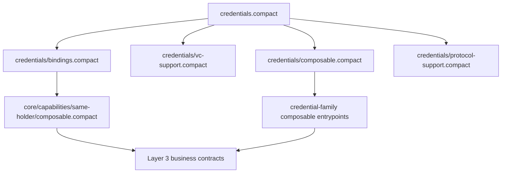

# @midnight-ntwrk/midnight-did-credentials

Generic Midnight VC/VP core for Compact-first credential families.

Status:

- reference implementation

Tier:

- reusable core package

Dependency direction:

- may depend only on lower shared primitives
- must not depend on DID-aware adapters, transport/orchestration packages,
  demos, or standalone integration harnesses

Reusable outside this repo:

- yes

Surface classification:

- `On-chain + off-chain`
- Compact entrypoints are the authoritative contract-authoring surface
- generated/runtime TypeScript exports are off-chain mirrors only

Start here:

1. write on-chain contracts against:
   - `src/credentials.compact`
   - `src/credentials/composable.compact`
   - narrower support entrypoints when composition requires less surface
2. use `src/index.ts` and generated/runtime exports only in wallets,
   verifiers, tests, and adapter code
3. read [`../docs/guides/integration-surface-map.md`](../docs/guides/integration-surface-map.md)
   when choosing between Compact and TypeScript surfaces
4. do not deploy this package root as a business contract; use it as a library surface
   for credential families and Layer 3 verifier/business contracts

Related docs:

- spec: [`../docs/spec/midnight-credentials.md`](../docs/spec/midnight-credentials.md)
- protocol classification: [`../docs/architecture/protocol-classification.md`](../docs/architecture/protocol-classification.md)
- profiles: [`../docs/spec/profiles.md`](../docs/spec/profiles.md)
- conformance: [`../docs/spec/conformance.md`](../docs/spec/conformance.md)
- credential status: [`../docs/spec/credential-status.md`](../docs/spec/credential-status.md)
- companion guide: [`../docs/guides/midnight-credentials-for-dummies.md`](../docs/guides/midnight-credentials-for-dummies.md)
- test matrix: [`../docs/testing/test-matrix.md`](../docs/testing/test-matrix.md)

## Purpose

This package is the reusable envelope and proof layer for credential families that will be modeled in separate specialization packages.

It owns the generic pieces that should be shared across many credential families:

- `SchemaRef`
- `VerificationMethodRef`
- `ExplicitHolderBinding`
- `SecretHolderBinding`
- `Proof`
- generic VC/VP envelope types through `VC<TClaims, TDisclosures, THolderBinding>`
- generic body-root helpers
- generic credential/presentation linking rules
- generic issuer proof-binding rules
- reusable holder-binding helper circuits for explicit and secret profiles
- shared VC-side status binding vocabulary for status-aware families:
  - `StatusRegistryRef`
  - `NoStatusBinding`
  - `RegistryBoundStatusBinding`

Status package-boundary rule:

- `credentials` owns the VC-side status binding shape
- `credentials-status-registry` owns registry-specific proof protocols,
  verifier-facing request helpers, and off-chain builders

This means a credential family should import status binding from this package,
while verifier applications and Layer 3 status workflows should import the
proof-protocol helpers from `credentials-status-registry`.

Protocol reading rule:

- the protocol modules in this package are reusable core protocol semantics
- transport/orchestration packages may wrap them, but they do not redefine them

## Compact Entry Points

- `src/credentials.compact` is the standalone entry point used for the package
  build and generated TS/JS artifacts.
- `src/credentials/composable.compact` is the shared Layer 3 root for contracts
  and credential families that need the full generic surface once.
- `src/credentials/vc-support.compact` is the narrower shared surface for VC
  envelope and proof helpers.
- `src/credentials/protocol-support.compact` is the narrower shared surface for
  issuance and presentation protocol modules.
- `src/credentials/bindings.compact` is the narrower shared surface for
  holder-binding types and witness-validation helpers.

These narrower entry points exist so capability packages can depend on less
than the full generic bundle when they do not need VC envelopes or protocols.

Deployability rule:

- `credentials` provides Compact library/build roots
- it is not the final business-contract surface an application should deploy
- deploy Layer 3 contracts that compose these roots through a family or demo/business package
They are alternative public surfaces, not internal layers underneath
`composable.compact`, because Compact does not deduplicate repeated includes.

It intentionally does not own schema-specific business logic such as:

- claim commitment layouts
- schema identifiers for a concrete family
- disclosure rules for a concrete family
- predicate circuits such as age, residency, or membership checks

Those belong in specialization packages such as:

- [`../prototypes/credential-families/birth`](../prototypes/credential-families/birth): explicit DID-bound holder profile
- [`../prototypes/credential-families/birth-secret`](../prototypes/credential-families/birth-secret): hidden holder-secret profile
- [`../core/capabilities/same-holder`](../core/capabilities/same-holder): same-holder composition capability for hidden-holder profiles

## Generic model

The reusable Compact module is `VC<TClaims, TDisclosures, THolderBinding>`.

It defines two generic envelope types:

- `Credential`
- `Presentation`

A specialization package provides:

- a concrete `TClaims` struct
- a concrete `TDisclosures` struct
- a concrete `THolderBinding` struct
- a claim-root helper for that claim set
- schema-specific validators
- disclosure validators
- any family-specific predicate circuits

## What the generic core validates

The generic core can validate:

- credential version and claim-root consistency
- issuance proof binding to the issuer verification method
- presentation version and linkage to the credential claim root
- presentation issuer consistency
- proof verification over a derived in-circuit challenge

The generic core intentionally does not force one holder-binding model.
That is delegated to specialization packages.

Current reusable holder-binding helper sets are:

- explicit DID-bound holder binding:
  - `assertValidExplicitHolderBinding(...)`
  - `assertMatchingExplicitHolderBindings(...)`
  - `assertProofMatchesExplicitHolderBinding(...)`
- lightweight Jubjub key holder binding:
- legacy compatibility Jubjub key holder binding:
  - `assertValidJubjubHolderBinding(...)`
  - `assertMatchingJubjubHolderBindings(...)`
  - `assertProofMatchesJubjubHolderBinding(...)`
- offchain DID holder binding:
  - `assertValidOffchainMidnightHolderBinding(...)`
  - `assertMatchingOffchainMidnightHolderBindings(...)`
  - `assertProofMatchesOffchainMidnightHolderBinding(...)`

TypeScript compatibility note:

- the Compact/core struct name remains:
  - `OffchainMidnightHolderBinding`
- the top-level TypeScript package also exports:
  - `OffchainDIDHolderBinding`
  as the preferred public-facing alias for integrators
- hidden holder-secret binding:
  - `secretHolderBindingCommitment(...)`
  - `secretHolderBindingChallengeResponse(...)`
  - `assertValidSecretHolderCredentialBinding(...)`
  - `assertValidSecretHolderPresentationBinding(...)`
  - `assertMatchingSecretHolderBindings(...)`
  - `assertSecretHolderBindingWitness(...)`

The generic core intentionally does not own same-holder multi-credential composition.

That capability now lives in a dedicated package:

- [`../core/capabilities/same-holder`](../core/capabilities/same-holder/README.md)

This keeps the generic core focused on single-credential invariants while
allowing business contracts to import same-holder composition only when needed.

## Read this first

If you are new to the model, read in this order:

1. [`../docs/guides/midnight-credentials-for-dummies.md`](../docs/guides/midnight-credentials-for-dummies.md)
2. [`../docs/spec/midnight-credentials.md`](../docs/spec/midnight-credentials.md)
3. this package README

## Naming choices

The generic core now uses:

- `Proof` instead of `JubjubCredentialProof`
- `issuanceProofChallenge(...)` and `presentationProofChallenge(...)` instead of a stored purpose enum
- `OffchainMidnightHolderBinding` as the canonical Compact/core struct name for
  the offchain DID-shaped holder-binding profile

Runtime/public-facing naming rule:

- `credentials-offchain-did` exposes `OffchainDIDHolderBinding` as the
  preferred adapter-facing name
- compatibility aliases may exist during migration, but the Compact/core struct
  remains `OffchainMidnightHolderBinding`

This is intentionally shorter because the same proof container is reused for both VC and VP flows.

## Canonical proof suite

The current Midnight VC/VP profile is explicitly Jubjub-based.

That means:

- `Proof` is still a Jubjub proof
- `Signature` is still a Jubjub signature
- `verifySignature(...)` still verifies a Jubjub signature

The API omits the curve name on purpose because the spec fixes the canonical proof suite for this profile.

## Why stored `purpose` was removed

We considered keeping a `purpose` field inside `Proof`, but it turned out to be redundant state.

The verifier already knows whether it is validating:

- an issuance proof over a credential body
- a presentation proof over a presentation body

So the current design removes the stored enum and keeps the important property instead:

- explicit domain separation in the challenge derivation

That domain separation now comes from dedicated helpers:

- `issuanceProofChallenge(...)`
- `presentationProofChallenge(...)`

This keeps the proof shape smaller and easier to adopt while still preventing accidental cross-context proof reuse.

## Why this split exists

We expect multiple credential families.

So the architecture should not force every family to duplicate:

- proof container types
- proof challenge derivation
- issuer proof binding
- holder proof binding
- generic VC/VP envelope rules

At the same time, the generic package should not decide:

- what the claims are
- how a family computes its claim root
- what disclosures are legal
- what domain-specific predicates exist

That balance is the point of this refactor.

## Build

- Compile Compact artifacts: `npm run contract -w credentials`
- Build TS exports: `npm run build -w credentials`
- Run tests: `npm test -w credentials`

## Note

Generic modules in Compact can be specialized by business packages, but top-level generic circuits are not directly exportable as package API. That is why this package exposes shared top-level proof helpers and a generic Compact module intended to be specialized by downstream packages.
