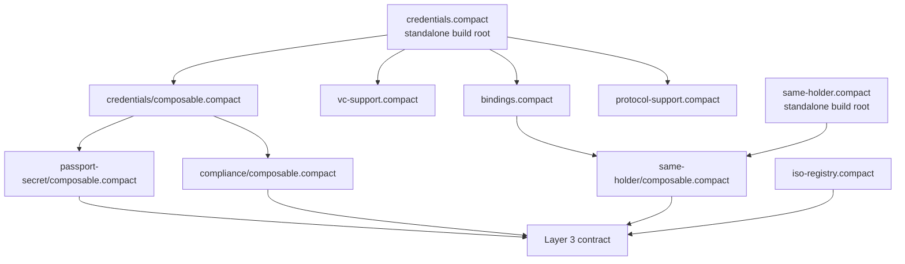

# Midnight Credentials Dependency Composition Model

Status: draft research note

## Problem

Midnight VC/VP packages are Compact-first. Concrete credential families expose
Compact structs and circuits, and the compiler generates TypeScript/JavaScript
artifacts for tests and applications. Layer 3 business contracts need a simple
way to import the credential families and protocol capabilities they require
without copying credential logic or depending on unstable generated internals.

The design goal is:

- Layer 3 contracts import concrete VC/VP/protocol capabilities directly.
- Generated TS/JS remains a build artifact, not the source of contract truth.
- Optional capabilities such as same-holder proofs do not become mandatory
  dependencies for every credential family.
- Published packages remain understandable for contract authors and wallet/app
  developers.

## Current Facts

The current repository already uses a layered package split:

| Layer | Package examples | Role |
|---|---|---|
| Layer 1 generic capabilities | `credentials`, `credentials-same-holder`, `credentials-iso-registry` | Generic VC/VP envelope, proof helpers, holder-binding profiles, same-holder circuits, shared code types |
| Layer 2 credential families | `credentials-birth`, `credentials-birth-secret`, `credentials-passport-secret`, `credentials-compliance` | Concrete claims, disclosures, requests, predicates, schema checks |
| Layer 3 business contracts | `credentials-demo-contract` | Contract state and business rules that compose one or more credential families |
| Layer 4 application/protocol orchestration | `credentials-protocol`, `credentials-openid`, `midnight-passport-prototype` | Transport/session/app coordination around Compact artifacts |

Important implementation detail:

- Compact source imports/includes are what matter for Layer 3 contract logic.
- Generated TS/JS artifacts are useful for tests, fixtures, serializers,
  application code, and package users, but Layer 3 Compact contracts should not
  treat generated TS/JS as an input dependency.

The current contracts use `include` for local Compact source composition and
module imports/prefixes for generic module instantiation, for example:

```compact
include "../../credentials-birth/src/birth-credential";

import VC<BirthCredentialClaims, BirthCredentialDisclosures, ExplicitHolderBinding>;

import IssuanceProtocol<
  BirthCredentialIssuanceOfferBody,
  BirthCredentialIssuanceRequestBody,
  BirthCredentialIssuanceResultBody
> prefix BirthCredentialIssuance_;
```

The Midnight MCP syntax reference confirms that Compact supports modular code
through imports, module generics, selective imports, and prefixes. The current
repo also relies on `include` for file-level source composition. The practical
recommendation is to keep the public package surface stable and compiler-tested
rather than expose arbitrary internal file paths.


## Compiler Spike Findings

A first Layer 3 compiler spike tried to compose the current top-level
`credentials-passport-secret` and `credentials-compliance` entry points in one
business contract. That failed because both entry points transitively include
`credentials-same-holder` and `credentials`, causing shared symbols such as
`SchemaRef` to be bound twice in the same scope.

A second spike tried to include shared dependencies once and instantiate each
credential family with a prefix. That avoided the duplicate generic core, but
failed because the current family validation files expect unprefixed generic VC
helpers such as `assertValidPresentationEnvelope`.

The failure is not a semantic problem in the credential model. It is a package
surface problem:

- the current top-level family entry points are good standalone build targets
- multi-family Layer 3 contracts need a different source surface
- validation/helper files that call generic VC helpers must be prefix-aware or
  wrapped by family-prefixed circuits

This is a useful result. It means the current package split is conceptually
right, but the current Compact source surface is optimized for standalone
credential-family compilation, not for multi-family Layer 3 composition.

The implementation model should therefore introduce composition-friendly
entry points before publishing packages.

## Composition-Friendly Entry Point Model

Each concrete credential family should expose two Compact entry points.

### Standalone entry point

Used for package-local tests, generated TS/JS artifacts, and simple consumers
that need only one family.

Example:

```text
src/secret-passport-credential.compact
```

Allowed behavior:

- includes generic dependencies
- instantiates the generic `VC` module
- exports convenient unprefixed family names
- compiles directly to `src/managed/<family>`

### Composition entry point

Used by Layer 3 contracts that compose multiple credential families.

Example candidate:

```text
src/secret-passport-credential/composable.compact
```

Required behavior:

- does not include shared generic dependencies such as `credentials` or
  `credentials-same-holder`
- assumes the Layer 3 contract imports shared dependencies once
- instantiates generic modules with a family prefix
- exports only family-prefixed concrete types and circuits
- ensures validation circuits call family-prefixed generic helpers or
  family-local wrapper circuits

This avoids both failure modes from the compiler spike:

- no duplicate `SchemaRef`, `Proof`, or holder-binding declarations
- no accidental collision between generic aliases such as `Credential` and
  `Presentation`

The likely final shape is:

```compact
// Layer 3 contract
include "credentials/src/credentials/composable";
include "credentials-same-holder/src/same-holder/composable";
include "credentials-iso-registry/src/iso-registry";

include "credentials-passport-secret/src/secret-passport-credential/composable";
include "credentials-compliance/src/sanction-screening-credential/composable";
```

Open design choice:

- either duplicate a small wrapper layer per family for standalone vs composable
  entry points, or refactor family internals so the standalone entry point is a
  thin wrapper around the composable entry point. The second option is cleaner
  but requires more Compact source restructuring.

Recommended direction:

1. Keep the standalone entry point as the package-local compiler target.
2. Extract family model/schema helpers into files that do not include generic
   dependencies.
3. Add a composable entry point that imports generic modules with a family
   prefix and exposes family-prefixed wrapper circuits.
4. Make validation files depend on those family-prefixed wrapper circuits, not
   on global unprefixed generic helper names.

## Naming And Collision Strategy

Compact provides prefix imports for module-level names:

```compact
import A prefix A$;
import B prefix B$;

// Use A$myCircuit and B$myCircuit without ambiguity.
```

That is the right model for generic credential modules and protocol modules.
For example, a Layer 3 contract that composes two credential families should not
rely on global helper names such as `Credential`, `Presentation`, or
`assertValidPresentationEnvelope`. Each family should instantiate the generic
module with its own prefix and then expose explicit family names:

```compact
import VC<PassportClaims, PassportDisclosures, BlindedSecretHolderBinding>
  prefix Passport_;

export type PassportCredential = Passport_Credential;
export type PassportPresentation = Passport_Presentation;
```

The caveat is `include`. An `include` composes source into the current scope, so
including two top-level family files can still duplicate shared declarations
before prefixing has any chance to help. That is the exact failure seen in the
compiler spike. The practical rule is:

- use `include` for one-time shared source dependencies
- use `import ... prefix ...` for generic module instantiations and imported
  module surfaces
- keep Layer 3 imports pointed at composition-safe entry points that do not
  transitively include the same shared core twice

## Recommended Package Shape

Each reusable credential package should publish three surfaces.

### 1. Compact Source Surface

This is the contract-author surface.

Recommended files:

```text
src/<family>.compact                 # standalone canonical entry point
src/<family>/composable.compact      # Layer 3 composition entry point
src/<family>/model.compact           # structs and request models
src/<family>/protocol-model.compact  # concrete protocol message bodies
src/<family>/helpers.compact         # roots, schema checks, constructor helpers
src/<family>/validation.compact      # assertion circuits and predicates
```

Rules:

- The top-level `<family>.compact` is the stable standalone entry point.
- The `<family>/composable.compact` entry point is the stable Layer 3 entry
  point when more than one credential family is composed in the same contract.
- Internal files may exist for readability, but Layer 3 contracts should avoid
  importing them directly unless the package explicitly documents them as public.
- Public circuits should use family-prefixed names, such as
  `assertValidSecretPassportCredential` or
  `sanctionScreeningCredentialClaimRoot`, to avoid collisions after composition.
- Generic module instantiations should use prefixes, for example
  `SecretPassportCredentialIssuance_`, so generated protocol types remain
  readable and collision-resistant.

## Shared Module Decomposition

The shared layer now distinguishes between a standalone package root and the
smaller shared surfaces that capability packages or Layer 3 contracts can
include intentionally.

Shared package surfaces:

| Package | Surface | Purpose |
|---|---|---|
| `credentials` | `src/credentials.compact` | standalone package root used for generated TS/JS artifacts |
| `credentials` | `src/credentials/composable.compact` | full shared Layer 3 root for credential-family composables and business contracts |
| `credentials` | `src/credentials/vc-support.compact` | VC envelope and proof-validation support |
| `credentials` | `src/credentials/protocol-support.compact` | issuance and presentation protocol modules |
| `credentials` | `src/credentials/bindings.compact` | holder-binding structs and witness-validation helpers |
| `credentials-same-holder` | `src/same-holder.compact` | standalone package root used for generated TS/JS artifacts |
| `credentials-same-holder` | `src/same-holder/composable.compact` | same-holder capability without re-including the whole `credentials` bundle |
| `credentials-iso-registry` | `src/iso-registry.compact` | flat shared vocabulary surface; no extra composable split needed today |

This is enough decomposition for the current Passport + Screening prototype:

- Passport and Screening credential-family composables include the full shared
  `credentials/composable.compact` surface once in Layer 3.
- `same-holder/composable.compact` can depend on the narrower
  `bindings.compact` surface when used in a smaller capability-only contract.
- `iso-registry` stays flat because it does not transitively include any other
  shared modules and does not create the duplicate-symbol problem.
- `vc-support`, `protocol-support`, and `bindings` are alternative public
  surfaces. `composable.compact` includes the leaf files directly rather than
  including those surfaces, because Compact does not deduplicate repeated
  `include` chains.



### 2. Generated Runtime Surface

This is the test/application surface produced by `compact compile`.

Recommended files:

```text
dist/managed/<family>/contract/index.js
dist/managed/<family>/contract/index.d.ts
dist/<family>.compact
```

Rules:

- Generated files are published for TypeScript consumers, fixtures, pure-circuit
  tests, and serialization codecs.
- Layer 3 Compact contracts should not import generated TS/JS.
- TS serializers should use generated Compact type descriptors or explicit
  package codecs, not ad-hoc JSON encoding.
- Generated APIs are version-coupled to the Compact compiler/runtime and should
  be treated as package build outputs.

### 3. TypeScript Convenience Surface

This is the app/wallet/test developer surface.

Recommended files:

```text
src/index.ts      # fixtures, codec exports, pureCircuits exports
src/codecs.ts     # Compact value encode/decode helpers for family structs
src/fixtures/*    # deterministic test fixtures only
```

Rules:

- Export family-specific helpers for app tests and prototype flows.
- Do not hide the Compact source model behind TypeScript-only abstractions.
- Keep fixtures clearly separated from production helper APIs.

## Layer 3 Composition Model

Layer 3 business contracts should be explicit about every credential family and
capability they need.

Recommended pattern:

```compact
pragma language_version >= 0.20;

import CompactStandardLibrary;

include "../../credentials-birth/src/birth-credential";
include "../../credentials-same-holder/src/same-holder";

export circuit verifyBusinessEligibility(
  credential: BirthCredential,
  credentialProof: Proof,
  request: BirthCredentialPresentationRequest,
  presentation: BirthCredentialPresentation,
  presentationProof: Proof,
  currentDay: Uint<32>
): [] {
  assertValidBirthCredentialPresentation(
    credential,
    credentialProof,
    presentation,
    presentationProof
  );
  assertBirthPresentationSatisfiesRequest(
    credential,
    request,
    presentation,
    presentationProof
  );

  // Business state mutation belongs here, not in the credential package.
}
```

For multi-credential policies, the Layer 3 contract should compose concrete
families through composition-safe entry points:

```compact
include "../../credentials/src/credentials";
include "../../credentials-same-holder/src/same-holder/composable";
include "../../credentials-iso-registry/src/iso-registry";

include "../../midnight-passport-prototype/packages/credentials-passport-secret/src/secret-passport-credential/composable";
include "../../midnight-passport-prototype/packages/credentials-compliance/src/sanction-screening-credential/composable";
```

Then the contract should:

1. verify each credential/presentation with its own family-specific circuits
2. apply cross-credential assertions such as same-holder proof
3. apply product-specific policy such as age, compliance freshness, or country
4. mutate business ledger state or return a typed business result

This keeps Layer 3 readable. A voting contract reads like a voting contract; an
auction contract reads like an auction contract. Credential packages provide
capabilities, not hidden product policy.

## Dependency Graph Recommendation

Use directed dependencies only from higher layers to lower layers:

```text
Layer 1 generic core
  credentials
  credentials-same-holder
  credentials-iso-registry
        ↑
Layer 2 concrete credential families
  credentials-birth
  credentials-birth-secret
  credentials-passport-secret
  credentials-compliance
        ↑
Layer 3 business contracts
  credentials-demo-contract
  future voting / auction / access contracts
        ↑
Layer 4 application orchestration
  credentials-protocol
  credentials-openid
  midnight-passport-prototype
```

Recommended constraints:

- Layer 1 must not depend on Layer 2 or Layer 3.
- Layer 2 may depend on Layer 1 and optional capability packages.
- Layer 3 may depend on only the Layer 2 families and Layer 1 capabilities it
  actually uses.
- Layer 4 may depend on generated TypeScript surfaces from Layer 1 through
  Layer 3, but should not change canonical Compact semantics.

## Capability Packages

Optional behaviors should live in small capability packages, not in a universal
credential super-package.

Current examples:

| Capability | Package | Why separate |
|---|---|---|
| Same-holder proof | `credentials-same-holder` | Needed only for multi-credential holder correlation |
| ISO code structs | `credentials-iso-registry` | Reusable data vocabulary, not VC semantics |
| OpenID-shaped transport DTOs | `credentials-openid` | TypeScript transport layer, not Compact contract logic |

Future candidate capability packages:

| Capability | Potential package | Notes |
|---|---|---|
| Revocation/status | `credentials-status` | Should remain optional until status model stabilizes |
| Nullifier/reuse prevention | `credentials-nullifier` | Useful for voting/access contracts, not mandatory for all VC families |
| Trust registry references | `credentials-trust-policy` | Likely Layer 5/governance-facing, not part of base credential validation |
| Requirement descriptors | `credentials-requirements` | Could help wallets understand Layer 3 contract requests if repeated patterns emerge |

## Versioning And Publishing Requirements

A credential package should version these together:

- Compact schema structs
- exported validation circuits
- generated TS/JS artifacts
- codecs and fixtures
- documented schema identifiers

Recommended package contents for publishing:

```text
package.json
README.md
dist/**
src/**/*.compact
```

Recommended `package.json` conventions:

- keep package name stable, for example
  `@midnight-ntwrk/midnight-did-credentials-passport-secret`
- include Compact sources in published files
- expose TypeScript entry points through `exports`
- document the stable Compact entry point path
- pin compatible `@midnight-ntwrk/compact-runtime` and Compact compiler/runtime
  expectations

Open question:

- The best published import path for Compact source dependencies needs a real
  package-consumer experiment. Today the repo uses relative `include` paths.
  Before publishing, create a small external consumer contract and verify the
  compiler can resolve the intended package source paths cleanly.

## Generated Code Guidance

Generated code is unavoidable and useful, but it should not leak into the wrong
layer.

Use generated code for:

- TypeScript type checking of fixture objects
- pure-circuit tests
- Compact value codecs and serialization
- application/wallet integration
- docs and API references

Do not use generated code for:

- defining canonical schema semantics
- Layer 3 contract imports
- cross-package Compact source composition
- business policy that should live in Compact

Rule of thumb:

> If the question is "what does this credential mean?", answer from Compact
> source. If the question is "how does TypeScript carry this credential?", use
> generated TS/JS and codecs.

## Recommended Next Prototype Task

The first dependency-composition spike is now represented by
`credentials-demo-contract/src/passport-compliance-demo.compact`. It composes:

- `credentials-same-holder`
- `credentials-iso-registry`
- `credentials-passport-secret/src/secret-passport-credential/composable`
- `credentials-compliance/src/sanction-screening-credential/composable`

The contract verifies a Passport presentation and a Sanction Screening
presentation under one verifier challenge, checks the same hidden holder through
the blinded holder-binding capability, and applies Layer 3 business rules such
as passport age, passport expiry, screening result, PEP status, screening
freshness, and screening expiry.

The spike validates these points:

- standalone credential-family entry points can remain unchanged for package
  builds and generated TS/JS artifacts
- capability packages can follow the same standalone/composable split when they
  otherwise re-include the full shared bundle
- composition-safe entry points prevent duplicate shared `SchemaRef`, `Proof`,
  holder-binding, and protocol declarations
- family-local wrapper circuits are enough to route generic VC helper calls
  through prefixed module instantiations
- generated TypeScript for the Layer 3 contract exposes both concrete family
  types and the composed business circuit

Next, harden this from a spike into a reusable pattern:

1. Add or generate a minimal Layer 3 contract that imports two concrete
   credential families and one optional capability package. Done for Passport +
   Compliance.
2. Keep all credential checks family-specific and all business state mutation in
   the Layer 3 contract. Done for the current eligibility check.
3. Verify Compact compilation and generated TS artifacts. Done in
   `credentials-demo-contract`.
4. Add a TypeScript test that imports the Layer 3 generated contract and proves
   the expected public types are usable. Done in
   `passport-compliance-composition.test.ts`.
5. Add fixture-backed tests that execute the composed eligibility circuit with
   successful and failing Passport + Compliance presentations.
6. Document the exact import paths that worked in each package README. Started.
7. Generalize the standalone/composable split to any future credential family
   before publishing.

Candidate scenario:

- `credentials-demo-contract` or a new `credentials-investment-demo-contract`
  imports:
  - `credentials-passport-secret`
  - `credentials-compliance`
  - `credentials-same-holder`
- The contract verifies:
  - passport age and expiry
  - compliance PASS / PEP=false / freshness
  - same-holder binding
- The contract returns or stores an investment eligibility capability.

This would validate the composition model against the Midnight Passport use
case and produce the dependency guidance needed before publishing packages.

## Decision For Now

Use an explicit dependency composition model:

1. one stable standalone Compact entry point per credential/capability package
2. one stable composition Compact entry point for multi-family Layer 3 imports
3. concrete family packages export family-prefixed types and circuits
4. Layer 3 contracts include/import only the concrete families and optional
   capability packages they need
5. generated TS/JS artifacts are published for applications and tests, not for
   Compact contract source composition
6. no generic multi-credential bundle package until repeated Layer 3 contracts
   prove the abstraction is worth it
