# Midnight Credentials For Dummies

Version: `0.1-draft`

This document is the friendly companion to [`../spec/midnight-credentials.md`](../spec/midnight-credentials.md).

The specification is still the source of truth.
This guide is the comic-book director's cut:

- more story
- more plain-language explanations
- more pointers to the actual Compact circuits
- more clarity about how the Midnight stack changes the SSI mental model

If the specification feels dense, start here.

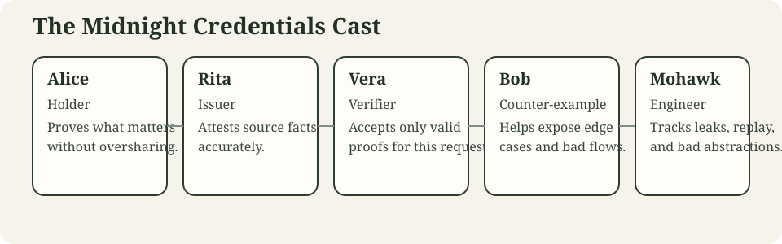

## Who This Is For

This document is for people who:

- understand DIDs and VCs only a little
- understand Midnight only a little
- want to know what the current code is doing
- want to learn one capability at a time instead of decoding the full spec first

If the specification feels like it was written by three auditors and one sleep-deprived cryptographer, this document is your safer entry point.

## How To Read This

Read it like a story:

1. start with the simplest credential
2. see what problem appears next
3. watch Mohawk become professionally dissatisfied
4. see which capability fixes the problem
5. jump to the linked tests and circuits when you want the exact mechanics

## Cast Of Characters

We reuse the same people across chapters.

| Character | Role | What they want | What goes wrong for them |
| --- | --- | --- | --- |
| Alice | holder | prove what matters without oversharing | people keep asking for more than they need |
| Bob | another holder | sometimes honest, sometimes the counter-example | accidentally helps us discover edge cases |
| Rita | issuer | attest source facts accurately | does not want the issuance model to become nonsense |
| Vera | verifier | accept only valid proofs for this request | would also like fewer support tickets |
| Mohawk | engineer | keep privacy and composability sane | notices every leak, replay path, and awkward abstraction |

## The World Rules

Before the story starts, remember three Midnight-specific rules.

### Rule 1: Smart contracts are passive

Contracts do not wake Alice up.
They do not send messages.
They do not open sessions.
They expose state and circuits.

So if a verifier contract has a request, that request is:

- read by an application
- derived by an application
- or reconstructed by the caller before submission

The contract does not shout across the network like a haunted Slack bot.

### Rule 2: Witnesses live off-chain

The private material used to satisfy the proof lives with the holder.

That means:

- witness preparation is local
- disclosure decisions are local
- predicate proofs are local
- the application layer matters a lot

### Rule 3: Midnight verification is split across layers

The stack is not "everything happens in the contract".

The real flow is:

1. an app or wallet orchestrates the protocol
2. the holder prepares witnesses and proofs locally
3. the contract verifies submitted evidence and performs business logic

If you remember only one architectural sentence, remember this:

- protocols are off-chain
- verification semantics are on-chain

## A Fast "Who Sees What" Cheat Sheet

Regular people usually get lost at exactly this point:

- Rita has some facts
- Alice has some secrets
- Vera asks for a proof
- the contract checks something

and suddenly nobody remembers which bytes are visible to whom.

So here is the short version.

| Thing | Rita sees | Alice sees | Vera sees | Contract sees |
| --- | --- | --- | --- | --- |
| source facts before issuance | yes | sometimes, if she supplied them | no | no |
| raw holder secret | no | yes | no | no |
| commitment to a claim | yes | yes | yes, if included in the credential body | yes, if submitted |
| issuer proof | yes | yes | yes | yes |
| holder proof | no | yes | yes | yes |
| openings for disclosed claims | no after issuance | yes | yes, but only for disclosed claims | yes, but only if submitted |
| predicate witness such as raw birth date | no after issuance | yes | no in the intended model | available to the circuit as witness during verification |
| verifier challenge | no unless Vera shared it | yes | yes | yes, if checked by the circuit |
| verifier-scoped pseudonym | no | yes | yes, for that verifier only | yes, if checked by the circuit |

If Mohawk had to compress the whole system into one sentence, it would be:

- Rita attests facts
- Alice keeps secrets
- Vera asks precise questions
- the contract checks consistency

That is the mental model.

## One-Screen Summary

Midnight Credentials in the current prototype are built in five layers.

| Layer | Purpose | Current packages or status |
| --- | --- | --- |
| Layer 1 | reusable generic credential capabilities | `credentials`, `credentials-same-holder` |
| Layer 2 | concrete credential-family logic | `credentials-birth`, `credentials-birth-secret` in the current workspace; additional families are future or adjacent prototype examples |
| Layer 3 | concrete verifier and business use-cases | `use-cases/hello-verifier/contract`, `use-cases/age-gate/contract` |
| Layer 4 | application orchestration, adapters, transports, and integration harnesses | `components/orchestration/protocol`, `protocols/openid`, `components/adapters/offchain-did`, `components/integration/standalone-environment` |
| Layer 5 | governance and trust policy | abstract future scope for now |

Think of it this way:

- Layer 1 gives you reusable Lego bricks.
- Layer 2 builds one specific credential family.
- Layer 3 uses those credentials to decide whether the contract should do something useful.
- Layer 4 coordinates the real protocol between apps, wallets, and contracts.
- Layer 5 decides which issuers, verifiers, schemas, and policies the ecosystem should trust.

### Why Layer 5 Exists But Stays Abstract

Governance is real.
The moment a system asks:

- which issuer is trusted
- which verifier is authorized
- which VC types are supported
- which schema versions are accepted

you are already in governance territory.

But that is not the same thing as the VC core.

So in the current work:

- Layer 5 is acknowledged
- Layer 5 is not yet implemented as a package
- Layer 5 must not pollute the core VC design while the cryptographic and protocol model is still stabilizing

## Quick Package Map

### Current validated workspace packages

| Package | What it does in simple words |
| --- | --- |
| `credentials` | the generic VC/VP envelope, proof logic, and holder-binding primitives |
| `credentials-same-holder` | optional proof that two or three hidden-holder presentations came from the same holder |
| `credentials-birth` | a birth credential family using explicit DID-based holder binding |
| `credentials-birth-secret` | the same birth family, but with hidden holder binding and better privacy |
| `credentials-iso-registry` | shared numeric ISO code types — countries, currencies, languages, regions, and genders as circuit-friendly integers |
| `credentials-status-registry` | prototype status/revocation package with a registry contract surface and off-chain builders |
| `use-cases/hello-verifier/contract` | the smallest current verifier contract that checks one typed request against one hello-family presentation |
| `use-cases/age-gate/contract` | a richer business use-case package that issues reusable access capabilities from explicit-holder and hidden-holder flows |
| `use-cases/age-gate/scenarios` | BDD living-documentation scenarios for the concrete age-gate use case |
| `components/adapters/offchain-did` | off-chain DID-aware adapter helpers for deriving holder-binding values |
| `protocols/openid` | OpenID-shaped transport/domain schemas for Compact VC/VP payloads |
| `components/orchestration/protocol` | party-boundary simulation layer with IssuerAgent, HolderAgent, VerifierAgent, and a MessageBus transport seam |
| `components/integration/standalone-environment` | shared Docker environment for integration tests — provisions real Midnight DIDs for issuer, holder, and verifier |

## Sequential Learning Path Through The Current Prototypes

If you want a low-confusion reading order, use this one.

| Step | Start here | What you learn before moving on |
| --- | --- | --- |
| 1 | `credentials-birth` | the smallest current concrete credential family with explicit holder binding |
| 2 | `use-cases/hello-verifier/contract` | the smallest verifier contract that consumes that starter family |
| 3 | `use-cases/age-gate/contract/src/demo.compact` | how a business contract turns successful verification into a reusable capability |
| 4 | `credentials-birth-secret` | hidden holder binding, blinded issuance anchors, pseudonyms, and same-holder composition |
| 5 | `use-cases/age-gate/contract/src/demo-revocation.compact` | how the current prototype status and revocation path changes verifier requirements |
| 6 | `use-cases/age-gate/scenarios` | the same flows written as living documentation for integrators |
| 7 | `components/orchestration/protocol` | how the same families behave when issuer, holder, and verifier are isolated into agents |
| 8 | `components/integration/standalone-environment` | how the same flows are exercised against a real Midnight stack |

Practical rule for the rest of this guide:

- when a section names a package or use-case path from this list, treat it as current workspace material on `develop`
- when a section talks about possible future families, treat it as design-space commentary rather than current repository scope

## Runnable Prototype Ladder

The table above tells you what to read.
This one tells you what to run.

If you are onboarding a new engineer, this is the lowest-friction current path through the repository.

| Step | Run | What you should learn from it |
| --- | --- | --- |
| 1 | `npm run test:ci -w credentials-birth` | the explicit-holder birth family works on its own before any business contract is added |
| 2 | `npm run test:ci -w use-cases/hello-verifier/contract` | the smallest verifier contract can build one typed request and verify one presentation |
| 3 | `npm run test:ci -w use-cases/age-gate/contract` | the explicit-holder business flow can issue, verify, mint a capability, and later claim it |
| 4 | `npm run test:ci -w credentials-birth-secret` | hidden-holder binding, blinded issuance anchors, pseudonyms, same-holder composition, and prototype status-aware family checks all work at the family layer |
| 5 | `npm run test:bdd:smoke` | the age-gate use-cases are also captured as living-documentation scenarios rather than only as unit tests |
| 6 | `npm run test:ci -w components/orchestration/protocol` | issuer, holder, and verifier can be isolated into agents without cheating on party boundaries |
| 7 | `npm run test:integration -w components/orchestration/protocol` | the protocol flow still works against real Midnight-backed infrastructure; requires Docker |

Rule of thumb:

- if Step 2 is too small for your task, go to Step 3
- if Step 3 is too public-holder oriented, go to Step 4
- if Step 4 feels too circuit-local, go to Step 5 or Step 6
- if Step 6 passes but you still distrust the environment assumptions, go to Step 7

## Chapter 1: Rita Issues A Very Boring, Very Important Credential

Rita works in an imaginary office where every drawer has a policy and every policy has a form.

Alice shows up and needs a credential that says:

- Alice has a subject ID
- Alice has a legal name
- Alice has a birth date
- Alice has a birth country

Rita does not issue "age over 18" directly.
That would be too narrow and too brittle.
Instead she attests to source facts.

That is the first important design choice:

- credential = source facts
- later proof = derived facts

### Why The Credential Body Uses Commitments

The credential body is not a pile of raw personal data.
It is mostly commitments to personal data.

That gives us these benefits:

- the structure is strongly typed for Compact
- the verifier can check integrity without seeing every value
- later predicates can be proven from committed values

This is the birth-credential choice, not a generic VC limitation. The generic
`VC<TClaims, ...>` envelope accepts whatever typed `TClaims` a credential family
defines. A family can use:

- direct public claims when simplicity and interoperability matter more than
  minimization
- direct selectively disclosed claims when the prototype can tolerate raw values
  in the credential body but still wants request gates
- committed private claims when values should not be cleartext in the credential
  body
- predicate-only commitments when a verifier needs a yes/no or threshold result
  rather than the raw value

The mixed reference package is
`prototypes/credential-families/mixed-claims`: it puts low-sensitivity metadata
in direct public fields and keeps identity/date/tier values behind commitments.

### Conceptual Diagram


### What The Circuits Are Actually Doing

In code, this chapter is mostly about these circuits:

- `prototypes/credential-families/birth/src/birth-credential.compact`
  - `birthCredentialClaimRoot(...)`
  - `subjectIdCommitment(...)`
  - `legalNameCommitment(...)`
  - `birthDateCommitment(...)`
  - `birthCountryCodeCommitment(...)`
- `core/primitives/credentials/src/credentials.compact`
  - `VC<...>.assertValidCredentialEnvelope(...)`
  - `VC<...>.assertValidCredentialProof(...)`
- `prototypes/credential-families/birth/src/birth-credential.compact`
  - `assertValidBirthCredential(...)`

The claim commitment circuits (`subjectIdCommitment`, `birthDateCommitment`, etc.) live in a shared module `prototypes/credential-families/birth/src/birth-credential/claims.compact` that is imported by both the explicit-holder and secret-holder credential families. That avoids duplicating the commitment logic across packages.

### In Plain Words

- the claim commitment circuits turn concrete values plus openings into fixed commitments
- `birthCredentialClaimRoot(...)` hashes the ordered commitment set into one stable root
- `assertValidCredentialEnvelope(...)` checks generic credential invariants such as version and claim-root consistency
- `assertValidCredentialProof(...)` makes sure the issuer proof really belongs to the issuer method recorded in the credential
- `assertValidBirthCredential(...)` glues the generic checks to the birth schema

### What The `*Commitment` Properties Mean Inside A VC

This is the simplest way to read a field such as:

- `subjectIdCommitment`
- `birthDateCommitment`
- `nationalityCommitment`
- `genderCommitment`

It means:

- "the issuer is attesting to a real value"
- "but the value itself is not stored here in clear form"
- "instead, the VC stores a commitment to that value"

So inside the VC:

- the commitment property is the durable public anchor
- the raw value is not part of the public credential body
- the opening is also not part of the public credential body

In practical terms, a commitment property gives the VC two useful traits at once:

- integrity: the issuer has signed a stable typed field
- privacy: the field does not reveal the underlying value by itself

### Why The VC Stores Commitments Instead Of Raw Values

Because the VC has to survive three different futures:

1. full disclosure later
2. partial disclosure later
3. predicate proof later

If the VC stored only raw values, privacy would be poor.
If it stored only opaque hashes with no typed structure, later verification would be awkward.

The commitment field is the compromise:

- typed enough for Compact
- hidden enough for privacy
- stable enough for later proofs

### One Example In Natural Language, TypeScript, And Compact

Natural language:

- Rita knows Alice's birth date.
- Rita does not want to publish it directly in the VC.
- So the VC stores `birthDateCommitment`, not the raw birth date.

TypeScript:

```ts
const birthDateCommitment = pureCircuits.birthDateCommitment(
  witness.birthDateDays,
  witness.birthDateOpening,
);

const credential = {
  ...,
  claims: {
    ...,
    birthDateCommitment,
  },
};
```

Compact:

```compact
export circuit birthDateCommitment(
  birthDateDays: Uint<32>,
  opening: Bytes<32>
): Bytes<32>
```

The VC publishes:

- `birthDateCommitment`

The VC does not publish:

- `birthDateDays`
- `birthDateOpening`

### Why This Matters

By the end of this chapter, Alice has something useful.
But she does not yet have something reusable.

She has a credential body and an issuer proof.
She does not yet have a presentation for a verifier.

### Tests For This Chapter

- `prototypes/credential-families/birth/src/test/capability-profiles.test.ts`
  - "supports the simplest issuer-attested source claim flow"
- `prototypes/credential-families/birth/src/test/holder-binding.test.ts`
  - "binds the issuer proof to the credential body"

## Chapter 2: Why A Presentation Exists

Alice now wants to use the credential.
Vera does not just want a static file dropped on her desk like an expired conference badge.

She wants proof that:

- the credential is real
- the holder is the right holder
- the proof is for this verifier interaction, not a replay from Tuesday

So we add a presentation.

### The Main Idea

A credential says:

- "Rita attested these claims"

A presentation says:

- "Alice is using this credential now, for this request, under this verifier challenge"

### Why The Challenge Exists

Without a verifier challenge, a presentation can be replayed.

With a verifier challenge:

- the holder proof becomes session-bound
- old presentations become less useful
- the verifier can state exactly what interaction this proof belongs to

### Sequence

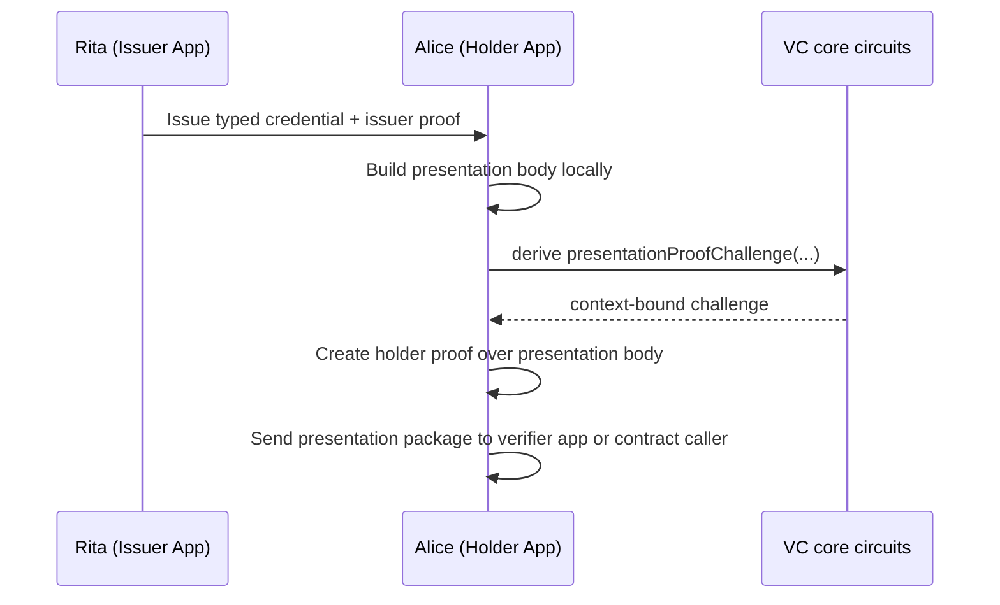

### What The Circuits Are Actually Doing

In the generic core:

- `verifySignature(...)`
- `issuanceContextTag(...)`
- `presentationContextTag(...)`
- `issuanceProofChallenge(...)`
- `presentationProofChallenge(...)`
- `assertValidIssuanceContextProof(...)`
- `assertValidPresentationContextProof(...)`

### In Plain Words

- `Proof` is reused for both issuance and presentation
- the system does not store a `purpose` field anymore
- instead, the context is separated by dedicated challenge derivation

That means:

- issuance proof uses issuance context
- presentation proof uses presentation context
- the same proof shape can be reused safely without pretending those contexts are identical

Mohawk approves of this because it is shorter, cleaner, and harder to misuse by accident.
Mohawk rarely approves of anything before coffee.

### Tests For This Chapter

- `core/primitives/credentials/src/test/proof-context.test.ts`
- `prototypes/credential-families/birth/src/test/holder-binding.test.ts`
  - "enforces a verifier-defined presentation request"

## Chapter 3: Explicit Holder Binding

The easiest holder model is:

- the credential is issued to Alice's DID verification method
- the presentation must be signed by that same method

This is simple.
Operationally, it is very good.
Privacy-wise, it is merely "fine, until it is not".

### Why This Model Is Good

- easy to explain
- easy to debug
- easy to integrate
- easy to map to DID thinking

### Why Mohawk Starts Squinting At It

If Alice keeps presenting the same holder method to many verifiers, those verifiers can correlate her.

The cryptography is not broken.
The privacy posture is just not ambitious enough.

### Diagram

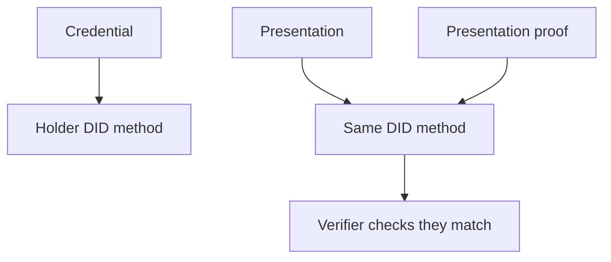

### What The Circuits Are Actually Doing

In the generic core:

- `assertValidExplicitHolderBinding(...)`
- `assertMatchingExplicitHolderBindings(...)`
- `assertProofMatchesExplicitHolderBinding(...)`

In the birth specialization:

- `assertValidBirthCredentialPresentation(...)`

### In Plain Words

- the credential stores a holder DID method reference
- the presentation stores a holder DID method reference
- the presentation proof signer must match that same method

This is good engineering.
It is just not the end of the privacy story.

### Tests For This Chapter

- `prototypes/credential-families/birth/src/test/holder-binding.test.ts`
  - "binds the holder proof to the presentation body"
- `prototypes/credential-families/birth/src/test/capability-profiles.test.ts`
  - "supports an operational flow with explicit holder binding and selective disclosure"

## Chapter 4: Selective Disclosure And The Age Predicate

Now Vera says:

"I do not need Alice's full birth date. I need to know whether Alice is old enough."

This is where Midnight gets interesting.

Rita attests source facts.
Alice later proves a derived fact.

That is the pattern:

- credential = source claims
- presentation = selected disclosures + predicates

### Why This Matters

Without predicates:

- Alice reveals more than necessary

With predicates:

- Alice reveals less
- Vera still gets the answer she needs

### Sequence

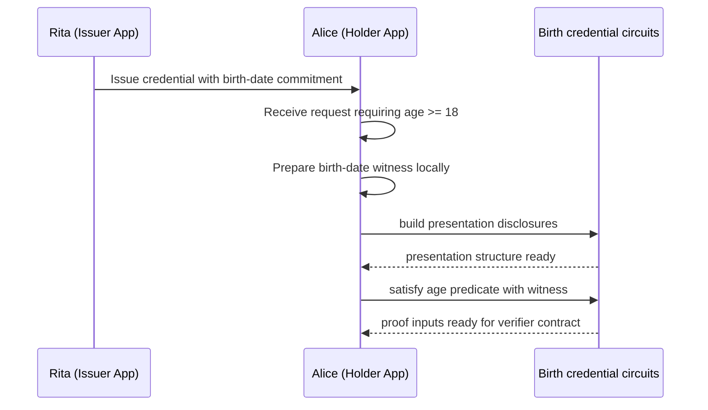

### What The Circuits Are Actually Doing

In `prototypes/credential-families/birth/src/birth-credential.compact`:

- `assertValidBirthCredentialPresentationRequest(...)`
- `assertBirthPresentationSatisfiesRequest(...)`
- `assertValidBirthCredentialAgePredicate(...)`

### In Plain Words

- the request says what the verifier wants
- the presentation says what Alice is willing to disclose or prove
- `assertBirthPresentationSatisfiesRequest(...)` checks that the presentation really satisfies the request
- `assertValidBirthCredentialAgePredicate(...)` checks the hidden birth-date witness against the committed birth-date claim and verifies the threshold condition

That last part is the magical-looking bit.
It is also the important bit.

The verifier does not need to know the raw birth date if the contract can still validate:

- the witness matches the commitment
- the witness implies the predicate

### What Happens To Commitment Properties Inside A VP

This is the missing piece for many readers.

The presentation usually does not copy all the raw personal data out of the VC.
Instead, it stays anchored to the VC commitments in one of three ways.

#### Mode 1: Keep The Commitment Hidden

The VP says:

- "I am proving something about the committed value"

but it does not reveal the value or the opening.

This is what happens for a pure predicate such as:

- `age >= 18`

The verifier gets:

- the credential
- the presentation
- the proof

The verifier does not get:

- raw birth date
- birth-date opening

#### Mode 2: Selectively Open The Commitment

The VP says:

- "I am revealing this one value, and here is the opening that proves it matches the VC commitment"

For example, Alice might reveal nationality.

The verifier gets:

- the disclosed nationality value
- the nationality opening

Then the circuit recomputes the commitment and checks it matches the commitment stored in the VC.

#### Mode 3: Carry The Commitment Forward As An Anchor

The VP often still references the credential's claim root or committed structure, so the verifier knows:

- this presentation belongs to that issued credential
- the disclosed or proven facts are tied back to the original VC

So the VP is not a brand new identity object.
It is a controlled use of the existing VC commitments.

### A Very Short Rule Of Thumb

Inside the VC:

- `*Commitment` fields are long-lived privacy-preserving anchors

Inside the VP:

- those anchors are either:
  - selectively opened
  - used for predicate proofs
  - or referenced indirectly through the credential claim root

### One Example In Natural Language, TypeScript, And Compact

Natural language:

- Alice has a VC with `nationalityCommitment`.
- Vera asks Alice to reveal nationality.
- Alice includes the nationality value and opening in the VP disclosure.
- The verifier recomputes the commitment and checks it matches the VC.

TypeScript:

```ts
const presentation = {
  ...,
  disclosed: {
    revealNationality: true,
    nationalityValue: witness.nationality,
    nationalityOpening: witness.nationalityOpening,
  },
};
```

Compact thinking:

```compact
assert(
  nationalityCommitment(
    presentation.disclosed.nationalityValue,
    presentation.disclosed.nationalityOpening
  ) == credential.claims.nationalityCommitment
)
```

The important idea is:

- the VP does not ask the verifier to trust the disclosed value by itself
- the VP asks the verifier to check that the disclosed value matches the commitment already signed in the VC

### Tests For This Chapter

- `prototypes/credential-families/birth/src/test/age-predicate.test.ts`
- `prototypes/credential-families/birth/src/test/capability-profiles.test.ts`
  - "supports a stronger flow with explicit holder binding, selective disclosure, and age predicate"

## Chapter 5: Alice Notices Someone Is Following Her

At first, everything seems fine.

Then Alice uses the same holder identifier with two verifiers.
Then three.
Then five.

Then she gets that uncomfortable feeling that somewhere, a spreadsheet has been opened in her honor.

She goes to Mohawk and says:

"I think they are tracking me."

Mohawk sighs the sigh of a person who has seen the same problem in six ecosystems and one procurement process.

"Yes," he says. "They probably are."

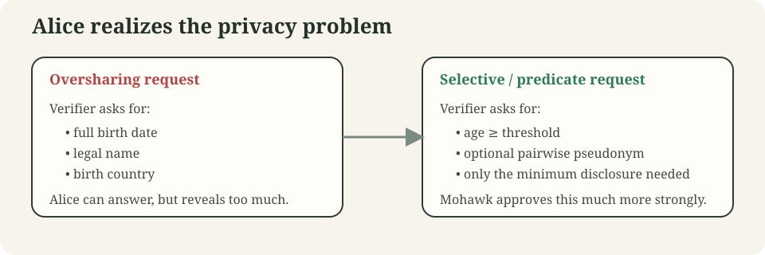

### The Problem

Even if the credential and proofs are valid:

- a stable public holder method is still a correlation handle

Nothing catastrophic has happened.
But the system is not giving Alice pairwise privacy.

And Alice would strongly prefer not to become a recurring row in Vera's analytics export.

So Mohawk proposes a new direction:

- hidden holder binding

## Chapter 6: Hidden Holder Binding

Instead of saying:

- "this credential belongs to DID method X"

we say:

- "this credential belongs to whoever knows the hidden holder secret committed here"

### Why This Helps

The verifier no longer needs a stable public DID method to confirm holder control.

That means:

- less direct correlation
- stronger privacy baseline
- more room for pairwise presentation behavior later

### Diagram

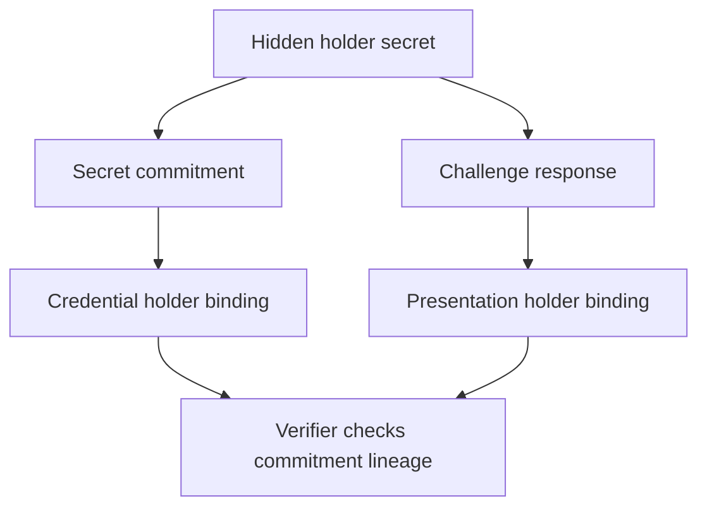

### What The Circuits Are Actually Doing

In `core/primitives/credentials/src/credentials.compact`:

- `secretHolderBindingCommitment(...)`
- `secretHolderBindingChallengeResponse(...)`
- `assertValidSecretHolderCredentialBinding(...)`
- `assertValidSecretHolderPresentationBinding(...)`
- `assertMatchingSecretHolderBindings(...)`
- `assertSecretHolderBindingWitness(...)`

### In Plain Words

- the credential stores a commitment to the holder secret
- the presentation stores a challenge response derived from that secret
- the verifier checks that the presentation binding matches the credential binding
- the holder supplies the secret and opening as private witness material
- the circuit proves the holder really knows the secret without publishing it
- the challenge response uses a dedicated domain separator (`"midnight:vc:holder-chall"`) to prevent cross-context hash collisions — consistent with how `verifierScopedPseudonym` and `blindedSecretHolderCommitment` use their own domain tags

That is the important privacy jump.

The holder is still bound.
The binding is just no longer a giant glowing label saying "hello, I am Alice again".

### One Example In Three Languages

Natural language:

- Rita issues a credential to "whoever knows Alice's hidden holder secret".
- Vera later asks for a fresh proof under challenge `Q`.
- Alice answers with a response derived from that secret and `Q`.

TypeScript:

```ts
const holderSecret = sha256("alice-holder-secret");
const holderSecretOpening = sha256("alice-holder-secret-opening");

const bindingCommitment = genericPureCircuits.secretHolderBindingCommitment(
  holderSecret,
  holderSecretOpening,
);

const challengeResponse = genericPureCircuits.secretHolderBindingChallengeResponse(
  holderSecret,
  verifierChallengeHash,
);
```

Compact:

```compact
export circuit secretHolderBindingCommitment(
  holderSecret: Bytes<32>,
  opening: Bytes<32>
): Bytes<32>

export circuit secretHolderBindingChallengeResponse(
  holderSecret: Bytes<32>,
  verifierChallengeHash: Bytes<32>
): Bytes<32>
```

Read left to right:

- the credential stores `secretHolderBindingCommitment(...)`
- the presentation stores `secretHolderBindingChallengeResponse(...)`
- the verifier checks that both came from the same underlying holder secret story

### What Actually Moves Between Parties

Here is the hidden-holder story without poetry:

| Stage | Rita sends | Alice stores or computes | Vera receives |
| --- | --- | --- | --- |
| issuance | credential body with holder-secret commitment + issuer proof | raw holder secret, opening, credential body, issuer proof | nothing yet |
| presentation request | nothing | verifier challenge, disclosure requirements, predicate requirements | request and challenge |
| presentation | nothing | challenge response from holder secret, selected disclosures, predicate witness | presentation body and holder proof |
| verification | nothing | nothing new | a package that can be checked against the original commitment |

So the transformation is:

1. Alice starts with a local secret.
2. The credential only stores a commitment to that secret.
3. The presentation derives a challenge response from that secret.
4. The verifier checks that the response is consistent with the commitment path.

The verifier never gets the secret itself.

### Why This Is Secure

This section is the answer to Alice's very reasonable question:

"Fine, but why can't Vera just fake the whole thing?"

Because the pieces are chained together.

1. Rita signed a credential body that includes the holder-binding anchor.
2. Alice can only satisfy the presentation if she knows the secret behind that anchor.
3. Vera chooses a fresh challenge, so replaying an old response should fail.
4. The circuit checks that the credential, presentation, and witness all describe the same holder-binding story.

If Vera tries to fake Alice:

- she can copy the public credential body
- she can copy an old presentation package
- but she cannot produce a valid fresh challenge response without Alice's secret

If Rita tries to track every future use:

- she knows the commitment she issued
- but she does not automatically learn every verifier challenge or verifier-scoped derivative
- and she does not get Alice's local witness material during presentation

This is not magic.
It is simply a chain of "you only get the next valid object if you know the previous secret input".

### What The Holder-Binding Is Similar To

If explicit DID holder binding is like showing the same membership card everywhere,
hidden holder binding is like proving you know the secret phrase associated with the membership
without shouting the card number across the room.

Mohawk calls this "the difference between authentication and involuntary merchandising."

### Where This Shows Up In The Concrete Family

In `prototypes/credential-families/birth-secret/src/secret-birth-credential.compact`:

- `assertValidSecretBirthCredential(...)`
- `assertValidSecretBirthCredentialPresentation(...)`
- `assertSecretBirthPresentationSatisfiesRequest(...)`

The secret-holder variant defines its own disclosure and request types — `SecretBirthCredentialDisclosures` and `SecretBirthCredentialPresentationRequest` — rather than reusing the explicit-holder types. This prevents accidental mixing of the two profiles.

### Tests For This Chapter

- `core/primitives/credentials/src/test/secret-holder-binding.test.ts`
- `prototypes/credential-families/birth-secret/src/test/holder-binding.test.ts`

## Chapter 7: Blinded Holder Binding

Mohawk is still not fully satisfied.

He says:

"Good. We hid the public DID method. Now let us talk about issuance-time exposure too."

This is where the model adds a blinded holder-binding anchor.

### What This Is

Start from:

- a hidden holder secret
- its commitment
- an issuer nonce
- a holder blinding factor

Then derive a safer issuance anchor.

### What This Is Not

It is not a finished production blind-signature issuance protocol.
That distinction still matters.

This is:

- a building block
- a privacy-oriented anchor
- a better place to continue from

This is not:

- a complete blind-signature issuance protocol
- a finished production privacy protocol

### What The Circuits Are Actually Doing

In `core/primitives/credentials/src/credentials.compact`:

- `blindedSecretHolderCommitment(...)`
- `assertValidBlindedSecretHolderCredentialBinding(...)`
- `assertValidBlindedSecretHolderPresentationBinding(...)`
- `assertMatchingBlindedSecretHolderBindings(...)`
- `assertBlindedSecretHolderBindingWitness(...)`

### In Plain Words

- the credential binding stores a blinded form of the secret commitment
- the presentation binding still proves the holder knows the underlying secret
- the same holder can later satisfy proofs without revealing the raw holder secret

This gives us a stronger privacy-oriented substrate for future work.

### The Easy Mental Model

Think about three different things:

1. Alice's real secret
2. a normal commitment to that secret
3. a blinded version of that commitment that is safe to place inside a credential

The issuer never needs to learn item 1.
The credential never needs to expose item 2 directly.
The verifier later checks proofs against item 3.

So the practical story is:

- Alice keeps the real secret local
- Alice sends a commitment plus a blinding factor in the issuance request
- Rita the issuer turns that into a blinded credential anchor
- later Alice proves she knows the underlying secret without revealing it

That is why this capability matters.
It reduces issuance-time exposure and still gives us a usable holder-binding story later.

### Simple Issuance Example

Use this cast:

- Rita = issuer
- Alice = holder
- Vera = future verifier

The issuance flow in easy terms is:

1. Rita sends Alice an offer:
   - "I can issue a secret-bound birth credential"
   - "expiration is supported"
2. Alice prepares local inputs:
   - holder secret
   - holder secret opening
   - holder binding blinding factor
3. Alice sends Rita an issuance request containing:
   - holder secret commitment
   - holder binding blinding factor
   - holder challenge hash
4. Rita issues a credential whose holder binding contains:
   - blinded holder secret commitment
   - issuer nonce
5. Alice stores:
   - the credential
   - the credential proof
   - the holder binding blinding factor

What Rita learns:

- a commitment
- a blinding factor
- the claim witness she is certifying

What Rita does not learn:

- Alice's raw holder secret
- Alice's secret opening

### Simple Presentation Example

Later Vera wants proof that Alice is over 18.

The flow becomes:

1. Vera sends a presentation request with:
   - a verifier challenge
   - a policy such as "prove age over 18"
2. Alice uses her local secret and witness material to build:
   - a challenge response
   - the age predicate witness
   - any requested disclosures
3. Alice sends a presentation submission
4. Vera checks that:
   - the presentation matches the request
   - the holder response matches the blinded credential binding
   - the age proof is satisfied

The verifier learns:

- whether the proof is valid
- any disclosures she explicitly requested

The verifier does not learn:

- Alice's raw holder secret
- Alice's secret opening

### Why The Blinding Step Helps

If we stopped at a plain secret commitment, the credential would carry a more directly reusable anchor.

With the blinding step:

- the issuer contributes an issuer nonce
- the holder contributes a blinding factor
- the credential stores the blinded anchor, not the raw secret and not just the raw commitment

So the stored holder-binding data is safer to reuse across later privacy-oriented flows.

### What The Current Repository Supports Today

Today the repository has a supported reference happy path for this capability:

- blinded-secret issuance through `components/orchestration/protocol`
- blinded-secret presentation through `components/orchestration/protocol`
- real DID-backed secret-holder integration coverage
- verifier-scoped pseudonym and same-holder composition built on the same hidden-secret family
- explicit blinded-secret rejection results in the reference protocol layer for
  malformed, mismatched, unknown-offer, expired-offer, and expired-request
  issuance requests
- explicit blinded-secret presentation rejection results in the same reference
  protocol layer for malformed submissions, request/submission mismatches, and
  unsatisfied verifier requests
- idempotent re-delivery of the same blinded-secret issuance outcome when the
  same request or the same issuer reply is delivered twice
- idempotent re-delivery of the same blinded-secret presentation outcome when
  the same presentation submission is delivered twice

In plain language, Rita can now answer Alice in two ways during the reference
issuance flow:

- "here is your credential result"
- "this request is rejected, and here is the reason"

Simple rejection examples now covered by the tests:

- the request forgot a required holder challenge
- the request no longer matches the offer Rita sent
- the request points at an offer Rita does not know about
- the holder answers too late and the offer has already expired
- the issuer answers too late and the request has already expired

Vera now has the same kind of structured answer for the reference presentation
flow:

- "this presentation is approved"
- "this presentation is rejected, and here is the reason"

Simple presentation rejection examples now covered by the tests:

- the holder sends a malformed presentation package
- the presentation no longer matches Vera's request
- the presentation stays well-formed, but Alice still does not satisfy the age
  threshold Vera asked for

Simple presentation replay examples now covered by the tests:

- the same valid presentation submission can be redelivered and yields the same
  approved outcome
- the same malformed presentation submission can be redelivered and yields the
  same rejection outcome
- an approved or rejected presentation outcome that does not point at a known
  submission is rejected locally by the holder reference agent

Simple idempotency examples now covered by the tests:

- the same valid request can be redelivered and yields the same issuance result
- the same malformed request can be redelivered and yields the same rejection result
- the same issuer result can be delivered twice without storing two credentials

What is still not being claimed:

- a final production blind-signature transport protocol
- durable protocol state across retries, restarts, or delayed delivery
- production randomness / nonce interfaces instead of the current
  reference-friendly deterministic paths
- revocation/non-revocation support
- broad application-level interoperability guarantees

So the honest summary is:

- yes, the plain secret-holder profile is already a real hidden-holder binding
  model, not just a sketch
- yes, the blinded-secret capability is real
- yes, the issuance and presentation happy path is supported
- yes, the reference protocol now emits explicit rejection results for common
  blinded-secret issuance and presentation failures
- yes, duplicate blinded-secret issuance deliveries now behave idempotently in
  the reference protocol layer
- yes, duplicate blinded-secret presentation deliveries now behave
  idempotently in the reference protocol layer
- yes, the reference protocol now carries explicit offer and request expiry
  fields for blinded-secret issuance
- yes, the reference protocol now carries envelope-level request and
  submission expiry semantics for blinded-secret presentation
- yes, challenge/nonce/blinding generation is now hidden behind an interface so
  integrators can plug in their own implementation
- yes, pending blinded-secret session state is now hidden behind a
  `ProtocolStateStore` interface so integrators can plug in persistent storage
- no, the credential family still does not define final body-level
  presentation timeout fields
- no, this is not yet the last word on production transport hardening
- no, these timeout semantics are still reference-layer behavior, not a final
  interoperable transport standard

Important qualifier:

- the default repository implementation behind that interface is still an
  explicitly unsafe deterministic reference source for tests
- real deployments should replace it with production randomness
- the default repository implementation behind the state-store interface is
  still an in-memory reference store
- real deployments should replace it with persistent storage if they need
  restart-safe protocol sessions

Mohawk calls it "a respectable intermediate state".
Which is the closest he gets to romance.

### The Transformation From Secret To Blinded Anchor

This is the part many people read twice.
That is normal.

Start with:

- holder secret
- opening for the secret commitment
- issuer nonce
- holder blinding factor

Then the flow is:

1. derive a normal commitment from the holder secret
2. mix that commitment with the issuer nonce
3. blind the result with the holder blinding factor
4. store the blinded value in the credential

Conceptually:

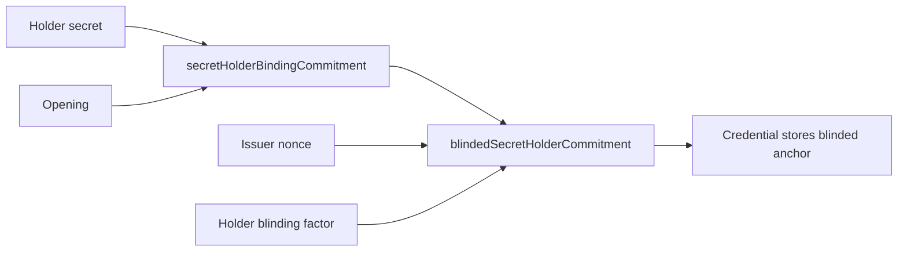

### Why Bother With Blinding

Because Mohawk does not want the issuance artifact to be a reusable tracking handle either.

Blinding gives us:

- better separation between issuance-time material and presentation-time material
- a cleaner base for future blind-issuance style work
- less temptation to treat one intermediate value as a global identity tag

### What Each Party Knows In The Blinded Model

| Party | Knows |
| --- | --- |
| Rita | issuer nonce, issued credential, issuer proof |
| Alice | holder secret, opening, blinding factor, issued credential |
| Vera | blinded anchor inside the credential, plus whatever the presentation reveals |

The important part is that no single verifier gets the full recipe.
Alice keeps the witness material.
Rita does not automatically observe every future proof.

### One Example In Three Languages

Natural language:

- Alice wants Rita to issue a credential without making the issuance anchor too reusable.
- So Alice blinds the holder-binding anchor before it lands in the credential.

TypeScript:

```ts
const secretCommitment = genericPureCircuits.secretHolderBindingCommitment(
  holderSecret,
  holderSecretOpening,
);

const blindedCommitment = genericPureCircuits.blindedSecretHolderCommitment(
  secretCommitment,
  issuerNonce,
  holderBindingBlindingFactor,
);
```

Compact:

```compact
export circuit blindedSecretHolderCommitment(
  secretCommitment: Bytes<32>,
  issuerNonce: Bytes<32>,
  holderBindingBlindingFactor: Bytes<32>
): Bytes<32>
```

The mental shortcut is:

- plain hidden binding = "I can prove I know the secret"
- blinded hidden binding = "I can still prove I know the secret, but the issuance anchor is less reusable as a tracking artifact"

### Tests For This Chapter

- `core/primitives/credentials/src/test/secret-holder-binding.test.ts`
  - blinded holder-binding witness
- `prototypes/credential-families/birth-secret/src/test/capability-profiles.test.ts`
  - advanced privacy profile

## Chapter 8: Verifier-Scoped Pseudonym

Now Vera says:

"I do not need Alice's global identity. I just need to know whether this is the same returning user in my domain."

That is a legitimate product requirement.
It just needs to be handled carefully.

So we add a verifier-scoped pseudonym.

### The Main Idea

The pseudonym is derived from:

- the hidden holder secret
- a verifier-domain hash

That means:

- the pseudonym is stable for one verifier domain
- it does not need to be stable everywhere

### Why This Is Better Than Reusing A Global DID

Vera gets local continuity.
She does not get a universal tracking handle.

That is a much better tradeoff.

### What The Circuits Are Actually Doing

In `core/primitives/credentials/src/credentials.compact`:

- `verifierScopedPseudonym(...)`
- `assertVerifierScopedPseudonym(...)`

In `prototypes/credential-families/birth-secret/src/secret-birth-credential.compact`:

- request fields carrying verifier domain context
- pseudonym disclosure checks inside `assertSecretBirthPresentationSatisfiesRequest(...)`

### In Plain Words

- the verifier request can demand a verifier-scoped pseudonym
- the holder computes it from the hidden holder secret and verifier-domain hash
- the circuit checks the pseudonym is correct for that domain

This lets Vera say:

- "I know this is the same person for my service"

without being able to say:

- "and therefore I know this is the same person in everybody else's service too"

### Data Transformation For The Pseudonym

The pseudonym is not pulled from thin air.
It is derived.

Inputs:

- hidden holder secret
- verifier-domain hash

Output:

- one pseudonym that is stable only for that domain

So:

- same holder secret + same verifier domain = same pseudonym
- same holder secret + different verifier domain = different pseudonym

That is why the verifier gets continuity without getting universal linkability.

### Why The Verifier Cannot Cheat By Reusing Another Domain

Vera cannot ask for "the nightclub pseudonym" and then reuse it as "the bank pseudonym"
without being caught by the circuit model, because the pseudonym is checked against the
domain hash that belongs to the request.

If the request says:

- domain hash = `hash("nightclub.example")`

then the presentation has to satisfy that domain.
A pseudonym derived for `hash("bank.example")` is simply the wrong object.

### One Example In Three Languages

Natural language:

- Vera runs `nightclub.example`.
- She wants to know whether this is the same returning visitor.
- She does not need Alice's global identifier.

TypeScript:

```ts
const verifierDomainHash = sha256("nightclub.example");

const pseudonym = genericPureCircuits.verifierScopedPseudonym(
  holderSecret,
  verifierDomainHash,
);
```

Compact:

```compact
export circuit verifierScopedPseudonym(
  holderSecret: Bytes<32>,
  verifierDomainHash: Bytes<32>
): Bytes<32>
```

If Alice visits:

- `nightclub.example` twice, the pseudonym is the same
- `bank.example` later, the pseudonym changes

That is the whole trick.

### Tests For This Chapter

- `core/primitives/credentials/src/test/secret-holder-binding.test.ts`
- `prototypes/credential-families/birth-secret/src/test/holder-binding.test.ts`
  - "derives a verifier-scoped pseudonym from the hidden holder secret"

## Chapter 9: Vera Wants Two Credentials, But One Holder

Now Vera asks for something harder.

She says:

"I need Alice to prove two different credentials belong to the same person."

Still fair.
Still useful.
Still dangerous if handled lazily.

Because the naive way to do this is:

- reveal the same public holder DID in both presentations

which puts us straight back into the "Alice is being tracked by a spreadsheet" problem.

So Mohawk looks offended again.
This is his default working posture.

## Chapter 10: The Same-Holder Capability

Instead of inventing one giant universal bundle format too early, the code uses a smaller and sharper capability:

- prove that two holder bindings are satisfied by the same hidden holder secret witness under one shared verifier challenge

That is enough.
And enough is often a better abstraction than "everything for all future use cases forever".

### Why This Design Is Good

It avoids freezing the wrong multi-credential presentation model too early.

Instead:

- each credential family keeps its own request and presentation types
- the verifier chooses when same-holder composition is required
- the capability package proves only the relation that matters

### Diagram

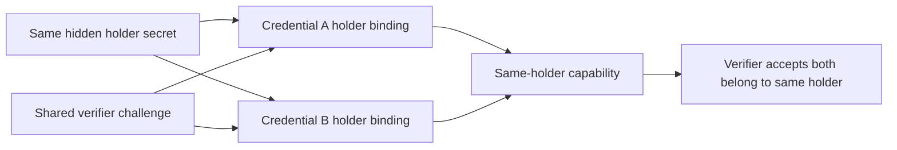

### What The Circuits Are Actually Doing

In `core/capabilities/same-holder/src/same-holder.compact`:

- `assertSameSecretHolderBindingWitnesses(...)`
- `assertSameBlindedSecretHolderBindingWitnesses(...)`
- `assertSameSecretHolderBindingWitnesses3(...)`
- `assertSameBlindedSecretHolderBindingWitnesses3(...)`

In `prototypes/credential-families/birth-secret/src/secret-birth-credential.compact`:

- `assertSameHolderSecretBirthPresentations(...)`

### In Plain Words

- each presentation is validated independently first
- both requests must share the same verifier challenge
- both holder bindings are then checked against the same hidden holder secret witness
- the concrete credential-family circuit composes those checks instead of pushing a universal bundle object into the generic core

The same idea now exists in two bounded forms:

- two-credential same-holder composition
- three-credential same-holder composition

That is enough to support realistic staged verifier flows without pretending we
already need one universal mega-presentation type.

That is very Midnight-friendly:

- small reusable capability at Layer 1
- family-specific composition at Layer 2

### What Same-Holder Proof Really Means

This is where regular people often hear the wrong sentence.

The system is not proving:

- "these two credentials have the same name"
- "these two credentials came from the same issuer"
- "these two credentials have matching public identifiers"

It is proving:

- "the same hidden holder secret witness can satisfy both holder bindings under the same verifier challenge"

That is narrower.
And that is good.
Narrow claims are easier to trust.

### Why The Shared Challenge Matters

Without a shared verifier challenge, Alice could satisfy two unrelated requests that happened at different times.

With a shared challenge:

- Vera is saying "I want one combined proof event"
- Alice is answering one combined proof event
- the circuits can treat the two presentations as one verifier interaction

That is why `assertSameSecretHolderBindingWitnesses(...)` and
`assertSameBlindedSecretHolderBindingWitnesses(...)` are about both:

- the same secret
- the same request context

### A Plain-English Flow

1. Vera asks for credential A and credential B under one shared challenge.
2. Alice builds both presentations locally.
3. Each presentation is valid on its own.
4. The same-holder capability checks that the hidden binding witness behind both presentations is the same.
5. Vera learns "same holder" without learning a global holder identifier.

Mohawk likes this because it proves exactly the relation Vera needs, and no more.

### One Example In Three Languages

Natural language:

- Vera asks Alice to prove that secret birth credential A and secret birth credential B belong to the same hidden holder.
- Alice should not reveal one global DID method to do that.

TypeScript:

```ts
sameHolderPureCircuits.assertSameBlindedSecretHolderBindingWitnesses(
  firstHolderBinding,
  secondHolderBinding,
  verifierChallengeHash,
  holderSecret,
  firstHolderSecretOpening,
  firstHolderBindingBlindingFactor,
  secondHolderSecretOpening,
  secondHolderBindingBlindingFactor,
);
```

Compact:

```compact
export circuit assertSameBlindedSecretHolderBindingWitnesses(
  firstBinding: BlindedSecretHolderBinding,
  secondBinding: BlindedSecretHolderBinding,
  verifierChallengeHash: Bytes<32>,
  holderSecret: Bytes<32>,
  firstHolderSecretOpening: Bytes<32>,
  firstHolderBindingBlindingFactor: Bytes<32>,
  secondHolderSecretOpening: Bytes<32>,
  secondHolderBindingBlindingFactor: Bytes<32>
): []
```

The verifier learns one thing:

- these two presentations came from the same hidden holder witness

The verifier does not automatically learn:

- Alice's long-term public DID method
- Alice's name
- Alice's subject identifier

### Tests For This Chapter

- `core/capabilities/same-holder/src/test/same-holder-capability.test.ts`
- `prototypes/credential-families/birth-secret/src/test/same-holder-composition.test.ts`

Those tests now cover both:

- two-credential same-holder proofs
- three-credential same-holder proofs

## Chapter 11: Capability Profiles, Or How Not To Lie To Yourself

At this point, the system has multiple privacy and presentation capabilities.

So the honest way to describe it is not:

- "the credential system does everything"

The honest way is:

- "the system supports a set of capability profiles"

That is a better engineering habit because it tells you exactly what combination you are using.

### Current Profiles

| Profile | What it means in simple words | Test |
| --- | --- | --- |
| simplest issuer-attested source claim | Rita attests to the typed birth credential and nothing fancy happens yet | `prototypes/credential-families/birth/src/test/capability-profiles.test.ts` |
| operational explicit-holder flow | Alice uses a DID-bound holder method and reveals only what Vera requests | `prototypes/credential-families/birth/src/test/capability-profiles.test.ts` |
| age-predicate flow | Alice proves `age >= threshold` instead of revealing the raw birth date | `prototypes/credential-families/birth/src/test/age-predicate.test.ts` |
| hidden-holder flow | Alice proves control using a hidden holder secret instead of a visible DID method | `prototypes/credential-families/birth-secret/src/test/capability-profiles.test.ts` |
| advanced privacy flow | Alice uses hidden holder binding, a blinded anchor, selective disclosure, verifier pseudonym, and age predicate | `prototypes/credential-families/birth-secret/src/test/capability-profiles.test.ts` |
| same-holder composition | Alice proves two or three credentials belong to the same hidden holder | `prototypes/credential-families/birth-secret/src/test/same-holder-composition.test.ts` |
| status-aware hidden-holder flow | Alice satisfies a revocation-aware verifier request with registry-bound status inputs | `prototypes/credential-families/birth-secret/src/test/status.test.ts` |
| authority-attested status flow | Alice satisfies a freshness-gated status request with an authority-attested status proof | `prototypes/credential-families/birth-secret/src/test/status-attestation.test.ts` |

### Current prototype use-cases used later in this guide

| Surface | What it demonstrates | Test or scenario |
| --- | --- | --- |
| `use-cases/hello-verifier/contract` | smallest verifier contract that consumes the hello-family starter package | `use-cases/hello-verifier/contract/src/test/hello-verifier.test.ts` |
| `use-cases/age-gate/contract` | explicit-holder business contract that mints and consumes an access capability | `use-cases/age-gate/contract/src/test/demo.test.ts` |
| `use-cases/age-gate/contract/src/demo-revocation.compact` | hidden-holder, status-aware business contract with verifier-supplied-root and authority-attested modes | `use-cases/age-gate/contract/src/test/demo-revocation.test.ts` |
| `use-cases/age-gate/scenarios` | BDD living documentation for the explicit-holder and hidden-holder age-gate flows | `use-cases/age-gate/scenarios/features/*.feature` |

### Why This Matters

Capability profiles stop everyone from waving their hands and saying:

- "yes yes, it supports privacy"

while quietly meaning five different things.

## Chapter 12: Midnight Stack Reality Check

This is the chapter where we stop pretending the whole story lives inside Compact.

It does not.

Midnight forces a healthier architecture:

- the holder prepares witnesses locally
- the application orchestrates the flow
- the contract verifies and applies business rules

### The Five Layers Again

| Layer | What it really owns |
| --- | --- |
| Layer 1 | generic proof and holder-binding capabilities |
| Layer 2 | concrete VC families, requests, disclosures, predicates |
| Layer 3 | product contract logic, state mutation, receipts, capabilities |
| Layer 4 | off-chain orchestration, wallet coordination, retries, multi-step protocol sequencing |
| Layer 5 | governance and trust policy for issuers, verifiers, schemas, and ecosystem rules |

### Why Layer 4 Comes Before Layer 3 In Human Understanding

Implementation dependencies go bottom-up.
Human understanding goes top-down.

For protocol reasoning, the off-chain layer comes first because it answers:

- who starts the interaction
- who creates or reads the request
- where the challenge comes from
- where witnesses are prepared
- who submits the final transaction

Only after that does the contract story become clean.

### Canonical Midnight Mental Model

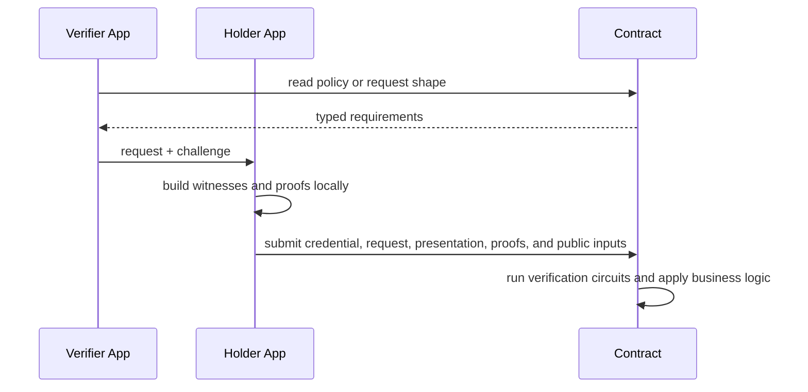

### The Joke Hidden Inside The Architecture

Web SSI often encourages people to believe the message exchange is the system.

Midnight politely corrects them:

- no, the message exchange is the orchestration layer
- the system also has witness logic and contract semantics

This is annoying at first.
Then it becomes cleaner.

## Chapter 13: The Demo Contract Story

Suppose Vera runs an age-gated contract.

Alice wants access.

The first temptation is to imagine the contract initiating the interaction.
That is wrong.

The contract is passive.
It exposes state and circuits.
Alice or Vera's app must initiate the flow.

### Model A: Off-Chain Verifier-Led Flow

This is the more general SSI-style model.

1. Vera's application reads contract policy
2. Vera's application creates or derives the request and challenge
3. Alice receives that request off-chain
4. Alice prepares the presentation locally
5. Alice submits a transaction to the contract
6. The contract verifies and issues a capability

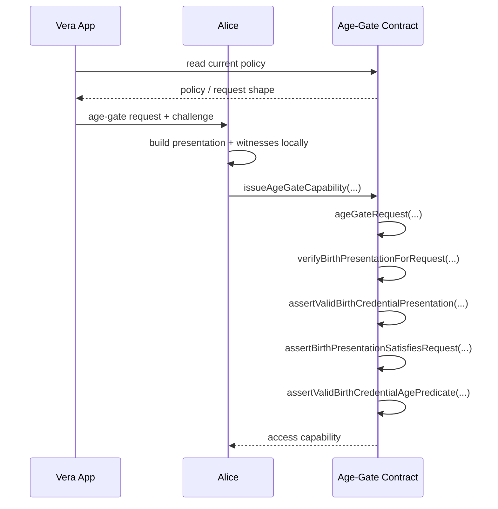

### Model B: Contract-Assisted Request Derivation

This is the demo-friendly Midnight variant.

1. Alice reads or reconstructs the contract request shape
2. Alice builds the presentation locally
3. Alice calls a contract circuit that reconstructs or checks the request internally
4. The contract verifies and returns the business result

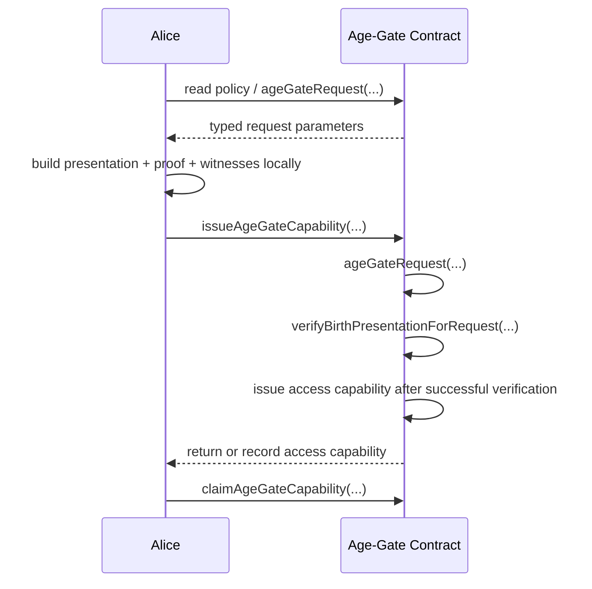

### What The Demo Contract Circuits Are Actually Doing

In `use-cases/age-gate/contract/src/demo.compact`:

- `ageGateRequest(...)`
- `verifyBirthPresentation(...)`
- `verifyBirthPresentationForRequest(...)`
- `issueAgeGateCapability(...)`
- `claimAgeGateCapability(...)`

### In Plain Words

- `ageGateRequest(...)` exposes the contract's current typed requirements
- `verifyBirthPresentation(...)` checks that the credential was issued by the demo contract, the holder and issuer keys match stored expectations, and the age predicate is satisfied
- `verifyBirthPresentationForRequest(...)` additionally checks that the presentation satisfies the request structure and challenge
- `issueAgeGateCapability(...)` is business logic: verify first, then mint or record a reusable capability
- `claimAgeGateCapability(...)` consumes or checks the capability later

This is the important architectural point:

- credentials are not the end goal
- credentials are inputs into business logic

### Tests For This Chapter

- `use-cases/age-gate/contract/src/test/demo.test.ts`

## Chapter 14: How Capabilities Compose

Here is the big picture.

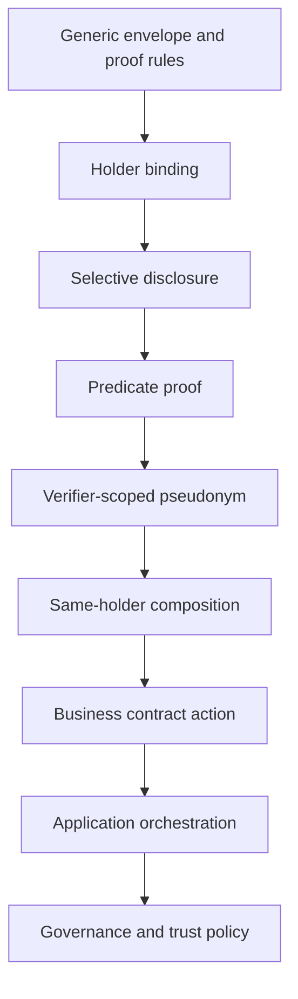

In plain words:

- first you need a typed envelope
- then you need issuer proof binding
- then you need holder binding
- then selective disclosure becomes meaningful
- then predicates become powerful
- then privacy capabilities reduce linkability
- then composition across credentials becomes practical
- then contracts can do something useful
- then applications coordinate real user journeys
- and eventually governance decides who should be trusted to participate at all

## Chapter 15: The Fifth Layer Nobody Wants To Build Too Early

Eventually someone asks the uncomfortable governance questions:

- which issuers are trusted for which schemas
- which verifiers are allowed to request which proofs
- which schema versions are acceptable
- which policy applies on which network

Congratulations.
You have discovered Layer 5.

### What Layer 5 Is

Layer 5 is governance and trust policy.

It may eventually include:

- trust registries
- issuer accreditation
- verifier authorization
- VC type support policy
- schema registration and version policy

### What Layer 5 Is Not

It is not the VC envelope.
It is not the proof primitive.
It is not the predicate logic.

Those belong in Layers 1 through 3.

### Why It Stays Abstract For Now

If we push governance into the VC core too early, the design gets muddy fast.

So for now:

- Layer 5 exists conceptually
- Layer 5 is documented as future scope
- Layer 5 must not distort the current VC/VP prototype

The future `MidnightTrustRegistry` idea belongs here.
Not inside the generic credential envelope.

## Chapter 16: What Mohawk Still Wants

Mohawk is happier now, but not done.

The current reference path still does not give us everything:

- production blind-issuance transport hardening is not finished
- the repository now has prototype status/revocation capability surfaces:
  - verifier-supplied revocation roots
  - a dedicated revocation registry
  - a hidden-holder authority-attested status path for Layer 3 verification
  - a revoked-set witness/capability path that is not yet the final in-circuit
    non-revocation proof
  - only claim expiry or protocol/session expiry where documented still do not
    count as real revocation support by themselves
- the chosen prototype direction is now clear:
  - a dedicated revocation registry
  - a revoked-set `MerkleTree`
  - non-membership proof inside the VP
  - no canonical reason/date fields in the first proof model
- application orchestration is prototyped in `components/orchestration/protocol` but not yet production-hardened
- governance is acknowledged but intentionally abstract
- more credential families still need to be modeled

So the story is not over.

But it is no longer vague.
And that is real progress.

## Chapter 17: Numbers Instead of Words

Mohawk is looking at the claims struct and frowning.

"Why," he asks, "is Alice's nationality a string?"

Nobody says anything.

"Is it 'Germany'? Is it 'DE'? Is it 'DEU'? Is it 'deutschland'? Is it 'GERMANY' because someone left caps lock on?"

Still silence.

"String comparison in a circuit is expensive," he continues, warming to the subject. "It is variable-length. It is encoding-dependent. It is the kind of thing that works in a unit test and explodes in production when someone's locale settings disagree with yours."

So the system uses numeric ISO codes instead.

### The ISO Registry

The `credentials-iso-registry` package provides a single source of truth for coded values used across all credential families.

| Type | ISO Standard | Compact Type | Example |
| --- | --- | --- | --- |
| `CountryCode` | ISO 3166-1 numeric | `Uint<16>` | 276 = Germany, 840 = United States |
| `CurrencyCode` | ISO 4217 numeric | `Uint<16>` | 978 = Euro, 840 = US Dollar |
| `LanguageCode` | ISO 639 numeric | `Uint<16>` | language identifiers |
| `RegionCode` | ISO 3166-2 | `Uint<16>` + `Uint<16>` | country + subdivision |
| `GenderCode` | ISO 5218 | `Uint<8>` | 0 = not known, 1 = male, 2 = female, 9 = not applicable |

Every value is a fixed-width integer. No variable-length strings. No encoding ambiguity. No locale sensitivity.

276 means Germany in Berlin, in Tokyo, and inside a zero-knowledge circuit running on a proof server that has never heard of the Bundesrepublik.

### Why This Matters For Circuits

Comparing two `Uint<16>` values in a circuit is trivial: one equality check, one gate, done.

Comparing two UTF-8 strings in a circuit is an engineering horror story involving padding, normalization, case folding, and a deep sense of regret.

The registry also provides assertion circuits like `assertCountryEquals(...)` and `assertRegionCountryEquals(...)` so that verifier contracts can check coded values without reimplementing the comparison logic.

### Where The Codes Land

The ISO types show up in credential claims structs. The current birth family uses `CountryCode` for `birthCountryCode`. A future family with public issuer-country or gender fields could use `CountryCode` and `GenderCode` with the same circuit-friendly approach. The presentation layer — the human-facing app — is responsible for rendering 276 as "Germany" on screen. The circuit layer never needs to know the word.

Mohawk considers this "the minimum acceptable encoding discipline for a system that intends to survive contact with more than one country."

### Where To Look

- `core/primitives/iso-registry/src/iso-registry/codes.compact`

## Chapter 18: Vera Starts With The Smallest Verifier

Before Vera adopts a full business contract, she often wants one smaller question answered first:

- can I verify one credential family against one typed request without dragging in every other concern?

That is exactly what `use-cases/hello-verifier/contract` exists to do.

It is the smallest current verifier-side prototype in the repository.

### What It Proves

The hello-verifier contract uses the starter `credentials-hello-family` package and does four things:

1. builds one typed verifier request for a small selective-disclosure shape
2. accepts one hello-family presentation
3. checks that the presentation satisfies the request
4. records the accepted credential root, request challenge, and selected disclosed values in ledger state

What it deliberately does not do:

- manage issuance state
- mint reusable business capabilities
- handle status or revocation
- simulate an external transport protocol

That is why it is a good first stop after the birth family itself.

### Sequence

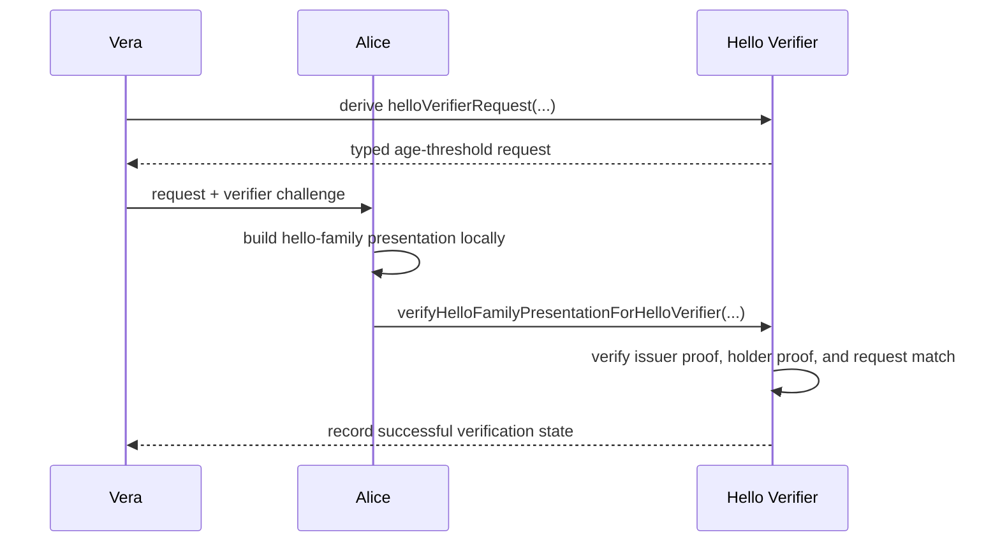

### In Plain Words

The contract is saying:

- give me a hello-family credential from the expected issuer
- give me a presentation that matches this challenge
- disclose the typed fields I asked for
- if all of that checks out, I will record the successful verification

This is not yet the business story.
It is the smallest useful verifier story.

### Tests For This Chapter

- `use-cases/hello-verifier/contract/src/test/hello-verifier.test.ts`

## Chapter 19: Two Current Use Cases From The Prototypes

Now we can move from the smallest verifier to the two concrete business flows that the repository currently carries as use-cases.

### Use Case 1: Explicit-Holder Age Gate

This is the simplest business composition currently implemented in-tree.

The flow in `use-cases/age-gate/contract/src/demo.compact` is:

1. the issuer submits an explicit-holder birth credential plus issuer proof
2. the contract records that credential as one it recognizes
3. the verifier or caller derives the age-gate request and challenge
4. the holder builds a presentation locally and submits it
5. the contract checks issuer proof, holder binding, request alignment, and the private age predicate
6. on success, the contract issues a reusable access capability
7. the holder can later claim that capability

This is the first current prototype where credentials clearly stop being the goal and start being an input into application logic.

What the contract cares about:

- was the credential issued under the expected issuer surface?
- does the presentation satisfy the typed request?
- is the holder old enough?

What the contract does not need:

- Alice's raw birth date
- Alice's full identity
- any off-chain transport assumptions

### Use Case 2: Hidden-Holder Revocation-Aware Age Gate

The second current use-case raises the difficulty in a way that matters architecturally.

In `use-cases/age-gate/contract/src/demo-revocation.compact`, the holder uses the hidden-holder birth family and the verifier must also reason about status.

The flow is:

1. the issuer submits a hidden-holder birth credential plus issuer proof
2. the verifier chooses a registry state and verification mode
3. the holder builds a hidden-holder presentation plus status-aware submission inputs
4. the contract checks request alignment, hidden holder binding, age predicate, and status inputs
5. if the status mode is authority-attested, the contract also checks expiration and verifier freshness windows
6. on success, the contract issues a reusable revocation-aware capability

This use-case currently supports two transitional verifier modes:

- verifier-supplied root
- authority-attested status proof

That is useful, but Mohawk would immediately add the caveat:

- this is still prototype status machinery, not the final in-circuit live-root non-membership contract

So the right mental model is:

- the VC-side status binding is now real and shared
- the current verifier/business flow is good enough to exercise trust boundaries
- the final cryptographic revocation contract is still an active maturity track

### Where These Use Cases Live As Code And Living Docs

| Surface | Why it matters |
| --- | --- |
| `use-cases/age-gate/contract/src/demo.compact` | explicit-holder business verifier and capability issuance |
| `use-cases/age-gate/contract/src/demo-revocation.compact` | hidden-holder, status-aware business verifier |
| `use-cases/age-gate/contract/src/test/demo.test.ts` | executable explicit-holder age-gate story |
| `use-cases/age-gate/contract/src/test/demo-revocation.test.ts` | executable hidden-holder status-aware story |
| `use-cases/age-gate/scenarios/features/age_gate_happy_path.feature` | BDD live documentation for the explicit-holder flow |
| `use-cases/age-gate/scenarios/features/hidden_holder_age_gate_happy_path.feature` | BDD live documentation for the hidden-holder status-aware flow |

The important separation is now explicit:

- prototype families prove capability shapes
- use-case packages prove business composition
- BDD scenarios live with the use-case because they are documentation for the business flow, not low-level circuit tests

## Chapter 20: The Protocol Layer

Up to now, every test lived inside a single function scope.

Alice, Rita, and Vera shared variables like old college roommates sharing a bathroom shelf.
That is fine for circuit testing.
It is terrible for reasoning about who knows what.

Mohawk finally loses patience.

"In a real system," he says, "Alice does not get to peek inside Rita's wallet to grab the signing key.
And Vera does not casually read Alice's private witness material.
Party boundaries are real."

### Why Party Boundaries Matter

When every party lives in the same test function, it is easy to accidentally:

- pass a private witness from the holder to the verifier
- let the verifier construct something only the issuer should build
- skip a message exchange step because the data was already in scope

None of those bugs show up in the circuit layer.
They show up in the integration layer, which is exactly where most SSI systems go wrong.

### The Agent Model

`components/orchestration/protocol` introduces three agent types:

| Agent | What it does |
| --- | --- |
| `IssuerAgent` / `SecretIssuerAgent` | creates offers, receives requests, issues credentials |
| `HolderAgent` / `SecretHolderAgent` | receives offers, sends requests, stores credentials, builds presentations |
| `VerifierAgent` | sends presentation requests, evaluates submissions, verifies same-holder proofs |

Each agent owns its own state.
They communicate only through a `MessageBus`.

### The MessageBus

The `MessageBus` is deliberately minimal:

- `send(message)` pushes a typed envelope to a named party queue
- `receive(party)` pops the next message for that party
- `drain(party)` collects all pending messages

It is not a real network.
It is a transport seam.

That means you can swap it for HTTP, DIDComm, or a blockchain-anchored channel later without touching the agent logic.

### The Contract Verifier

The off-chain `VerifierAgent` calls the circuit pure functions directly and evaluates the proof.

The `ContractVerifier` wraps the `CredentialsDemoSimulator` and represents an on-chain verifier.
It differs from the off-chain verifier in one important way:

- the contract verifier requires credentials to be registered first (via `issueBirthCredential`)
- the off-chain verifier only needs to see the proof and the credential

That distinction matters because the contract carries state.
The off-chain verifier is stateless.

Mohawk considers this "the correct separation of concerns".
He does not elaborate.

### The Same Interaction In Natural Language, TypeScript, And Compact Thinking

Natural language:

1. Vera asks for a proof.
2. Alice prepares local witness material.
3. Alice sends a typed submission.
4. Vera or the contract checks the submission.

TypeScript:

```ts
const request = verifier.createAndSendPresentationRequest("holder", requirements);
const incoming = bus.receive("holder");
const submission = holder.receiveRequestAndSendSubmission(incoming);
const result = verifier.receiveSubmissionAndEvaluate(
  bus.receive("verifier")!,
  simulatorWitness,
);
```

Compact thinking:

```compact
assertValid...RequestMessage(...)
assert...SubmissionMatchesRequest(...)
assertValid...CredentialPresentation(...)
assert...PresentationSatisfiesRequest(...)
assertValid...Predicate(...)
```

The TypeScript layer answers:

- who sends what
- when the challenge appears
- who owns which private material

The Compact layer answers:

- whether the submitted objects are valid
- whether the request and submission line up
- whether the hidden witness really satisfies the claimed predicate or binding

That separation is not bureaucracy.
It is the safety model.

### Advanced Flow: Who Touches Which Data

When the advanced privacy profile is used, the off-chain protocol layer keeps the boundaries sharp.

| Party | Builds locally | Sends outward |
| --- | --- | --- |
| Issuer agent | credential body, issuer proof | offer, issued credential package |
| Holder agent | secret-holder witness, disclosures, predicate witnesses, holder proof, pseudonym | issuance request, presentation submission |
| Verifier agent | request policy, challenge, result | presentation request, verification result |
| Contract verifier | verification state, capability receipt | on-chain decision or capability |

The crucial security property here is boring but essential:

- the verifier asks for a proof
- the holder manufactures the proof
- the contract checks the proof

The verifier does not manufacture Alice's private witness material.
If your architecture lets Vera do that, Mohawk will take your whiteboard markers away.

### Data Transformation Across The Advanced Flow

For a hidden-holder credential, the public-to-private story looks like this:

1. Rita issues a credential containing commitments and holder-binding anchor.
2. Alice stores that credential plus her local witness material.
3. Vera sends a verifier challenge and request policy.
4. Alice transforms local witness material into:
   - selected disclosures
   - predicate witness inputs
   - challenge-bound holder response
   - optional verifier-scoped pseudonym
5. Vera or the contract verifies the resulting package against the original credential.

That is the same design principle repeated everywhere:

- public artifact at issuance
- private witness at use time
- narrow verifier request
- deterministic circuit checks

### What The Tests Cover

| Test file | What it proves |
| --- | --- |
| `components/orchestration/protocol/src/test/explicit-holder/issuance.test.ts` | protocol-level issuance with party boundaries |
| `components/orchestration/protocol/src/test/explicit-holder/presentation.test.ts` | presentation flow through the MessageBus |
| `components/orchestration/protocol/src/test/explicit-holder/full-lifecycle.test.ts` | issuance through verification in one protocol run |
| `components/orchestration/protocol/src/test/secret-holder/issuance.test.ts` | secret-holder issuance through agents |
| `components/orchestration/protocol/src/test/secret-holder/presentation.test.ts` | hidden-holder presentation through agents |
| `components/orchestration/protocol/src/test/secret-holder/pseudonym.test.ts` | verifier-scoped pseudonym through the protocol layer |
| `components/orchestration/protocol/src/test/secret-holder/same-holder.test.ts` | same-holder composition through party-isolated agents, including a three-credential flow |
| `components/orchestration/protocol/src/test/contract-verifier/age-gate.test.ts` | contract verifier age-gate with protocol-issued credentials |
| `components/orchestration/protocol/src/test/contract-verifier/capability-lifecycle.test.ts` | full capability lifecycle through the contract verifier |
| `components/orchestration/protocol/src/test/helpers/message-bus.test.ts` | MessageBus transport primitives |

### Why This Chapter Exists

Without the protocol layer, the codebase proved that the circuits were correct.

With the protocol layer, the codebase now proves that the circuits remain correct when each party can only see its own state and messages arrive through a typed channel.

That is a different and harder claim.
And Mohawk is almost smiling.

## Chapter 21: The Standalone Environment

Mohawk trusts the circuits.
He trusts the protocol layer.
He does not trust the universe.

Specifically, he does not trust that a proof which passes the simulator will survive contact with a real Midnight node, a real indexer, and a real proof server all running at the same time.

Simulator tests prove the math is right.
Integration tests prove the stack works.
Those are different claims.

### What The Standalone Environment Provides

The `components/integration/standalone-environment` package spins up a Docker-based Midnight stack:

- a Midnight node
- an indexer
- a proof server
- wallet setup and funding
- DID provisioning for issuer, holder, and verifier

That last part matters.
In the simulator tests, DIDs are invented on the spot.
In the standalone environment, DIDs are provisioned on a real ledger, which means the DID resolution path is exercised end-to-end.

### How It Connects To The Protocol Agents

The integration tests use the same `IssuerAgent`, `HolderAgent`, and `VerifierAgent` from `components/orchestration/protocol`.
The only difference is the profile: real DID documents backed by on-ledger resolution instead of simulated identities.

That is the whole trick.
Same agents, same message bus, same protocol steps.
Different trust anchor underneath.

### When Docker Is Not Running

The integration tests detect whether the Docker environment is available.
If it is not, they skip gracefully.

That means:

- CI runs integration tests when Docker is provisioned
- local developers can run unit and simulator tests without Docker
- nobody gets a broken build because they forgot to start a container

### Why This Chapter Exists

The standalone environment is the bridge between "the circuits are correct" and "the system works".

It is also the bridge to future protocol work.
When OID4VCI or DIDComm transports arrive, this is the environment where they get tested against real infrastructure instead of polite simulations.

Mohawk considers this "the minimum acceptable level of paranoia".

### Tests For This Chapter

- `components/orchestration/protocol/src/test/integration/explicit-holder-lifecycle.integration.test.ts`
- Integration tests require Docker and skip automatically when unavailable

## Chapter 23: Midnight Vs AnonCreds, In Human Language

By now Alice has suffered through:

- explicit holder binding
- hidden holder binding
- verifier-scoped pseudonyms
- same-holder composition
- business contracts that ask deeply personal questions like "are you at least 18?"

So this is the right moment to answer the obvious question:

"Why are we building Midnight Credentials at all if AnonCreds already exists?"

Short answer:

- AnonCreds is better today at privacy-preserving credential exchange
- Midnight is better when the proof must directly drive smart-contract behavior

Mohawk summarizes it less diplomatically:

> AnonCreds is excellent at convincing a verifier.
> Midnight is excellent at making the verified fact do something.

### The Fast Comparison

| Question | AnonCreds | Midnight |
| --- | --- | --- |
| Is it strong for privacy-preserving VC exchange? | yes | partially, but still maturing |
| Does it support hidden holder binding well? | yes | yes, in the new secret-holder profiles |
| Does it have mature blind issuance? | yes | supported reference happy path, but not yet a finished production transport standard |
| Does it support same-holder proofs across credentials? | yes | yes, prototyped as reusable capabilities |
| Is it naturally shaped for smart contracts? | not really | yes |
| Can the proof directly drive contract state changes? | usually not the core model | yes |
| Are disclosures bounded and typed for contract consumption? | not the main design goal | yes |

### The Real Difference

AnonCreds mainly solves this problem:

"How can Alice prove something to Vera with strong privacy and as little disclosure as possible?"

Midnight mainly solves this problem:

"How can Alice prove something in a way that a smart contract can safely consume and enforce?"

Those problems overlap, but they are not identical.

### Alice At A Door, Version 1: AnonCreds Style

Alice wants to enter a nightclub.
Vera is the verifier at the entrance.

In an AnonCreds-style mental model:

1. Vera asks for a presentation
2. Alice builds a privacy-preserving proof
3. Vera verifies it
4. Vera decides whether to let Alice in

That is already very powerful.
The verifier gets a cryptographic answer instead of a pinky promise.

But the final action still lives mostly in verifier behavior.

### Alice At A Door, Version 2: Midnight Style

Now replace the nightclub bouncer with a business contract.

The contract has a rule:

- only a holder with a valid proof of `age >= 18` may execute `enterVenue()`

In a Midnight mental model:

1. the contract defines what proof shape it expects
2. Alice prepares the proof locally
3. Alice submits the proof to the contract-facing flow
4. the proof is checked against typed circuits
5. the contract either:
   - allows the action
   - records a state transition
   - issues a capability
   - or rejects the action

This is the important shift:

- in AnonCreds, proof success usually helps a verifier decide
- in Midnight, proof success can become executable policy input

That is why Midnight has a different kind of power.

### What Midnight Smart Contracts Can Do With A Proof

If the proof is valid, a Midnight business contract can do more than say
"looks good to me".

It can:

- allow a protected state transition
- deny a protected state transition
- mint or record a capability for later use
- bind the result to a ledger action
- combine proof success with payment or token movement
- enforce that only certain disclosures or predicates are accepted

Mohawk likes this because it reduces the distance between:

- policy
- proof
- enforcement

Less room for "the verifier code probably does the same thing as the contract policy"
usually means fewer spectacularly avoidable mistakes.

### Why Disclosure Feels Different On Midnight

AnonCreds is very good at selective disclosure.
That part should be respected.

Midnight's difference is not "more privacy by magic".
Midnight's difference is:

- disclosures are strongly typed
- disclosures are bounded
- predicates are specialization-defined
- the contract can see exactly which proof modes are allowed

That means a Midnight credential family can say:

- this field may be fully hidden
- this field may be disclosed with an opening
- this field may be used only for a predicate
- this verifier request must not ask for anything else

In practice, this makes Midnight disclosure easier to audit at the circuit level.

### A Story About Alice, Vera, And Mohawk

Alice wants to join a regulated on-chain auction.

The auction contract requires:

- age at least 18
- nationality in an allowed list
- no raw birth date disclosure
- no reusable global holder identifier

Vera, the verifier service, could do this off-chain in many ecosystems.

But the Midnight version can go further:

1. Vera publishes or derives the request policy
2. Alice prepares a hidden-holder presentation
3. Alice proves `age >= 18`
4. Alice discloses nationality only if the policy requires it
5. Alice derives a verifier-scoped pseudonym
6. the contract accepts the proof and unlocks bidding rights

That last step is the crucial part.

The proof does not merely persuade Vera.
The proof changes what the system allows Alice to do.

Mohawk calls this:

"turning zero-knowledge into a very opinionated access-control system"

### Why AnonCreds Is Still Stronger In Some Areas

This book should not pretend otherwise.

AnonCreds is still ahead today on:

- mature blind issuance
- mature privacy-preserving credential exchange
- mature same-holder composition in the broader model
- non-revocation proofs

So the right posture is not:

"Midnight replaces AnonCreds in every dimension."

The right posture is:

"Midnight borrows the privacy capabilities that fit, while staying native to Compact and smart-contract enforcement."

### The Difference In One Tiny TypeScript Sketch

The AnonCreds mental model is closer to:

```ts
const accepted = verifier.verifyPresentation(presentation, request);
if (accepted) {
  grantAccess();
}
```

The Midnight mental model is closer to:

```ts
const request = buildAgeGateRequest({ minimumAge: 18, verifierDomain: 'auction.example' });
const submission = holder.prepareSubmission(request, witnessBundle);

await auctionContract.joinRestrictedAuction(submission);
```

The decision boundary moves closer to the contract.

### The Difference In One Tiny Compact Sketch

In Compact-style thinking, the contract is not asking:

"Did some external verifier say yes?"

It is asking:

"Did this submission satisfy the exact proof rules I accept?"

```compact
export circuit joinRestrictedAuction(
  credential: SecretBirthCredential,
  presentation: SecretBirthPresentation,
  proof: PresentationProof
): [] {
  assertSecretBirthPresentationSatisfiesRequest(
    credential,
    presentation,
    requestForAdultsOnlyAuction()
  );

  assertValidPresentationProof(
    secretBirthPresentationBodyRoot(presentation),
    proof
  );

  // Business effect happens here.
  // The proof is not just observed; it gates the contract behavior.
}
```

That is the core Midnight superpower.

### So Which One Should Alice Use?

If Alice mainly needs privacy-preserving exchange with a verifier ecosystem,
AnonCreds is currently the more mature answer.

If Alice needs proofs that can be consumed by a Midnight smart contract and
turned into real system behavior, Midnight Credentials is the better fit.

If Alice needs both, then Midnight should borrow the right privacy ideas from
AnonCreds without importing its whole worldview.

Mohawk approves of this because it is the rare architectural plan that is both:

- ambitious
- and not completely detached from reality

## Where To Start In The Code

If you want the shortest path through the current repository, use this sequence.

1. `core/primitives/credentials/src/credentials.compact`
   - generic VC/VP model, proof contexts, and holder-binding primitives
2. `core/primitives/credentials/src/test/proof-context.test.ts`
   - proof basics and domain separation
3. `prototypes/credential-families/birth/src/birth-credential.compact`
   - explicit-holder birth family
4. `prototypes/credential-families/birth/src/test/capability-profiles.test.ts`
   - explicit-holder family profiles
5. `use-cases/hello-verifier/contract/src/hello-verifier.compact`
   - smallest current verifier contract
6. `use-cases/hello-verifier/contract/src/test/hello-verifier.test.ts`
   - minimal verifier request and verification flow
7. `use-cases/age-gate/contract/src/demo.compact`
   - explicit-holder age-gate business composition
8. `use-cases/age-gate/contract/src/test/demo.test.ts`
   - explicit-holder capability issuance and claim flow
9. `prototypes/credential-families/birth-secret/src/secret-birth-credential.compact`
   - hidden-holder birth family
10. `prototypes/credential-families/birth-secret/src/test/capability-profiles.test.ts`
   - hidden-holder base profiles
11. `prototypes/credential-families/birth-secret/src/test/same-holder-composition.test.ts`
   - same-holder composition in a real family
12. `prototypes/credential-families/birth-secret/src/test/status-binding-commitment.test.ts`
   - issuer-signed status-binding commitment in the family wrapper proof
13. `prototypes/credential-families/birth-secret/src/test/status.test.ts`
   - verifier-supplied-root status-aware verification
14. `prototypes/credential-families/birth-secret/src/test/status-attestation.test.ts`
   - authority-attested status-aware verification
15. `use-cases/age-gate/contract/src/demo-revocation.compact`
   - hidden-holder revocation-aware business composition
16. `use-cases/age-gate/contract/src/test/demo-revocation.test.ts`
   - status-aware capability issuance and freshness behavior
17. `use-cases/age-gate/scenarios/features/age_gate_happy_path.feature`
   - BDD live documentation for the explicit-holder path
18. `use-cases/age-gate/scenarios/features/hidden_holder_age_gate_happy_path.feature`
   - BDD live documentation for the hidden-holder status-aware path
19. `components/orchestration/protocol/src/test/contract-verifier/age-gate.test.ts`
   - contract-verifier age-gate through isolated agents
20. `components/orchestration/protocol/src/test/integration/explicit-holder-lifecycle.integration.test.ts`
   - protocol flow against real Midnight-backed infrastructure (requires Docker)
21. `tooling/scripts/scaffold-vc-family.mjs`
   - starter scaffold when you want to create the next family without inventing the package layout from scratch

## Final Mental Model

If you remember only one thing, remember this:

Midnight Credentials are not "JSON credentials copied onto a chain".

They are:

- typed claim structures
- commitment-based privacy
- witness-driven proofs
- challenge-bound presentations
- reusable capability layers
- off-chain orchestration plus on-chain verification
- future governance on top, not mixed into the core

Alice gets a credential.
Vera asks for proof.
Mohawk notices the next privacy leak.
The codebase adds one capability at a time.

That is the whole story.
