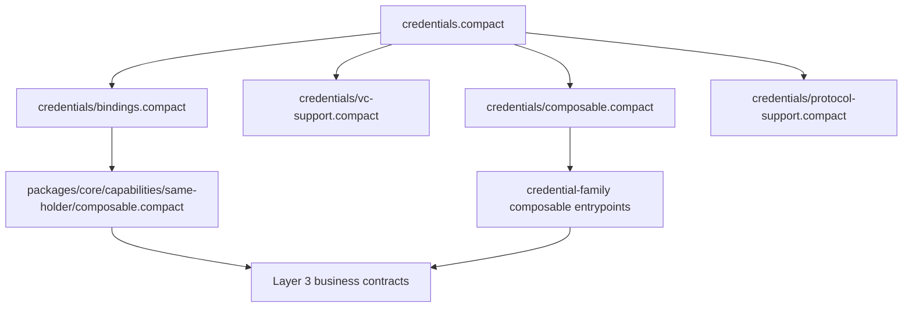

# @midnight-ntwrk/midnight-did-credentials

> Maturity: `core`
> Package class: `dist`
> Release stage: `internal`

Private compatibility facade for Compact-first Midnight VC/VP credential
families. Canonical reusable Compact semantics are owned by
`@midnight-ntwrk/credential-compact` in `packages/core/compact`.

Status:

- internal compatibility package retained while consumers migrate to the canonical package
- shared canonical source files are byte-equivalence-tested; facade-only legacy
  verification/status extensions remain explicitly non-canonical
- excluded from the publication and workspace artifact pack allowlists
- not a production-readiness claim; authority and assurance blockers remain

Tier:

- reusable core package

Dependency direction:

- may depend only on lower shared primitives
- must not depend on DID-aware adapters, transport/orchestration packages,
  demos, or standalone integration harnesses

Reusable outside this repo:

- yes

Surface classification:

- `On-chain + off-chain`
- Compact entrypoints are retained compatibility surfaces, not a second owner
  of reusable core semantics
- generated/runtime TypeScript exports are off-chain compatibility mirrors only

Verification-contract V1 status:

- the canonical transcript, public-input, evidence, result, and owned-record
  types are available from the Compact and root TypeScript surfaces
- `prepareVerification`, `preflightVerification`,
  `submitLedgerVerification`, and `verifyPublicOffchain` provide strict
  normalization and final injected executor boundaries over the same canonical
  47-field transcript
- request-, holder-action-, and credential-action replay-scope records now have
  matching Compact and TypeScript derivation helpers with cross-runtime vectors
- the explicit-holder age-gate reference contract demonstrates persistent,
  atomic nullifier consumption with a protected business mutation; this core
  package remains stateless and does not own application ledgers
- `ledger-local-v1` and `ledger-attested-v1` return their distinct ledger
  authority only after exact evidence/nullifier/atomic-mutation binding and an
  independently confirmed successful committed transaction; submitted,
  included, reverted, failed, and unconfirmed observations stay local-process
- `offchain-public-v1` is local-process only and requires an authenticated
  resolved-profile identity bound to the transcript plus the profile's exact
  empty private-input inventory; hidden-holder, private predicate,
  same-holder, private status, and verifier-scoped hidden bindings are rejected
- missing evaluators/providers remain machine-readably unsupported with bounded
  indeterminate reason and failure-stage labels
- `compareVerificationParityV1` checks proof/decision classification parity
  without flattening executor authority labels
- see the
  [`verification V1 specification`](../../../../docs/spec/verification-contract-v1.md)
  and
  [`encoding spike`](../../../../docs/testing/compact-persistent-hash-record-encoding-2026-07-17.md)

Start here:

1. new contract authors use `@midnight-ntwrk/credential-compact`, including
   `credentials.compact` for standalone builds and
   `credentials/composable.compact` once for Layer 3 composition
2. existing compatibility consumers may continue using this package's
   `src/credentials.compact`; do not add new facade-owned semantics
3. use `src/index.ts` and generated/runtime exports only in wallets,
   verifiers, tests, and adapter code
4. read [`../../../../docs/guides/integration-surface-map.md`](../../../../docs/guides/integration-surface-map.md)
   when choosing between Compact and TypeScript surfaces
5. do not deploy this package root as a business contract; use it as a library surface
   for credential families and Layer 3 verifier/business contracts

## Installed Tarball Usage

The package is ESM-only. An isolated Node or TypeScript consumer can use the
root and explicit subpaths without repository-relative imports:

```ts
import { modJubjubSubgroupOrder } from "@midnight-ntwrk/midnight-did-credentials";
import { Contract } from "@midnight-ntwrk/midnight-did-credentials/contract";
import { JUBJUB_SUBGROUP_ORDER } from "@midnight-ntwrk/midnight-did-credentials/jubjub";
```

Browser bundles that need only pure Jubjub arithmetic should use `./jubjub`.
The root and `./contract` surfaces intentionally expose generated contract code
and its on-chain runtime.

Installed Compact consumers resolve the exported package root from `dist`:

```compact
include "credentials";
```

```bash
compact compile +0.31.1 --skip-zk \
  --compact-path node_modules/@midnight-ntwrk/midnight-did-credentials/dist \
  ./consumer.compact ./managed/consumer
```

The package lane verifies these forms from a copied tarball in a temporary
project outside this repository.

Related docs:

- spec: [`../../../../docs/spec/midnight-credentials.md`](../../../../docs/spec/midnight-credentials.md)
- protocol classification: [`../../../../docs/architecture/protocol-classification.md`](../../../../docs/architecture/protocol-classification.md)
- profiles: [`../../../../docs/spec/profiles.md`](../../../../docs/spec/profiles.md)
- conformance: [`../../../../docs/spec/conformance.md`](../../../../docs/spec/conformance.md)
- credential status: [`../../../../docs/spec/credential-status.md`](../../../../docs/spec/credential-status.md)
- companion guide: [`../../../../docs/guides/midnight-credentials-for-dummies.md`](../../../../docs/guides/midnight-credentials-for-dummies.md)
- test matrix: [`../../../../docs/testing/test-matrix.md`](../../../../docs/testing/test-matrix.md)

## Purpose

This package is the reusable envelope and proof layer for credential families that will be modeled in separate specialization packages.

It owns the generic pieces that should be shared across many credential families:

- `SchemaRef`
- `SchemaCapabilities`
- `SchemaDescriptor`
- `VerificationMethodRef`
- `ExplicitHolderBinding`
- `SecretHolderBinding`
- `Proof`
- generic credential envelope types through
  `VC<TPublicClaims, TClaimCommitments, THolderBinding, TStatusBinding>`
- generic presentation envelope types through `VP<TDisclosures, THolderBinding>`
- generic issuance protocol envelopes through
  `Issue<TOfferBody, TRequestBody, TResultBody>`
- generic presentation protocol envelopes through
  `Present<TRequestBody, TSubmissionBody, TResultBody>`
- generic body-root helpers
- generic credential/presentation linking rules
- generic issuer proof-binding rules
- reusable holder-binding helper circuits for explicit and secret profiles
- shared VC-side status binding vocabulary for status-aware families:
  - `StatusType`
  - `StatusRegistryRef`
  - `NoStatusBinding`
  - `RegistryBoundStatusBinding`

Status package-boundary rule:

- `credentials` owns the VC-side status binding shape
- `credentials-status-registry` owns registry-specific proof protocols,
  verifier-facing request helpers, and off-chain builders

This means a credential family should import status binding from this package,
while verifier applications and Layer 3 status workflows should import the
proof-protocol helpers from `credentials-status-registry`.

Protocol reading rule:

- the protocol modules in this package are reusable core protocol semantics
- transport/orchestration packages may wrap them, but they do not redefine them

## Compact Entry Points

These are retained compatibility entrypoints. Their reusable subset is locked
to `packages/core/compact` by executable equivalence tests; the private
`verification-v1` and status-attestation extensions are explicit legacy deltas.

- `src/credentials.compact` is the standalone compatibility entry point used
  for the package build and generated TS/JS artifacts.
- `src/credentials/composable.compact` is the compatibility Layer 3 root for
  existing contracts. New family composition uses the canonical package root.
- `src/credentials/vc-support.compact` is the narrower shared surface for VC
  envelope and proof helpers.
- `src/credentials/protocol-support.compact` is the narrower shared surface for
  issuance and presentation protocol modules.
- `src/credentials/bindings.compact` is the narrower shared surface for
  holder-binding types and witness-validation helpers.

These narrower entry points exist so capability packages can depend on less
than the full generic bundle when they do not need VC envelopes or protocols.

Deployability rule:

- `credentials` provides Compact library/build roots
- it is not the final business-contract surface an application should deploy
- deploy Layer 3 contracts that compose these roots through a family or demo/business package
They are alternative public surfaces, not internal layers underneath
`composable.compact`, because Compact does not deduplicate repeated includes.



It intentionally does not own schema-specific business logic such as:

- claim commitment layouts
- schema identifiers for a concrete family
- disclosure rules for a concrete family
- predicate circuits such as age, residency, or membership checks

Those belong in specialization packages such as:

- [`../../../../packages/prototypes/credential-families/birth/README.md`](../../../../packages/prototypes/credential-families/birth/README.md): explicit DID-bound holder profile
- [`../../../../packages/prototypes/credential-families/birth-secret/README.md`](../../../../packages/prototypes/credential-families/birth-secret/README.md): hidden holder-secret profile
- [`../../capabilities/same-holder/README.md`](../../capabilities/same-holder/README.md): same-holder composition capability for hidden-holder profiles

## Schema Capabilities And Wallet Resolution

`SchemaRef` stays small and canonical: package id, schema id, major version, and
minor version. It should not grow unbounded URI fields because families and
contracts use it in Compact roots.

The reusable sidecar metadata is:

- `SchemaCapabilities`: feature metadata for the credential family
- `SchemaFamilyResolutionHint`: either a bounded resolver hint or the no-hint
  sentinel from `noSchemaFamilyResolverHint()`
- `SchemaDescriptor`: `SchemaRef` plus capabilities plus resolver hint

Protocol `features` fields are compatibility feature hints, not schema
authority. A wallet or verifier that receives protocol feature booleans should
compare them against a trusted schema descriptor or family registry before
treating them as capabilities.

`protocolFeaturesAsSchemaCapabilities(...)` exists as a migration drift guard:
it is intentionally a name-only conversion today so protocol hint fields and
schema capability fields cannot silently diverge during the deprecation period.

Closed ecosystems can use the no-hint sentinel and resolve families from a
known package set. Generic wallets should prefer a registry or resolver mapping
from `SchemaRef` to the credential-family adapter package.

## Generic model

The reusable Compact modules are:

- `VC<TPublicClaims, TClaimCommitments, THolderBinding, TStatusBinding>`
- `VP<TDisclosures, THolderBinding>`
- `Issue<TOfferBody, TRequestBody, TResultBody>`
- `Present<TRequestBody, TSubmissionBody, TResultBody>`

The VC and VP layers are intentionally separate.

`VC<>` owns:

- credential envelope state
- direct/public claim carriage through `claims: TPublicClaims`
- private commitment carriage through `claimCommitments: TClaimCommitments`
- claim-root consistency
- status-binding carriage
- issuer proof binding

`VP<>` owns:

- presentation envelope state
- disclosure carriage
- linkage back to the credential claim root

The generic relation helpers sit beside those two modules so that VC/VP
linkage does not force one fused generic type.

A specialization package provides:

- a concrete `TPublicClaims` struct, or `NoPublicClaims`
- a concrete `TClaimCommitments` struct, or `NoClaimCommitments`
- a concrete `TDisclosures` struct
- a concrete `THolderBinding` struct
- a concrete `TStatusBinding` struct
- a claim-root helper for the direct-claim and commitment sets
- schema-specific validators
- disclosure validators
- any family-specific predicate circuits

## What the generic core validates

The generic core can validate:

- credential version and claim-root consistency
- issuance proof binding to the issuer verification method
- presentation version and linkage to the credential claim root
- presentation issuer consistency
- proof verification over a derived in-circuit challenge
- generic issuance and presentation protocol envelope typing through
  `Issue<>` and `Present<>`

The generic core intentionally does not force one holder-binding model.
That is delegated to specialization packages.

Current reusable holder-binding helper sets are:

- explicit DID-bound holder binding:
  - `assertValidExplicitHolderBinding(...)`
  - `assertMatchingExplicitHolderBindings(...)`
  - `assertProofMatchesExplicitHolderBinding(...)`
- legacy compatibility Jubjub key holder binding:
  - `assertValidJubjubHolderBinding(...)`
  - `assertMatchingJubjubHolderBindings(...)`
  - `assertProofMatchesJubjubHolderBinding(...)`
- offchain DID holder binding:
  - `assertValidOffchainMidnightHolderBinding(...)`
  - `assertMatchingOffchainMidnightHolderBindings(...)`
  - `assertProofMatchesOffchainMidnightHolderBinding(...)`

TypeScript compatibility note:

- the Compact/core struct name remains:
  - `OffchainMidnightHolderBinding`
- the top-level TypeScript package also exports:
  - `OffchainDIDHolderBinding`
  as the preferred public-facing alias for integrators
- hidden holder-secret binding:
  - `secretHolderBindingCommitment(...)`
  - `secretHolderBindingChallengeResponse(...)`
  - `assertValidSecretHolderCredentialBinding(...)`
  - `assertValidSecretHolderPresentationBinding(...)`
  - `assertMatchingSecretHolderBindings(...)`
  - `assertSecretHolderBindingWitness(...)`

The generic core intentionally does not own same-holder multi-credential composition.

That capability now lives in a dedicated package:

- [`../../capabilities/same-holder/README.md`](../../capabilities/same-holder/README.md)

This keeps the generic core focused on single-credential invariants while
allowing business contracts to import same-holder composition only when needed.

## Read this first

If you are new to the model, read in this order:

1. [`../../../../docs/guides/midnight-credentials-for-dummies.md`](../../../../docs/guides/midnight-credentials-for-dummies.md)
2. [`../../../../docs/spec/midnight-credentials.md`](../../../../docs/spec/midnight-credentials.md)
3. this package README

## Naming choices

Holder-binding terminology:

- canonical terminology guide:
  - [`../../../../docs/architecture/holder-binding-terminology.md`](../../../../docs/architecture/holder-binding-terminology.md)
- use `OffchainDIDHolderBinding` for runtime/public TypeScript-facing adapter
  docs
- keep `OffchainMidnightHolderBinding` for the Compact/core struct name
- describe `JubjubHolderBinding` as legacy compatibility or a minimal non-DID
  profile, not as the default for new DID-shaped work

The generic core now uses:

- `Proof` instead of `JubjubCredentialProof`
- `issuanceProofChallenge(...)` and `presentationProofChallenge(...)` instead of a stored purpose enum
- `OffchainMidnightHolderBinding` as the canonical Compact/core struct name for
  the offchain DID-shaped holder-binding profile

Runtime/public-facing naming rule:

- `credentials-offchain-did` exposes `OffchainDIDHolderBinding` as the
  preferred adapter-facing name
- compatibility aliases may exist during migration, but the Compact/core struct
  remains `OffchainMidnightHolderBinding`

This is intentionally shorter because the same proof container is reused for both VC and VP flows.

## Canonical proof suite

The current Midnight VC/VP profile is explicitly Jubjub-based.

That means:

- `Proof` is still a Jubjub proof
- `Signature` is still a Jubjub signature
- `verifySignature(...)` still verifies a Jubjub signature

The API omits the curve name on purpose because the spec fixes the canonical proof suite for this profile.

## Why stored `purpose` was removed

We considered keeping a `purpose` field inside `Proof`, but it turned out to be redundant state.

The verifier already knows whether it is validating:

- an issuance proof over a credential body
- a presentation proof over a presentation body

So the current design removes the stored enum and keeps the important property instead:

- explicit domain separation in the challenge derivation

That domain separation now comes from dedicated helpers:

- `issuanceProofChallenge(...)`
- `presentationProofChallenge(...)`

This keeps the proof shape smaller and easier to adopt while still preventing accidental cross-context proof reuse.

## Why this split exists

We expect multiple credential families.

So the architecture should not force every family to duplicate:

- proof container types
- proof challenge derivation
- issuer proof binding
- holder proof binding
- generic VC/VP envelope rules

At the same time, the generic package should not decide:

- what the claims are
- how a family computes its claim root
- what disclosures are legal
- what domain-specific predicates exist

That balance is the point of this refactor.

## Build

- Compile Compact artifacts: `pnpm --dir credentials run contract`
- Build TS exports: `pnpm --dir credentials run build`
- Run tests: `pnpm --dir credentials run test`

## Note

Generic modules in Compact can be specialized by business packages, but top-level generic circuits are not directly exportable as package API. That is why this package exposes shared top-level proof helpers and a generic Compact module intended to be specialized by downstream packages.
